# Guía Definitiva para Captura de Tŕafico

## OpenVPN

Existen múltiples escenarios en donde se encontrarán diferentes obstáculos que se deberán sortear para poder capturar el tráfico de una aplicación, desde el lenguaje/framework utilizado para desarrollar el aplicativo, hasta protecciones diseñadas con el fin de brindar una capa o múltiples capas extra de seguridad, tales como el SSLPinning.

Este método lo he ocupado como último recurso a la hora de realizar pruebas de penetración a aplicaciones móviles, en el caso de verme restringido en tiempo, o que me encuentre con protecciones las cuales me esté resultando difícil evadir.

Al tiempo que encontré este método, se me había presentado un caso en dónde no estaba pudiendo capturar el tráfico y había podido identificar que el framework utilizado para la aplicación que estaba evaluando era [Flutter](https://flutter.dev/). Y es que este framework en particular suele evadir de alguna manera las configuraciones establecidas en la sección de proxies de los dispositivos, o al menos eso pude asumir dada la investigación y que al realizar las configuraciones pertinentes para caturar el tráfico, no se mostraban errores relacionados con certificados o comunicaciones cifradas por parte del proxy (BurpSuite).

Sin más que mencionar al respecto, se considerará que se usa un servidor OpenVPN hosteado en una máquina virtual de VMWare en modo NAT, ejemplificando la configuración con el siguiente diagrama:


### Máquina Virtual

La instalación del servidor OpenVPN es bastante directa por medio de [este script](https://git.io/vpn). El script detecta Kali como un sistema operativo Debian, pero falla en determinar la versión, por lo que se puede eliminar la sección de `exit` en la verificación de la versión con los siguientes comandos. Si el script falla, se recomienda eliminar la línea manualmente.

```bash
wget https://git.io/vpn -O openvpn-install.sh
sed -i "$(($(grep -ni "debian is too old" openvpn-install.sh | cut  -d : -f 1)+1))d" ./openvpn-install.sh
chmod +x openvpn-install.sh
sudo ./openvpn-install.sh
```

A excepción de que se quiera configurar algo en específico se pueden usar los valores predeterminados del script, sin embargo, será importe señalar la IP del host principal (en este caso, la máquina que hostea VMWare), por ejemplo:

```bash
Welcome to this OpenVPN road warrior installer!

This server is behind NAT. What is the public IPv4 address or hostname?
Public IPv4 address / hostname [187.189.145.250]: 10.10.10.27 # IP asignada por mi router

Which protocol should OpenVPN use?
   1) UDP (recommended)
   2) TCP
Protocol [1]: 

What port should OpenVPN listen to?
Port [1194]: 

Select a DNS server for the clients:
   1) Current system resolvers
   2) Google
   3) 1.1.1.1
   4) OpenDNS
   5) Quad9
   6) AdGuard
DNS server [1]: 

Enter a name for the first client:
Name [client]: iPhonePT

OpenVPN installation is ready to begin.
Press any key to continue...
```

El script creará un archivo de configuración de OpenVPN ubicado en el directorio `/root`, el cuál posteriormente se descargará en el cliente (celular).

```bash
[...Snip...]
Finished!

The client configuration is available in: /root/iPhonePT.ovpn
New clients can be added by running this script again.
```

Se inicia el servicio de OpenVPN:

```bash
sudo service openvpn start
```

Se transfiere el archivo de configuración, en este caso se usará un servidor web temporal:

```bash
sudo python -m http.server --directory /root
```

Se dan de alta los puertos a los que se les realizará el redireccionamiento en la configuración de red de VMWare yendo a `Edit > Virtual Network Editor`.

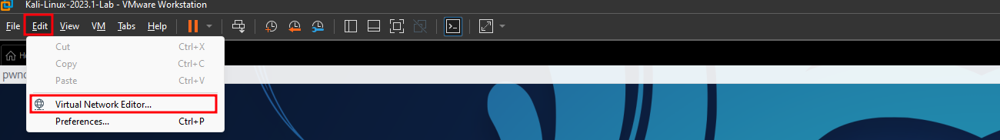

Identificar la red a ocupar, este caso se ocupará la red en NAT y dar click en `Change Settings`.

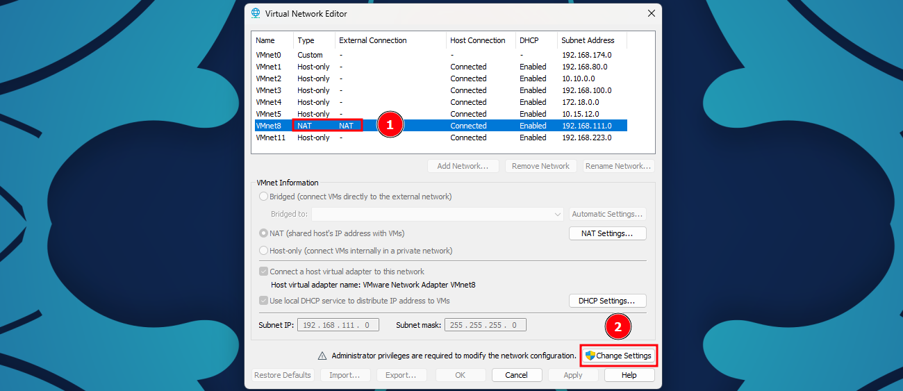

Dar click en configuración de NAT, seleccionando la red que se ocupará.

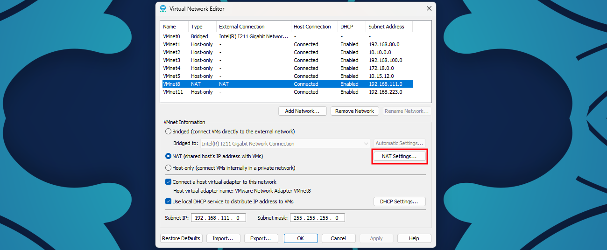

Seleccionar `Add...` y configurar el redireccionamiento hacia el servidor HTTP montado indicando el puerto expuesto, protocolo e IP de la máquina virtual. Se ocupará el mismo puerto en la máquina host.

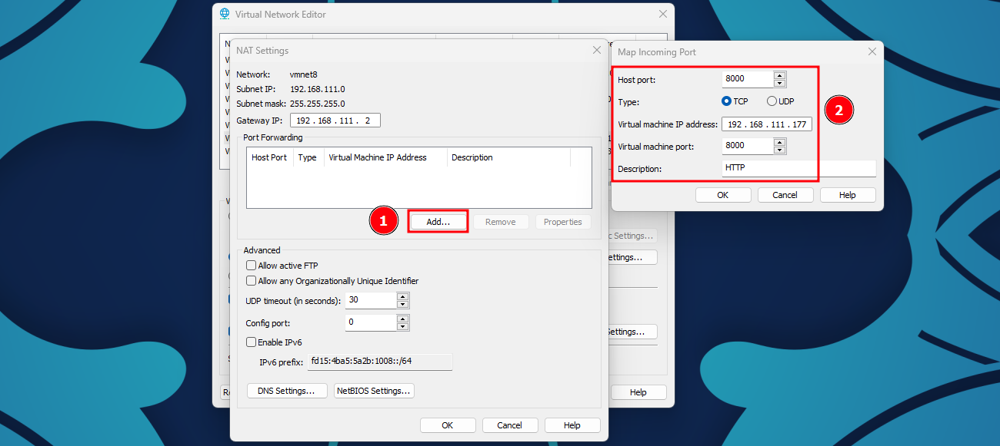

Repetir el mismo procedimiento para el puerto del servidor OpenVPN.

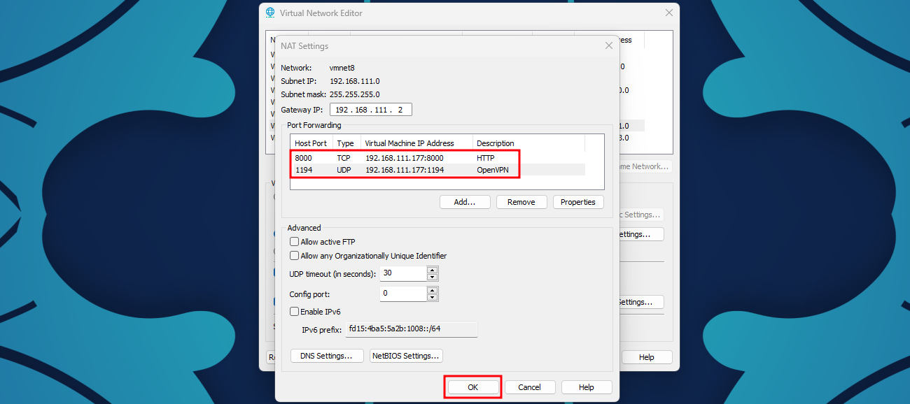

Seleccionar `Ok` para guardar cambios.

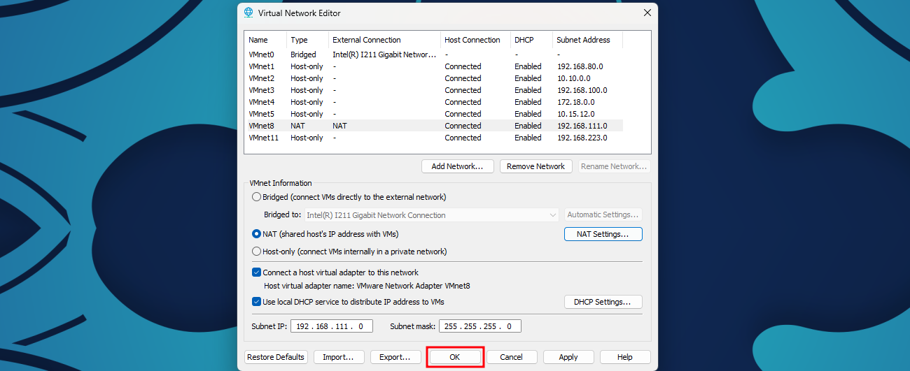

**Es importante señalar que si se cuenta con algún servicio de firewall/antivirus se tendrán que realizar las configuraciones pertinentes, no mostradas en esta guía, para alcanzar los servicios desde el host principal.**

### iOS

A partir de este punto sería posible alcanzar los servicios expuestos de la máquina virtual, por lo que se accederá al servidor web desde el dispositivo para descargar el archivo de configuración de OpenVPN.

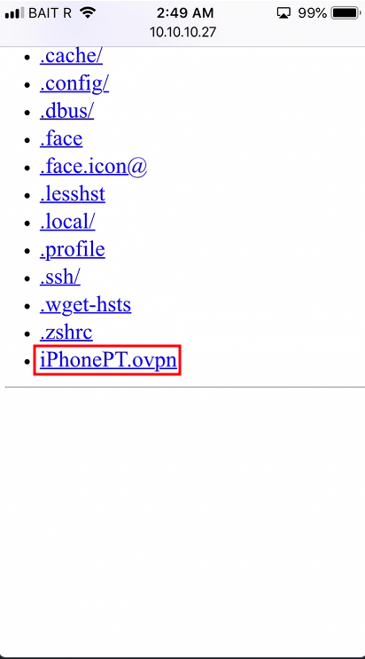

Al seleccionar el archivo, se podrá abrir directamente en la aplicación cliente de OpenVPN, pudiendo variar de la versión del navegador.

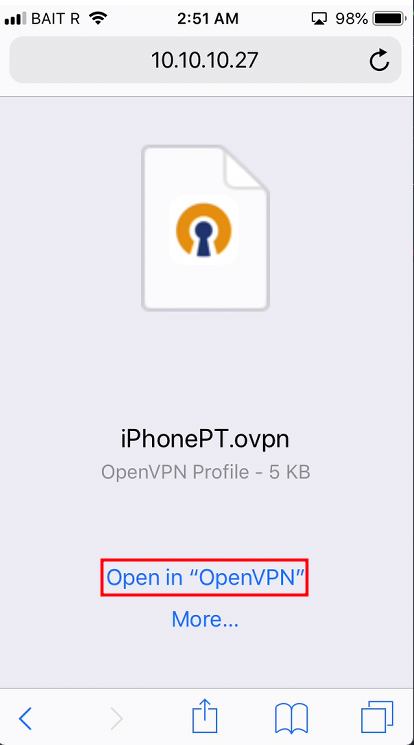

Se seleccionará `ADD` para añadir el perfil al cliente.

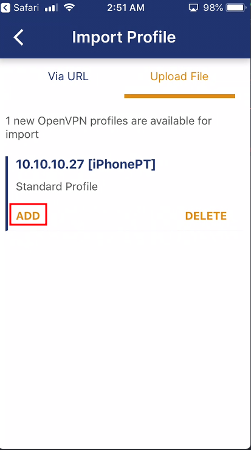

Seleccionar `CONNECT` para realizar la conexión al servidor.

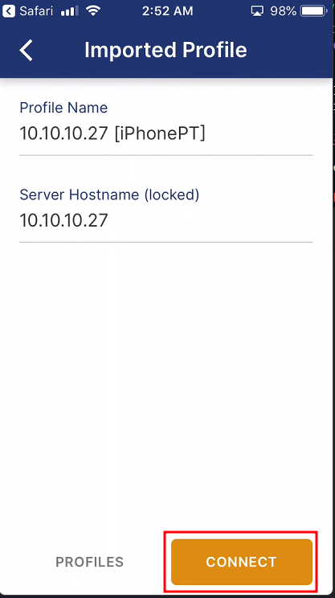

Se podrá verificar si se realizó la conexión satisfactoriamente si se observa las estadísticas de conexión populada, añadiendo que se podrá ver también el ícono en la barra superior del dispositivo.

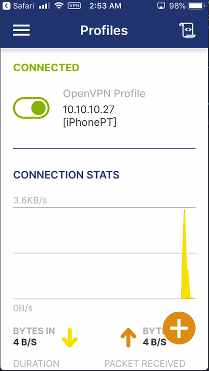

### Man In The Middle

Restará añadir las reglas de redirección para las interfaces involucradas para redirijir el tráfico HTTP y HTTPS, mediante las líneas de comando, asumiendo que el proxy usará el puerto 8080:

```bash
sudo iptables -t nat -A PREROUTING -i tun0 -p tcp --dport 80 -j REDIRECT --to-port 8080
sudo iptables -t nat -A PREROUTING -i tun0 -p tcp --dport 443 -j REDIRECT --to-port 8080
sudo iptables -t nat -A POSTROUTING -s 10.10.10.0/24 -o eth0 -j MASQUERADE # Utilizar la red en la que se encuentra el host principal
```

Finalmente, se configurará el proxy para escuchar en todas las interfaces.

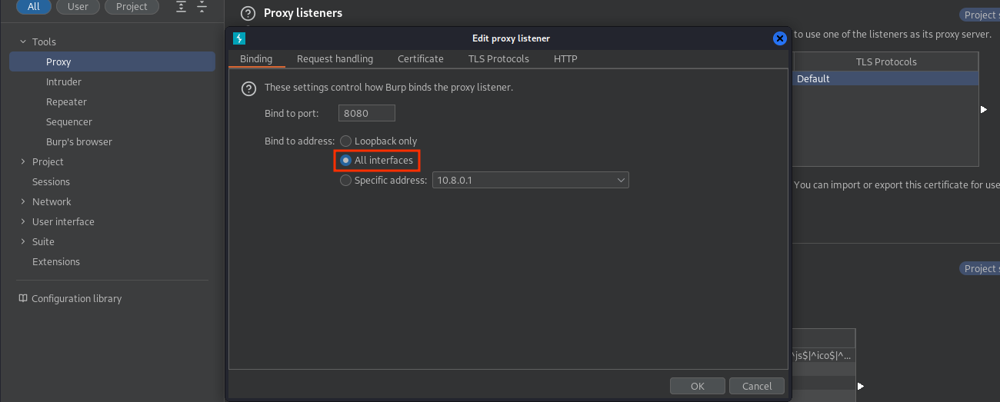

Y habilitar la opción para soporte de `Invisible Proxy`.

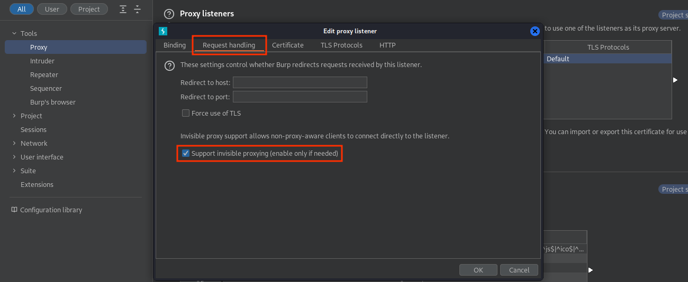

En este momento, al utilizar el navegador o cualquier aplicación debería ser posile visualizar el tráfico dentro de Burpsuite.

<!--
TODO:
- Añadir evidencia de tráfico capturado.
- Realizar setup para Android.
-->

## Referencias

- https://blog.nviso.eu/2020/06/12/intercepting-flutter-traffic-on-ios/