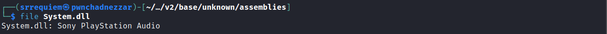

# General


## Frameworks


### Xamarin


#### Decompresión de DLLs (Compresión XALZ)


Posterior al proceso de decompilación/extración de la aplicación es posible encontrarse con DLLs extraídas que parecieran estar dañadas o ser identificadas como tipo de archivo `Sony PlayStation Audio`.



Por lo tanto, al abrirse en algún decompilador relacionado a la tecnología (`ILSpy`, etc) no reconocerá el archivo, ya que existe un tipo de compresión de archivos utilizado por el framework para el compilado de la aplicación, descrito en [este pull request](https://github.com/xamarin/xamarin-android/pull/4686) donde se puede encontrar más información al respecto del tipo de archivos comprimidos XALZ.

Durante la ejecución de un pentest a un aplicativo móvil se enfrentó esta situación, encontrando la solución al problema gracias a [este artículo publicado por X41 DSec](https://www.x41-dsec.de/security/news/working/research/2020/09/22/xamarin-dll-decompression/) en el que se propone el siguiente script para descomprimir la DLL ([repositorio de Github](https://github.com/x41sec/tools/blob/master/Mobile/Xamarin/Xamarin_XALZ_decompress.py)).

```python title="Xamarin_XALZ_decompress.py"
#!/usr/bin/env python
# -*- coding: utf-8 -*-
"""
Installation notes:
This program requires the python lz4 library.
Install via 
* "lz4" (pip) 
* "python3-lz4" (Debian, Ubuntu)
"""

import lz4.block
import sys
import struct

def print_usage_and_exit(): 
    sys.exit("usage: ./command compressed-inputfile.dll uncompressed-outputfile.dll")

if __name__ == "__main__":
    if len(sys.argv) != 3:
        print_usage_and_exit()

    input_filepath = sys.argv[1]
    output_filepath = sys.argv[2]
    header_expected_magic = b'XALZ'
    
    with open(input_filepath, "rb") as xalz_file:
        data = xalz_file.read()
    
        if data[:4] != header_expected_magic:
            sys.exit("The input file does not contain the expected magic bytes, aborting ...")
    
        header_index = data[4:8]
        header_uncompressed_length = struct.unpack('<I', data[8:12])[0]
        payload = data[12:]
        
        print("header index: %s" % header_index)
        print("compressed payload size: %s bytes" % len(payload))
        print("uncompressed length according to header: %s bytes" % header_uncompressed_length)
        
        decompressed = lz4.block.decompress(payload, uncompressed_size=header_uncompressed_length)
                
        with open(output_filepath, "wb") as output_file:
            output_file.write(decompressed)
            output_file.close()
        print("result written to file")
```
