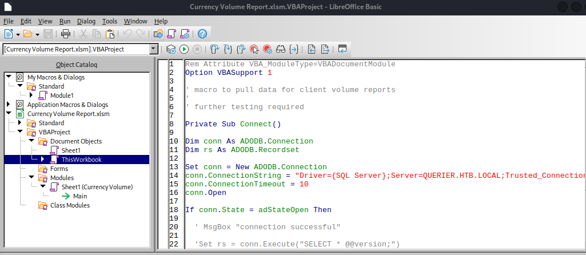

# Querier <!-- omit from toc -->

Write-up de la máquina Querier de [HackTheBox](hackthebox.com).


## Tabla de Contenido <!-- omit from toc -->

- [Introducción](#introducción)
  - [Técnicas vistas / Tags](#técnicas-vistas--tags)
  - [Estadísticas](#estadísticas)
- [Reconocimiento](#reconocimiento)
  - [Escaneo de host](#escaneo-de-host)
    - [Escaneo completo de puertos](#escaneo-completo-de-puertos)
    - [Escaneo específico](#escaneo-específico)
- [Enumeración](#enumeración)
  - [Servicios](#servicios)
    - [smb - 445](#smb---445)
      - [Manual](#manual)
      - [Nombre de herramienta](#nombre-de-herramienta)
- [Explotación](#explotación)
  - [Tipo de explotación](#tipo-de-explotación)
    - [Pasos previos | Preparación](#pasos-previos--preparación)
    - [Ejecución](#ejecución)
- [Post Explotación](#post-explotación)
  - [Enumeración](#enumeración-1)
  - [Escalación de privilegios](#escalación-de-privilegios)
- [Conclusión](#conclusión)
- [Notas adicionales](#notas-adicionales)
- [Referencias](#referencias)


## Introducción

### Técnicas vistas / Tags

- Macro Inspection (Olevba2)
- MSSQL Hash Stealing \[Net-NTLMv2\] (xp_dirtree)
- Abusing MSSQL (xp_cmdshell)
- Cached GPP Files (Privilege Escalation)

### Estadísticas

| Característica | Descripción |
|---|---|
| Nombre | [Querier](https://app.hackthebox.com/machines/Querier) |
| OS | Windows |
| Dificultad oficial | Medium |
| Dificultad de comunidad |  |
| Puntos | 30 |
| Creadores | [mrh4sh](https://app.hackthebox.com/users/2570) & [egre55](https://app.hackthebox.com/users/1190) |

## Reconocimiento

### Escaneo de host

#### Escaneo completo de puertos

```bash
└─$ sudo nmap -sS -v -p- -open -n -Pn -oG nmap/all_ports_ss $TARGET
Host discovery disabled (-Pn). All addresses will be marked 'up' and scan times may be slower.
Starting Nmap 7.92 ( https://nmap.org ) at 2023-04-24 22:05 EDT
Initiating SYN Stealth Scan at 22:05
Scanning 10.10.10.125 [65535 ports]
Discovered open port 445/tcp on 10.10.10.125
Discovered open port 135/tcp on 10.10.10.125
Discovered open port 139/tcp on 10.10.10.125
Discovered open port 49668/tcp on 10.10.10.125
Discovered open port 1433/tcp on 10.10.10.125
Discovered open port 49665/tcp on 10.10.10.125
Discovered open port 49671/tcp on 10.10.10.125
Discovered open port 49664/tcp on 10.10.10.125
Discovered open port 49670/tcp on 10.10.10.125
Discovered open port 5985/tcp on 10.10.10.125
Discovered open port 49667/tcp on 10.10.10.125
SYN Stealth Scan Timing: About 46.22% done; ETC: 22:06 (0:00:36 remaining)
Discovered open port 49666/tcp on 10.10.10.125
Discovered open port 47001/tcp on 10.10.10.125
Discovered open port 49669/tcp on 10.10.10.125
Completed SYN Stealth Scan at 22:06, 49.82s elapsed (65535 total ports)
Nmap scan report for 10.10.10.125
Host is up (0.15s latency).
Not shown: 65521 closed tcp ports (reset)
PORT      STATE SERVICE
135/tcp   open  msrpc
139/tcp   open  netbios-ssn
445/tcp   open  microsoft-ds
1433/tcp  open  ms-sql-s
5985/tcp  open  wsman
47001/tcp open  winrm
49664/tcp open  unknown
49665/tcp open  unknown
49666/tcp open  unknown
49667/tcp open  unknown
49668/tcp open  unknown
49669/tcp open  unknown
49670/tcp open  unknown
49671/tcp open  unknown

Read data files from: /usr/bin/../share/nmap
Nmap done: 1 IP address (1 host up) scanned in 49.93 seconds
           Raw packets sent: 71083 (3.128MB) | Rcvd: 68183 (2.727MB)
```

#### Escaneo específico

```bash
└─$ nmap -sCV -p 135,139,445,1433,5985,47001,49664,49665,49666,49667,49668,49669,49670,49671 -n -Pn -oN nmap/targeted $TARGET
Starting Nmap 7.92 ( https://nmap.org ) at 2023-04-24 22:25 EDT
Nmap scan report for 10.10.10.125
Host is up (0.14s latency).

PORT      STATE SERVICE       VERSION
135/tcp   open  msrpc         Microsoft Windows RPC
139/tcp   open  netbios-ssn   Microsoft Windows netbios-ssn
445/tcp   open  microsoft-ds?
1433/tcp  open  ms-sql-s      Microsoft SQL Server 2017 14.00.1000.00; RTM
| ssl-cert: Subject: commonName=SSL_Self_Signed_Fallback
| Not valid before: 2023-04-25T02:05:06
|_Not valid after:  2053-04-25T02:05:06
| ms-sql-ntlm-info:
|   Target_Name: HTB
|   NetBIOS_Domain_Name: HTB
|   NetBIOS_Computer_Name: QUERIER
|   DNS_Domain_Name: HTB.LOCAL
|   DNS_Computer_Name: QUERIER.HTB.LOCAL
|   DNS_Tree_Name: HTB.LOCAL
|_  Product_Version: 10.0.17763
|_ssl-date: 2023-04-25T02:26:42+00:00; 0s from scanner time.
5985/tcp  open  http          Microsoft HTTPAPI httpd 2.0 (SSDP/UPnP)
|_http-server-header: Microsoft-HTTPAPI/2.0
|_http-title: Not Found
47001/tcp open  http          Microsoft HTTPAPI httpd 2.0 (SSDP/UPnP)
|_http-server-header: Microsoft-HTTPAPI/2.0
|_http-title: Not Found
49664/tcp open  msrpc         Microsoft Windows RPC
49665/tcp open  msrpc         Microsoft Windows RPC
49666/tcp open  msrpc         Microsoft Windows RPC
49667/tcp open  msrpc         Microsoft Windows RPC
49668/tcp open  msrpc         Microsoft Windows RPC
49669/tcp open  msrpc         Microsoft Windows RPC
49670/tcp open  msrpc         Microsoft Windows RPC
49671/tcp open  msrpc         Microsoft Windows RPC
Service Info: OS: Windows; CPE: cpe:/o:microsoft:windows

Host script results:
| ms-sql-info:
|   10.10.10.125:1433:
|     Version:
|       name: Microsoft SQL Server 2017 RTM
|       number: 14.00.1000.00
|       Product: Microsoft SQL Server 2017
|       Service pack level: RTM
|       Post-SP patches applied: false
|_    TCP port: 1433
| smb2-time:
|   date: 2023-04-25T02:26:38
|_  start_date: N/A
| smb2-security-mode:
|   3.1.1:
|_    Message signing enabled but not required

Service detection performed. Please report any incorrect results at https://nmap.org/submit/ .
Nmap done: 1 IP address (1 host up) scanned in 66.20 seconds
```

## Enumeración

### Servicios

#### smb - 445

```bash
└─$ smbclient -L \\\\10.10.10.125
Password for [WORKGROUP\srrequiem]:

        Sharename       Type      Comment
        ---------       ----      -------
        ADMIN$          Disk      Remote Admin
        C$              Disk      Default share
        IPC$            IPC       Remote IPC
        Reports         Disk
Reconnecting with SMB1 for workgroup listing.
do_connect: Connection to 10.10.10.125 failed (Error NT_STATUS_RESOURCE_NAME_NOT_FOUND)
Unable to connect with SMB1 -- no workgroup available
```

```bash
└─$ smbclient \\\\10.10.10.125\\Reports
Password for [WORKGROUP\srrequiem]:
Try "help" to get a list of possible commands.
smb: \> ls
  .                                   D        0  Mon Jan 28 18:23:48 2019
  ..                                  D        0  Mon Jan 28 18:23:48 2019
  Currency Volume Report.xlsm         A    12229  Sun Jan 27 17:21:34 2019

                5158399 blocks of size 4096. 851052 blocks available
smb: \> get "Currency Volume Report.xlsm"
getting file \Currency Volume Report.xlsm of size 12229 as Currency Volume Report.xlsm (1.0 KiloBytes/sec) (average 1.0 KiloBytes/sec)
smb: \>
```



asdas

```vb
Rem Attribute VBA_ModuleType=VBADocumentModule
Option VBASupport 1

' macro to pull data for client volume reports
'
' further testing required

Private Sub Connect()

Dim conn As ADODB.Connection
Dim rs As ADODB.Recordset

Set conn = New ADODB.Connection
conn.ConnectionString = "Driver={SQL Server};Server=QUERIER.HTB.LOCAL;Trusted_Connection=no;Database=volume;Uid=reporting;Pwd=PcwTWTHRwryjc$c6"
conn.ConnectionTimeout = 10
conn.Open

If conn.State = adStateOpen Then

  ' MsgBox "connection successful"
 
  'Set rs = conn.Execute("SELECT * @@version;")
  Set rs = conn.Execute("SELECT * FROM volume;")
  Sheets(1).Range("A1").CopyFromRecordset rs
  rs.Close

End If

End Sub
```

##### Manual


##### Nombre de herramienta


## Explotación

### Tipo de explotación

#### Pasos previos | Preparación


#### Ejecución

```bash
└─$ john --wordlist=/usr/share/wordlists/rockyou.txt mssql_svc.hash
Using default input encoding: UTF-8
Loaded 1 password hash (netntlmv2, NTLMv2 C/R [MD4 HMAC-MD5 32/64])
Will run 4 OpenMP threads
Press 'q' or Ctrl-C to abort, almost any other key for status
corporate568     (mssql-svc)
1g 0:00:00:02 DONE (2023-04-24 23:01) 0.3846g/s 3446Kp/s 3446Kc/s 3446KC/s correforenz..cornamuckla
Use the "--show --format=netntlmv2" options to display all of the cracked passwords reliably
Session completed.
```

## Post Explotación

### Enumeración


### Escalación de privilegios

```powershell
͹ Cached GPP Passwords

C:\ProgramData\Microsoft\Group Policy\History\{31B2F340-016D-11D2-945F-00C04FB984F9}\Machine\Preferences\Groups\Groups.xml

C:\Documents and Settings\All Users\Application Data\Microsoft\Group Policy\History\{31B2F340-016D-11D2-945F-00C04FB984F9}\Machine\Preferences\Groups\Groups.xml
    Found C:\ProgramData\Microsoft\Group Policy\History\{31B2F340-016D-11D2-945F-00C04FB984F9}\Machine\Preferences\Groups\Groups.xml
rName: Administrator
    NewName: [BLANK]
    cPassword: MyUnclesAreMarioAndLuigi!!1!
    Changed: 2019-01-28 23:12:48
    Found C:\Documents and Settings\All Users\Application Data\Microsoft\Group Policy\History\{31B2F340-016D-11D2-945F-00C04FB984F9}\Machine\Preferences\Groups\Groups.xml
    UserName: Administrator
    NewName: [BLANK]
    cPassword: MyUnclesAreMarioAndLuigi!!1!
-28 23:12:48 2019-01
```

## Conclusión


## Notas adicionales


## Referencias

