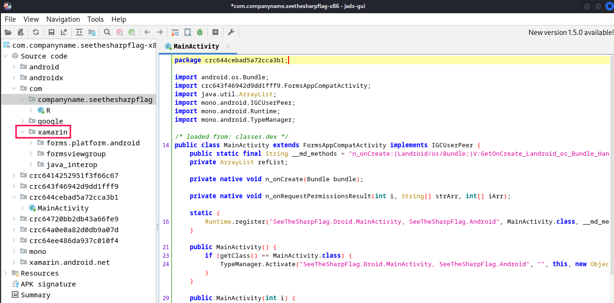
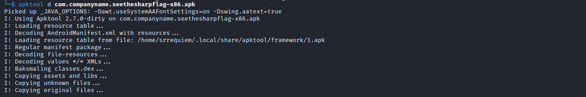
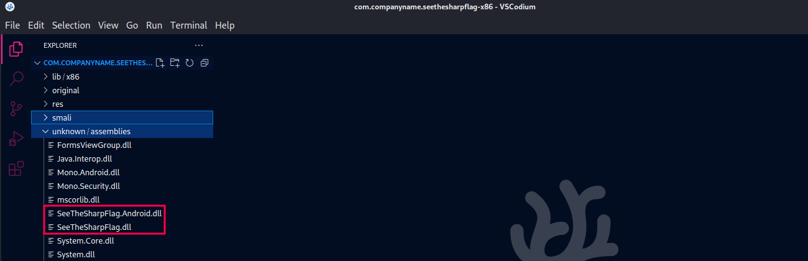
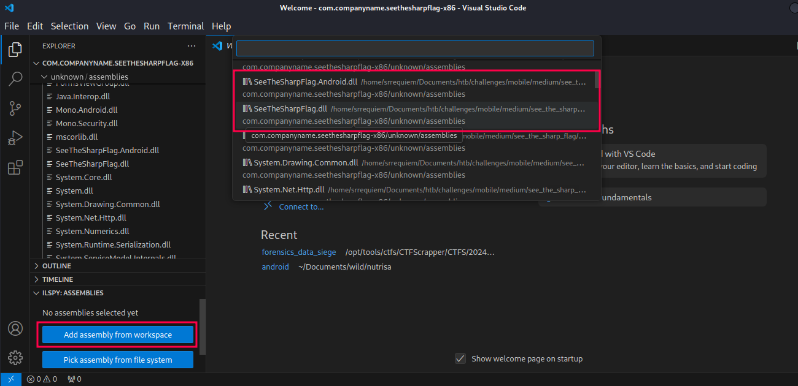
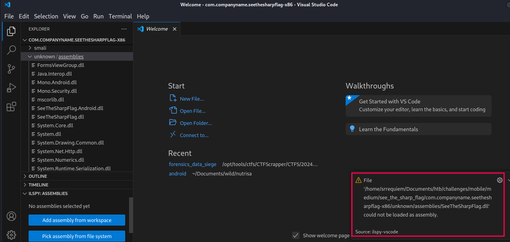
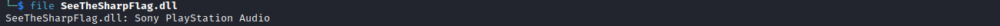
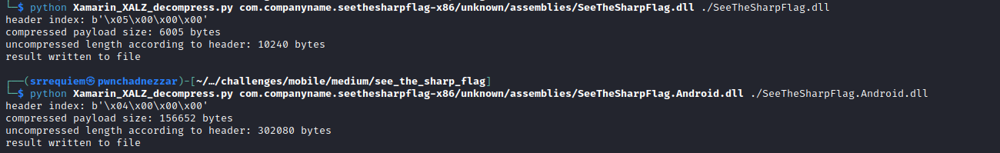
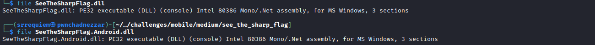
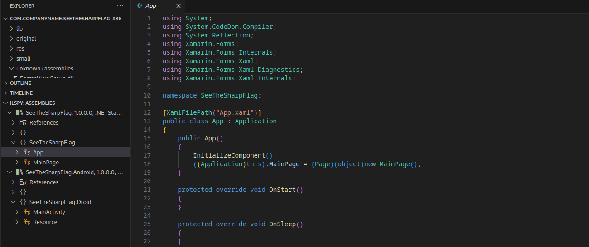
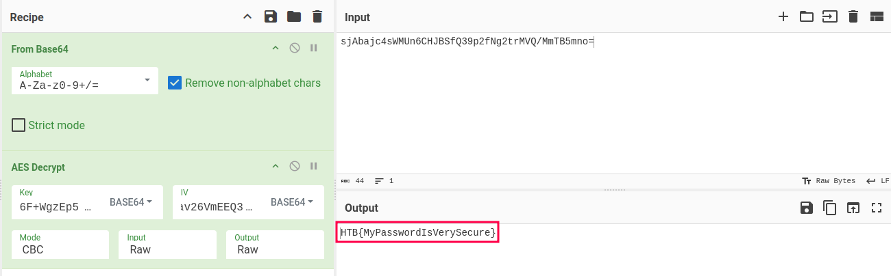

---
tags:
  - Android
  - Xamarin
  - APKTool
  - Compresión XALZ
  - Decompilación de DLLs
  - ILSpy
---

# SeeTheSharpFlag


## Información


| Característica | Descripción |
|---|---|
| Dificultad oficial | Medium |
| Puntos | 40 |
| Creadores | [heartpoll](https://app.hackthebox.com/users/74804) & [bertolis](https://app.hackthebox.com/users/27897) |
| Descripción | I have made a password verification app. If I can remember the password, the app will tell me it is correct. See if you can guess my password. |


## Reconocimiento inicial


Nos entregan el archivo `com.companyname.seethesharpflag-x86.apk` y haciendo uso de `jadx-gui` directamente sobre el apk se visualiza la estructura del código, sin embargo, se pueden observar ciertos "wrappers" y código de varias bibliotecas utilizadas, entre lo identificado una relacionada a xamarin, tecnología que se ocupa para desarrollar aplicaciones multiplataforma con [C#/.NET](https://dotnet.microsoft.com/es-es/apps/xamarin).



Adicionalmente se uso `apktool` para ver si se obtenía más información de utilidad.



Después, se listo el directorio creado en la ejecución, encontrando así DLLs potenciales para analizar.




## Intento de decompilación


Haciendo uso de VSCode más el plugin de [ILSpy](https://marketplace.visualstudio.com/items?itemName=icsharpcode.ilspy-vscode) se pueden seleccionar las DLLs deseadas e intentar decompilarlas para visualizar el código fuente.



Curiosamente, al seleccionar cualquiera de las DLLs para decompilar, sobresale un error al intentar cargar la DLL.



Más aún, si intentamos identificar el tipo de archivo de las DLLs extraídas, son identificadas como "Sony PlayStation Audio".




## Decompresión de XALZ


Después de indagar más al respecto, se encontró [este artículo](https://www.x41-dsec.de/security/news/working/research/2020/09/22/xamarin-dll-decompression/) en el cual describen un tipo de compresión que no fue del todo "notificado" o no es del todo "conocido" llamado XALZ, gestionado por el equipo de desarrollo de Xamarin (escribo un poco más a detalle [aquí](https://srrequiem.xyz/Secronomicon/Gu%C3%ADas/Mobile/General)). El artículo expone el siguiente script para descomprimir el archivo y obtener la DLL original.

```python title="Xamarin_XALZ_decompress.py"
#!/usr/bin/env python
# -*- coding: utf-8 -*-
"""
Installation notes:
This program requires the python lz4 library.
Install via 
* "lz4" (pip) 
* "python3-lz4" (Debian, Ubuntu)
"""

import lz4.block
import sys
import struct

def print_usage_and_exit(): 
    sys.exit("usage: ./command compressed-inputfile.dll uncompressed-outputfile.dll")

if __name__ == "__main__":
    if len(sys.argv) != 3:
        print_usage_and_exit()

    input_filepath = sys.argv[1]
    output_filepath = sys.argv[2]
    header_expected_magic = b'XALZ'
    
    with open(input_filepath, "rb") as xalz_file:
        data = xalz_file.read()
    
        if data[:4] != header_expected_magic:
            sys.exit("The input file does not contain the expected magic bytes, aborting ...")
    
        header_index = data[4:8]
        header_uncompressed_length = struct.unpack('<I', data[8:12])[0]
        payload = data[12:]
        
        print("header index: %s" % header_index)
        print("compressed payload size: %s bytes" % len(payload))
        print("uncompressed length according to header: %s bytes" % header_uncompressed_length)
        
        decompressed = lz4.block.decompress(payload, uncompressed_size=header_uncompressed_length)
                
        with open(output_filepath, "wb") as output_file:
            output_file.write(decompressed)
            output_file.close()
        print("result written to file")
```

Por lo que se ejecuta el script señalando la DLL y se indica el nombre de la DLL posterior a la decompresión de la siguiente manera.



Como resultado, si de nuevo se ejecuta el comando `file` a las DLLs extraídas ahora el archivo es identificado como DLL.




## Decompilado de DLLs


Ahora si se puede hacer uso de `ILSpy` como anteriomente se señaló, pudiendo ver así el código fuente resultante de la decompilación.



Dentro de la DLL `SeeTheSharpFlag.dll` se identificó la clase `MainPage` la cual, resalto la función `Button_Clicked`. Esta, realiza un proceso de descifrado AES de un valor y se pueden ver los valores de lo cifrado, el IV y llave.

```c#
private void Button_Clicked(object sender, EventArgs e)
{
    byte[] buffer = Convert.FromBase64String("sjAbajc4sWMUn6CHJBSfQ39p2fNg2trMVQ/MmTB5mno=");
    byte[] rgbKey = Convert.FromBase64String("6F+WgzEp5QXodJV+iTli4Q==");
    byte[] rgbIV = Convert.FromBase64String("DZ6YdaWJlZav26VmEEQ31A==");
    using AesManaged aesManaged = new AesManaged();
    using ICryptoTransform transform = aesManaged.CreateDecryptor(rgbKey, rgbIV);
    using MemoryStream stream = new MemoryStream(buffer);
    using CryptoStream stream2 = new CryptoStream(stream, transform, CryptoStreamMode.Read);
    using StreamReader streamReader = new StreamReader(stream2);
    if (streamReader.ReadToEnd() == ((InputView)SecretInput).Text)
    {
        SecretOutput.Text = "Congratz! You found the secret message";
    }
    else
    {
        SecretOutput.Text = "Sorry. Not correct password";
    }
}
```

Con esta información se puede realizar el descifrado, sintentizado en la receta de CyberChef:

```
https://gchq.github.io/CyberChef/#recipe=From_Base64('A-Za-z0-9%2B/%3D',true,false)AES_Decrypt(%7B'option':'Base64','string':'6F%2BWgzEp5QXodJV%2BiTli4Q%3D%3D'%7D,%7B'option':'Base64','string':'DZ6YdaWJlZav26VmEEQ31A%3D%3D'%7D,'CBC','Raw','Raw',%7B'option':'Hex','string':''%7D,%7B'option':'Hex','string':''%7D)&input=c2pBYmFqYzRzV01VbjZDSEpCU2ZRMzlwMmZOZzJ0ck1WUS9NbVRCNW1ubz0
```

Obteniendo así la bandera del reto.



> Bandera: HTB{MyPasswordIsVerySecure}.


## Referencias

- [Microsoft - Xamarin](https://dotnet.microsoft.com/es-es/apps/xamarin).
- [Secronomicon - Guías Mobile General](https://srrequiem.xyz/Secronomicon/Gu%C3%ADas/Mobile/General).
- [X41 D-Sec - Decompressing Xamarin DLLs](https://www.x41-dsec.de/security/news/working/research/2020/09/22/xamarin-dll-decompression/).
- [Github Pull Request - Add support for compressed assemblies in APK](https://github.com/dotnet/android/pull/4686).